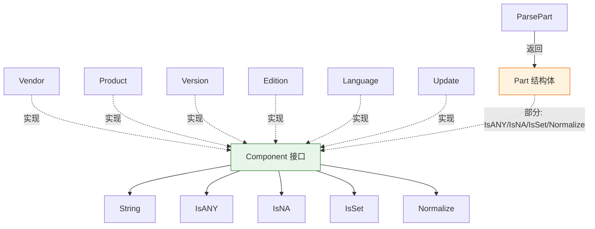

# 🧩 组件类型

本模块定义 `Component` 接口，以及每个 CPE 属性类型共同实现的方法集：`Vendor`、`Product`、`Version`、`Edition`、`Language`、`Update`。这些类型都是基于 `string` 的命名类型（各自声明在单独的文件中），并提供相同的五个方法，因此可作为 `Component` 统一处理。`Part` 类型实现了其中的一个子集（它没有 `String` 方法）。

## 类型：Component

```go
type Component interface {
    String() string
    IsANY() bool
    IsNA() bool
    IsSet() bool
    Normalize() string
}
```

`Component` 接口描述每个 CPE 属性类型的通用行为：

- `String` 返回原始字符串值。
- `IsANY` 判断值是否为逻辑值 ANY（`*`）。
- `IsNA` 判断值是否为逻辑值 NA（`-`）。
- `IsSet` 判断值是否为真实值（非空、非 ANY、非 NA）。
- `Normalize` 返回值的规范化形式（小写、空格→下划线、合并连续下划线）。

命名类型 `Vendor`、`Product`、`Version`、`Edition`、`Language`、`Update` 均实现该接口。

## 🏷️ String

```go
func (v Vendor) String() string
func (p Product) String() string
func (v Version) String() string
func (e Edition) String() string
func (l Language) String() string
func (u Update) String() string
```

返回组件的原始字符串值。

| 返回值 | 类型 | 说明 |
| --- | --- | --- |
| 第 1 个 | `string` | 原始值 |

```go
v := cpeskills.Vendor("microsoft")
fmt.Println(v.String()) // microsoft
```

## ❓ IsANY

```go
func (v Vendor) IsANY() bool
func (p Product) IsANY() bool
func (v Version) IsANY() bool
func (e Edition) IsANY() bool
func (l Language) IsANY() bool
func (u Update) IsANY() bool
```

判断值是否等于逻辑值 ANY（`*`）。

| 返回值 | 类型 | 说明 |
| --- | --- | --- |
| 第 1 个 | `bool` | 值为 `*` 时返回 `true` |

```go
v := cpeskills.Vendor("*")
fmt.Println(v.IsANY()) // true
```

## ❓ IsNA

```go
func (v Vendor) IsNA() bool
func (p Product) IsNA() bool
func (v Version) IsNA() bool
func (e Edition) IsNA() bool
func (l Language) IsNA() bool
func (u Update) IsNA() bool
```

判断值是否等于逻辑值 NA（`-`）。

| 返回值 | 类型 | 说明 |
| --- | --- | --- |
| 第 1 个 | `bool` | 值为 `-` 时返回 `true` |

```go
v := cpeskills.Version("-")
fmt.Println(v.IsNA()) // true
```

## ✔️ IsSet

```go
func (v Vendor) IsSet() bool
func (p Product) IsSet() bool
func (v Version) IsSet() bool
func (e Edition) IsSet() bool
func (l Language) IsSet() bool
func (u Update) IsSet() bool
```

判断值是否为真实值：非空、非 ANY、非 NA。

| 返回值 | 类型 | 说明 |
| --- | --- | --- |
| 第 1 个 | `bool` | 为具体值时返回 `true` |

```go
v := cpeskills.Vendor("microsoft")
fmt.Println(v.IsSet()) // true

a := cpeskills.Vendor("*")
fmt.Println(a.IsSet()) // false
```

## 🧹 Normalize

```go
func (v Vendor) Normalize() string
func (p Product) Normalize() string
func (v Version) Normalize() string
func (e Edition) Normalize() string
func (l Language) Normalize() string
func (u Update) Normalize() string
```

返回值的规范化形式，内部委托 `NormalizeComponent`：将值转为小写，空格替换为下划线，连续多个下划线合并为一个。逻辑值（`*`、`-`、`""`）原样返回。

| 返回值 | 类型 | 说明 |
| --- | --- | --- |
| 第 1 个 | `string` | 规范化后的值 |

```go
p := cpeskills.Product("Windows 10")
fmt.Println(p.Normalize()) // windows_10
```

## 📥 ParsePart

```go
func ParsePart(s string) (Part, error)
```

将 part 短名字符串解析为 `Part` 值。可识别的输入（不区分大小写）为 `a`（Application）、`h`（Hardware）、`o`（Operation System），返回对应的预定义 `Part`；`*` 返回 `ShortName` 为 `*`、`LongName` 为 `ANY` 的 `Part`。其他输入返回错误。

| 参数 | 类型 | 说明 |
| --- | --- | --- |
| `s` | `string` | 待解析的 part 短名 |

| 返回值 | 类型 | 说明 |
| --- | --- | --- |
| 第 1 个 | `Part` | 解析得到的 Part（出错时为零值） |
| 第 2 个 | `error` | 成功为 `nil`，否则为 "invalid part value" 错误 |

```go
p, err := cpeskills.ParsePart("a")
if err != nil {
    panic(err)
}
fmt.Println(p.LongName) // Application
```

## Part 的方法

`Part` 结构体类型实现了 `Component` 方法集的检查子集（它没有实现 `String`，因此不完全满足 `Component` 接口）。

```go
func (p Part) IsANY() bool
func (p Part) IsNA() bool
func (p Part) IsSet() bool
func (p Part) Normalize() string
```

`IsANY` / `IsNA` 将 `ShortName` 与 `*` / `-` 比较。`IsSet` 判断 `ShortName` 是否非空、非 ANY、非 NA。`Normalize` 返回小写后的 `ShortName`。

| 返回值 | 类型 | 说明 |
| --- | --- | --- |
| 第 1 个 | `bool` / `string` | `IsANY`/`IsNA`/`IsSet` 返回 `bool`；`Normalize` 返回 `string` |

```go
p := *cpeskills.PartApplication
fmt.Println(p.IsSet())     // true
fmt.Println(p.IsANY())     // false
fmt.Println(p.Normalize()) // a
```

## 📐 组件方法集示意图


