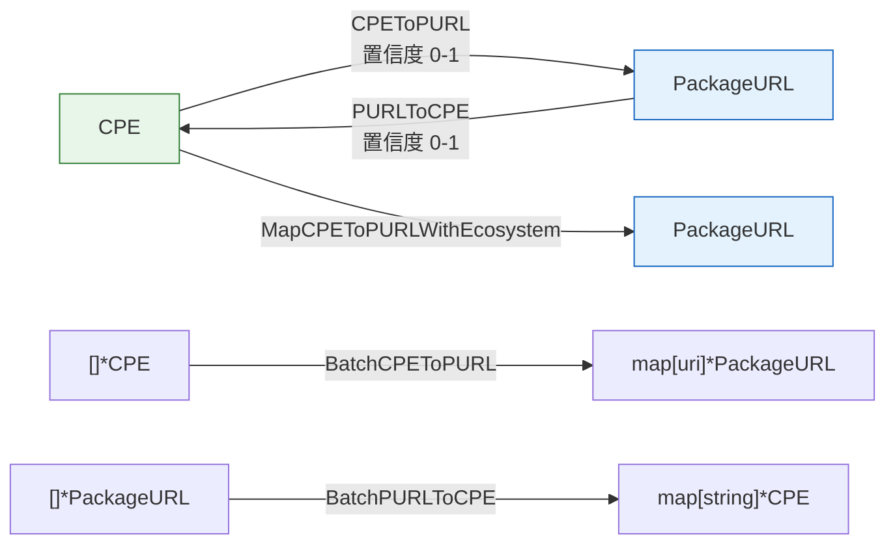

# 🔁 CPE 与 PURL 互转

本模块在 CPE（`*CPE`）与 Package URL（`*PackageURL`）标识符之间相互转换。由于两套方案描述包的方式不同——CPE 用 vendor/product/version，PURL 用 ecosystem/namespace/name——每次转换都附带 `0.0`–`1.0` 范围内的置信度分数，数值越高表示映射越确定。

## 🔄 CPEToPURL

```go
func CPEToPURL(cpe *CPE) (*PackageURL, float64, error)
```

将 CPE 转换为 PackageURL，依据 CPE 的 vendor 与 product 推断生态系统。返回映射后的 PURL 与置信度分数（`0.0`–`1.0`）；当版本缺失或为 `*` 时分数会降低。

| 参数 | 类型 | 说明 |
| --- | --- | --- |
| `cpe` | `*CPE` | 待转换的 CPE |

| 返回值 | 类型 | 说明 |
| --- | --- | --- |
| #1 | `*PackageURL` | 映射后的 PURL，出错时为 `nil` |
| #2 | `float64` | 映射置信度，`0.0`–`1.0` |
| #3 | `error` | `cpe` 为 nil 时非 nil |

```go
cpe := &cpeskills.CPE{
    Part:        *cpeskills.PartApplication,
    Vendor:      "apache",
    ProductName: "log4j-core",
    Version:     "2.14.1",
}
purl, conf, err := cpeskills.CPEToPURL(cpe)
if err != nil {
    log.Fatal(err)
}
fmt.Println(purl.String(), conf)
// pkg:maven/apache/log4j-core@2.14.1 0.9
```

## 🔄 PURLToCPE

```go
func PURLToCPE(purl *PackageURL) (*CPE, float64, error)
```

将 PackageURL 转换为 CPE，依据 PURL 的生态系统、命名空间与名称推断 vendor 和 product。返回 CPE 与置信度分数（`0.0`–`1.0`）；版本为空或生态系统为 `EcosystemGeneric` 时分数会降低。

| 参数 | 类型 | 说明 |
| --- | --- | --- |
| `purl` | `*PackageURL` | 待转换的 PURL |

| 返回值 | 类型 | 说明 |
| --- | --- | --- |
| #1 | `*CPE` | 映射后的 CPE，出错时为 `nil` |
| #2 | `float64` | 映射置信度，`0.0`–`1.0` |
| #3 | `error` | `purl` 为 nil 时非 nil |

```go
p, _ := cpeskills.ParsePURL("pkg:maven/org.apache.logging.log4j/log4j-core@2.14.1")
cpe, conf, err := cpeskills.PURLToCPE(p)
if err != nil {
    log.Fatal(err)
}
fmt.Println(cpe.Cpe23, conf)
```

## 🎯 MapCPEToPURLWithEcosystem

```go
func MapCPEToPURLWithEcosystem(cpe *CPE, ecosystem Ecosystem) (*PackageURL, error)
```

使用调用者指定的生态系统将 CPE 转换为 PURL。相比自动推断的 `CPEToPURL`，它可避免生态系统歧义，适用于已知目标生态系统的场景。命名空间/名称布局因生态系统而异（如 Maven 以 vendor 作 groupId、npm 作 `@scope`、Go 作模块路径前缀）。

| 参数 | 类型 | 说明 |
| --- | --- | --- |
| `cpe` | `*CPE` | 待转换的 CPE |
| `ecosystem` | `Ecosystem` | 目标生态系统 |

| 返回值 | 类型 | 说明 |
| --- | --- | --- |
| #1 | `*PackageURL` | 映射后的 PURL，出错时为 `nil` |
| #2 | `error` | `cpe` 为 nil 或生态系统未知时非 nil |

```go
purl, err := cpeskills.MapCPEToPURLWithEcosystem(cpe, cpeskills.EcosystemMaven)
if err != nil {
    log.Fatal(err)
}
fmt.Println(purl.String())
```

## 📦 BatchCPEToPURL

```go
func BatchCPEToPURL(cpes []*CPE) map[string]*PackageURL
```

批量将 CPE 转换为 PURL。结果 map 以各 CPE 的 URI（来自 `cpe.GetURI()`）为键；转换失败的 CPE 会被静默跳过。

| 参数 | 类型 | 说明 |
| --- | --- | --- |
| `cpes` | `[]*CPE` | 待转换的 CPE 列表 |

| 返回值 | 类型 | 说明 |
| --- | --- | --- |
| #1 | `map[string]*PackageURL` | CPE URI 到映射 PURL 的映射 |

```go
m := cpeskills.BatchCPEToPURL([]*cpeskills.CPE{cpe1, cpe2})
for uri, purl := range m {
    fmt.Println(uri, "->", purl.String())
}
```

## 📋 BatchPURLToCPE

```go
func BatchPURLToCPE(purls []*PackageURL) map[string]*CPE
```

批量将 PURL 转换为 CPE。结果 map 以各 PURL 的规范字符串（来自 `purl.String()`）为键；转换失败的 PURL 会被静默跳过。

| 参数 | 类型 | 说明 |
| --- | --- | --- |
| `purls` | `[]*PackageURL` | 待转换的 PURL 列表 |

| 返回值 | 类型 | 说明 |
| --- | --- | --- |
| #1 | `map[string]*CPE` | PURL 字符串到映射 CPE 的映射 |

```go
m := cpeskills.BatchPURLToCPE([]*cpeskills.PackageURL{p1, p2})
for s, cpe := range m {
    fmt.Println(s, "->", cpe.Cpe23)
}
```

## 📐 CPE ↔ PURL 映射图


