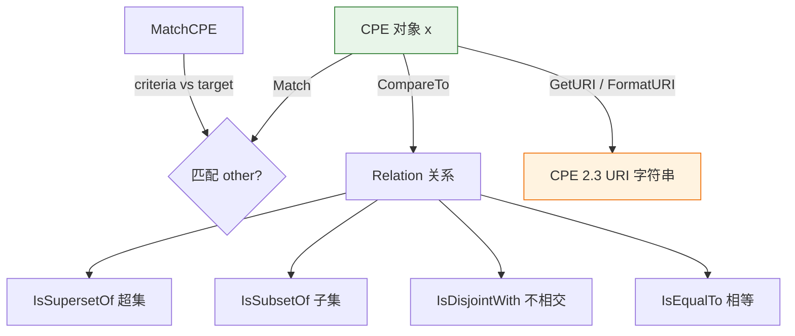

# 📦 CPE 核心类型与方法

`CPE` 是本库的核心类型，表示一个通用平台枚举（Common Platform Enumeration）对象。它实现了 CPE 名称匹配规范，支持 2.3 URI 格式的解析与格式化，并提供集合关系比较（超集、子集、相交、相等）。

## 类型：CPE

```go
type CPE struct {
    Cpe23          string   `json:"cpe_23" bson:"cpe_23"`
    Part           Part     `json:"part" bson:"part"`
    Vendor         Vendor   `json:"vendor" bson:"vendor"`
    ProductName    Product  `json:"product_name" bson:"product_name"`
    Version        Version  `json:"version" bson:"version"`
    Update         Update   `json:"update" bson:"update"`
    Edition        Edition  `json:"edition" bson:"edition"`
    Language       Language `json:"language" bson:"language"`
    SoftwareEdition string  `json:"software_edition" bson:"software_edition"`
    TargetSoftware string   `json:"target_software" bson:"target_software"`
    TargetHardware string   `json:"target_hardware" bson:"target_hardware"`
    Other          string   `json:"other" bson:"other"`
    Cve            string   `json:"cve" bson:"cve"`
    Url            string   `json:"url" bson:"url"`
}
```

CPE 结构体的字段对应 CPE 2.3 规范中的各属性，外加 `Cve`（关联漏洞编号）和 `Url`（信息来源）两个扩展字段。

## 🔍 Match

```go
func (x *CPE) Match(other *CPE) bool
```

判断当前 CPE 是否匹配另一个 CPE，依据 CPE 名称匹配规范实现。匹配规则考虑通配符 `*` 与不适用标记 `-` 的特殊语义：相同 URI 直接匹配；`Part` 必须完全匹配；其余属性任一方为 `*` 即匹配，双方均为 `-` 即匹配，否则需完全相等。

| 参数 | 类型 | 说明 |
| --- | --- | --- |
| `other` | `*CPE` | 要与当前 CPE 比较的目标对象 |

| 返回值 | 类型 | 说明 |
| --- | --- | --- |
| 第 1 个 | `bool` | 匹配返回 `true`，否则 `false` |

```go
package main

import (
    "fmt"
    "github.com/scagogogo/cpe-skills"
)

func main() {
    windowsCPE, _ := cpeskills.ParseCpe23("cpe:2.3:a:microsoft:windows:10:*:*:*:*:*:*:*")
    pattern, _ := cpeskills.ParseCpe23("cpe:2.3:a:microsoft:windows:*:*:*:*:*:*:*:*")

    if pattern.Match(windowsCPE) {
        fmt.Println("匹配成功")
    }
}
```

## ⚙️ GetURI

```go
func (c *CPE) GetURI() string
```

返回该 CPE 对象的 2.3 格式 URI 字符串。

| 返回值 | 类型 | 说明 |
| --- | --- | --- |
| 第 1 个 | `string` | CPE 2.3 URI 字符串 |

```go
cpe, _ := cpeskills.ParseCpe23("cpe:2.3:a:microsoft:windows:10:*:*:*:*:*:*:*")
fmt.Println(cpe.GetURI())
```

## 🧩 FormatURI

```go
func FormatURI(cpe *CPE) string
```

将 CPE 对象格式化为 2.3 URI 字符串，是 `GetURI` 的包级函数形式。

| 参数 | 类型 | 说明 |
| --- | --- | --- |
| `cpe` | `*CPE` | 待格式化的 CPE 对象 |

| 返回值 | 类型 | 说明 |
| --- | --- | --- |
| 第 1 个 | `string` | CPE 2.3 URI 字符串 |

```go
cpe := cpeskills.MustParse("cpe:2.3:a:microsoft:windows:10:*:*:*:*:*:*:*")
fmt.Println(cpeskills.FormatURI(cpe))
```

## 🎯 MatchCPE

```go
func MatchCPE(criteria *CPE, target *CPE, options *MatchOptions) bool
```

依据可选的匹配选项，判断 `criteria` 是否匹配 `target`。`options` 传入 `nil` 时使用默认规则。

| 参数 | 类型 | 说明 |
| --- | --- | --- |
| `criteria` | `*CPE` | 匹配条件（模式） |
| `target` | `*CPE` | 被匹配的目标 CPE |
| `options` | `*MatchOptions` | 匹配选项，`nil` 表示默认 |

| 返回值 | 类型 | 说明 |
| --- | --- | --- |
| 第 1 个 | `bool` | 匹配返回 `true`，否则 `false` |

```go
criteria := cpeskills.MustParse("cpe:2.3:a:microsoft:windows:*:*:*:*:*:*:*:*")
target := cpeskills.MustParse("cpe:2.3:a:microsoft:windows:10:*:*:*:*:*:*:*")
if cpeskills.MatchCPE(criteria, target, nil) {
    fmt.Println("目标匹配条件")
}
```

## 📊 CompareTo

```go
func (x *CPE) CompareTo(other *CPE) Relation
```

将当前 CPE 与另一个 CPE 比较，返回二者之间的集合关系。

| 参数 | 类型 | 说明 |
| --- | --- | --- |
| `other` | `*CPE` | 被比较的另一个 CPE |

| 返回值 | 类型 | 说明 |
| --- | --- | --- |
| 第 1 个 | `Relation` | 二者的关系（相等、超集、子集、不相交等） |

```go
a := cpeskills.MustParse("cpe:2.3:a:microsoft:windows:*:*:*:*:*:*:*:*")
b := cpeskills.MustParse("cpe:2.3:a:microsoft:windows:10:*:*:*:*:*:*:*")
fmt.Println(a.CompareTo(b))
```

## ⬆️ IsSupersetOf

```go
func (x *CPE) IsSupersetOf(other *CPE) bool
```

判断当前 CPE 是否为另一个 CPE 的超集。

| 参数 | 类型 | 说明 |
| --- | --- | --- |
| `other` | `*CPE` | 被比较的另一个 CPE |

| 返回值 | 类型 | 说明 |
| --- | --- | --- |
| 第 1 个 | `bool` | 是超集返回 `true`，否则 `false` |

```go
a := cpeskills.MustParse("cpe:2.3:a:microsoft:windows:*:*:*:*:*:*:*:*")
b := cpeskills.MustParse("cpe:2.3:a:microsoft:windows:10:*:*:*:*:*:*:*")
fmt.Println(a.IsSupersetOf(b))
```

## ⬇️ IsSubsetOf

```go
func (x *CPE) IsSubsetOf(other *CPE) bool
```

判断当前 CPE 是否为另一个 CPE 的子集。

| 参数 | 类型 | 说明 |
| --- | --- | --- |
| `other` | `*CPE` | 被比较的另一个 CPE |

| 返回值 | 类型 | 说明 |
| --- | --- | --- |
| 第 1 个 | `bool` | 是子集返回 `true`，否则 `false` |

```go
a := cpeskills.MustParse("cpe:2.3:a:microsoft:windows:10:*:*:*:*:*:*:*")
b := cpeskills.MustParse("cpe:2.3:a:microsoft:windows:*:*:*:*:*:*:*:*")
fmt.Println(a.IsSubsetOf(b))
```

## 🚫 IsDisjointWith

```go
func (x *CPE) IsDisjointWith(other *CPE) bool
```

判断当前 CPE 是否与另一个 CPE 不相交（无任何重叠）。

| 参数 | 类型 | 说明 |
| --- | --- | --- |
| `other` | `*CPE` | 被比较的另一个 CPE |

| 返回值 | 类型 | 说明 |
| --- | --- | --- |
| 第 1 个 | `bool` | 不相交返回 `true`，否则 `false` |

```go
a := cpeskills.MustParse("cpe:2.3:a:microsoft:windows:*:*:*:*:*:*:*:*")
b := cpeskills.MustParse("cpe:2.3:a:adobe:reader:*:*:*:*:*:*:*:*")
fmt.Println(a.IsDisjointWith(b))
```

## 🟰 IsEqualTo

```go
func (x *CPE) IsEqualTo(other *CPE) bool
```

判断当前 CPE 是否与另一个 CPE 相等。

| 参数 | 类型 | 说明 |
| --- | --- | --- |
| `other` | `*CPE` | 被比较的另一个 CPE |

| 返回值 | 类型 | 说明 |
| --- | --- | --- |
| 第 1 个 | `bool` | 相等返回 `true`，否则 `false` |

```go
a := cpeskills.MustParse("cpe:2.3:a:microsoft:windows:10:*:*:*:*:*:*:*")
b := cpeskills.MustParse("cpe:2.3:a:microsoft:windows:10:*:*:*:*:*:*:*")
fmt.Println(a.IsEqualTo(b))
```

## 📐 类型关系图


