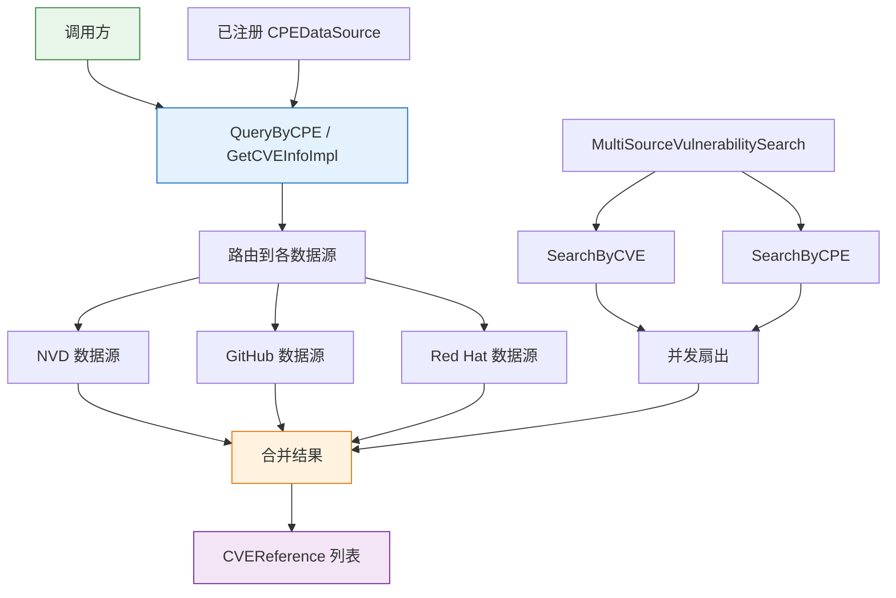

# 🗄️ 数据源（Datasource）

`datasource` 模块为漏洞数据源（NVD、GitHub 安全公告、Red Hat CVE）提供统一抽象。它定义了带可选认证与缓存的 HTTP 客户端 `VulnDataSource`、可并发查询多个数据源的 `MultiSourceVulnerabilitySearch`，以及用于将自定义数据提供者接入全局查询路径的 `CPEDataSource` 接口与注册函数。

## 类型：DataSourceType

```go
type DataSourceType string
```

字符串枚举，标识漏洞数据源类型。定义的常量：

| 常量 | 值 | 说明 |
| --- | --- | --- |
| `DataSourceNVD` | `"NVD"` | NVD（国家漏洞数据库） |
| `DataSourceMITRE` | `"MITRE"` | MITRE CVE 数据库 |
| `DataSourceGitHub` | `"GitHub"` | GitHub 安全公告 |
| `DataSourceRedHatCVE` | `"RedHat"` | Red Hat CVE 数据库 |
| `DataSourceOWASP` | `"OWASP"` | OWASP 数据源 |
| `DataSourceCustom` | `"Custom"` | 自定义数据源 |

## 类型：VulnDataSource

```go
type VulnDataSource struct {
    Type            DataSourceType
    Name            string
    Description     string
    URL             string
    Authentication  *DataSourceAuth
    Client          *http.Client
    LastUpdated     time.Time
    CacheSettings   *CacheSettings
    Options         map[string]interface{}
}
```

表示单个漏洞数据源。`Client` 默认为 60 秒超时的 HTTP 客户端。`CacheSettings` 默认启用缓存、24 小时过期。`Options` 是用于存放数据源特定配置的任意键值映射。

## 类型：DataSourceAuth

```go
type DataSourceAuth struct {
    APIKey   string
    Username string
    Password string
    Token    string
    Headers  map[string]string
}
```

保存随请求发送给数据源的凭证。`Headers` 用于携带任意额外的 HTTP 头（如 `Authorization`）。

## 类型：CacheSettings

```go
type CacheSettings struct {
    Enabled          bool
    Directory        string
    ExpiryHours      int
    FileNameTemplate string
}
```

控制已获取响应的磁盘缓存。`Enabled` 切换缓存开关；`Directory` 是缓存根目录；`ExpiryHours` 是以小时为单位的 TTL；`FileNameTemplate` 是可选的文件名模板。

## 类型：MultiSourceVulnerabilitySearch

```go
type MultiSourceVulnerabilitySearch struct {
    Sources          []*VulnDataSource
    ConcurrencyLevel int
    TimeoutSeconds   int
    MergeResults     bool
}
```

并发查询多个 `VulnDataSource` 实例并可选地合并结果。`NewMultiSourceSearch` 将 `ConcurrencyLevel` 默认设为 3、`TimeoutSeconds` 设为 30、`MergeResults` 设为 `true`。

## 类型：CPEDataSource

```go
type CPEDataSource interface {
    QueryByCPE(cpe string) ([]string, error)
    GetCVEInfo(cveID string) (*CVEReference, error)
}
```

任何 CPE 数据提供者实现此接口后即可接入全局查询路径。实现通过 `RegisterDataSource` 注册，由包级函数 `QueryByCPE` / `GetCVEInfoImpl` 查询。

## 🆕 NewVulnDataSource

```go
func NewVulnDataSource(sourceType DataSourceType, name, description, url string) *VulnDataSource
```

创建一个 `VulnDataSource`，内置 60 秒超时的 HTTP 客户端和启用的缓存（24 小时过期，`./cache` 目录）。`Options` 初始化为空映射。

| 参数 | 类型 | 说明 |
| --- | --- | --- |
| `sourceType` | `DataSourceType` | `DataSource*` 常量之一 |
| `name` | `string` | 人类可读的数据源名称 |
| `description` | `string` | 简短描述 |
| `url` | `string` | 数据源基础 URL |

| 返回值 | 类型 | 说明 |
| --- | --- | --- |
| #1 | `*VulnDataSource` | 新的数据源 |

```go
ds := cpeskills.NewVulnDataSource(
    cpeskills.DataSourceNVD,
    "NVD",
    "国家漏洞数据库",
    "https://services.nvd.nist.gov/rest/json/cves/2.0",
)
```

## 🔐 SetAuthentication

```go
func (ds *VulnDataSource) SetAuthentication(auth *DataSourceAuth)
```

为数据源附加认证凭证。后续的 `FetchData` 调用会携带这些凭证。

| 参数 | 类型 | 说明 |
| --- | --- | --- |
| `auth` | `*DataSourceAuth` | 要附加的凭证 |

```go
ds.SetAuthentication(&cpeskills.DataSourceAuth{APIKey: "nvd-api-key"})
```

## 💾 SetCacheSettings

```go
func (ds *VulnDataSource) SetCacheSettings(cache *CacheSettings)
```

替换数据源的缓存设置。

| 参数 | 类型 | 说明 |
| --- | --- | --- |
| `cache` | `*CacheSettings` | 新的缓存设置 |

```go
ds.SetCacheSettings(&cpeskills.CacheSettings{
    Enabled:     true,
    Directory:   "/var/cache/cpe",
    ExpiryHours: 12,
})
```

## 🌐 FetchData

```go
func (ds *VulnDataSource) FetchData(endpoint string) ([]byte, error)
```

对 `URL + endpoint` 发起 HTTP GET，应用认证头和缓存设置，返回原始响应体。

| 参数 | 类型 | 说明 |
| --- | --- | --- |
| `endpoint` | `string` | 追加到数据源 `URL` 之后的路径 |

| 返回值 | 类型 | 说明 |
| --- | --- | --- |
| #1 | `[]byte` | 原始响应体 |
| #2 | `error` | 网络或 HTTP 错误 |

```go
body, err := ds.FetchData("/cves?cveId=CVE-2021-44228")
```

## 📋 GetVulnerabilities

```go
func (ds *VulnDataSource) GetVulnerabilities(params map[string]string) ([]*CVEReference, error)
```

以给定查询参数查询数据源，返回解析后的 `CVEReference` 记录。响应解析按数据源类型（NVD、GitHub、Red Hat）分发。

| 参数 | 类型 | 说明 |
| --- | --- | --- |
| `params` | `map[string]string` | 数据源特定的查询参数 |

| 返回值 | 类型 | 说明 |
| --- | --- | --- |
| #1 | `[]*CVEReference` | 解析后的漏洞记录 |
| #2 | `error` | 获取或解析错误 |

```go
cves, err := ds.GetVulnerabilities(map[string]string{"keyword": "log4j"})
```

## 🔎 GetVulnerabilityById

```go
func (ds *VulnDataSource) GetVulnerabilityById(cveID string) (*CVEReference, error)
```

按 CVE ID 从数据源获取单个漏洞。查询前会先用 `cve.Format` 标准化 ID。

| 参数 | 类型 | 说明 |
| --- | --- | --- |
| `cveID` | `string` | CVE 标识符，如 `"CVE-2021-44228"` |

| 返回值 | 类型 | 说明 |
| --- | --- | --- |
| #1 | `*CVEReference` | 匹配的漏洞，未找到则为 `nil` |
| #2 | `error` | 获取或解析错误 |

```go
cve, err := ds.GetVulnerabilityById("CVE-2021-44228")
```

## 🧩 SearchVulnerabilitiesByCPE

```go
func (ds *VulnDataSource) SearchVulnerabilitiesByCPE(cpe *CPE) ([]*CVEReference, error)
```

在数据源中搜索影响给定 CPE 的漏洞。

| 参数 | 类型 | 说明 |
| --- | --- | --- |
| `cpe` | `*CPE` | 要搜索漏洞的 CPE |

| 返回值 | 类型 | 说明 |
| --- | --- | --- |
| #1 | `[]*CVEReference` | 影响该 CPE 的漏洞 |
| #2 | `error` | 搜索错误 |

```go
cpe, _ := cpeskills.ParseCpe23("cpe:2.3:a:apache:log4j:2.0:*:*:*:*:*:*:*")
cves, err := ds.SearchVulnerabilitiesByCPE(cpe)
```

## 🔀 NewMultiSourceSearch

```go
func NewMultiSourceSearch(sources []*VulnDataSource) *MultiSourceVulnerabilitySearch
```

基于给定数据源构建一个多源搜索器，默认并发度为 3、超时 30 秒、结果合并开启。

| 参数 | 类型 | 说明 |
| --- | --- | --- |
| `sources` | `[]*VulnDataSource` | 要并发查询的数据源 |

| 返回值 | 类型 | 说明 |
| --- | --- | --- |
| #1 | `*MultiSourceVulnerabilitySearch` | 新的搜索器 |

```go
ms := cpeskills.NewMultiSourceSearch([]*cpeskills.VulnDataSource{nvd, redhat})
```

## 🔍 SearchByCVE

```go
func (ms *MultiSourceVulnerabilitySearch) SearchByCVE(cveID string) ([]*CVEReference, error)
```

并发查询每个数据源中给定 CVE ID 的信息，`MergeResults` 为 `true` 时按 CVE ID 去重合并，并遵循 `TimeoutSeconds` 与 `ConcurrencyLevel`。

| 参数 | 类型 | 说明 |
| --- | --- | --- |
| `cveID` | `string` | CVE 标识符 |

| 返回值 | 类型 | 说明 |
| --- | --- | --- |
| #1 | `[]*CVEReference` | 合并后的漏洞记录 |
| #2 | `error` | 汇总的搜索错误 |

```go
cves, err := ms.SearchByCVE("CVE-2021-44228")
```

## 🔍 SearchByCPE

```go
func (ms *MultiSourceVulnerabilitySearch) SearchByCPE(cpe *CPE) ([]*CVEReference, error)
```

并发查询每个数据源中影响给定 CPE 的漏洞并合并结果。

| 参数 | 类型 | 说明 |
| --- | --- | --- |
| `cpe` | `*CPE` | 要搜索的 CPE |

| 返回值 | 类型 | 说明 |
| --- | --- | --- |
| #1 | `[]*CVEReference` | 合并后的漏洞记录 |
| #2 | `error` | 搜索错误 |

```go
cves, err := ms.SearchByCPE(cpe)
```

## 🏗️ CreateNVDDataSource

```go
func CreateNVDDataSource(apiKey string) *VulnDataSource
```

返回一个预配置的 NVD `VulnDataSource`（API 2.0 基础 URL）。当 `apiKey` 非空时作为认证附加，以享受更高的速率限制。

| 参数 | 类型 | 说明 |
| --- | --- | --- |
| `apiKey` | `string` | 可选的 NVD API 密钥；空字符串表示匿名访问 |

| 返回值 | 类型 | 说明 |
| --- | --- | --- |
| #1 | `*VulnDataSource` | 已配置的 NVD 数据源 |

```go
nvd := cpeskills.CreateNVDDataSource("my-nvd-api-key")
```

## 🐙 CreateGitHubDataSource

```go
func CreateGitHubDataSource(token string) *VulnDataSource
```

返回一个预配置的 GitHub 安全公告 `VulnDataSource`。`token` 作为 GraphQL API 访问的认证附加。

| 参数 | 类型 | 说明 |
| --- | --- | --- |
| `token` | `string` | GitHub 个人访问令牌 |

| 返回值 | 类型 | 说明 |
| --- | --- | --- |
| #1 | `*VulnDataSource` | 已配置的 GitHub 数据源 |

```go
gh := cpeskills.CreateGitHubDataSource("ghp_xxx")
```

## 🎩 CreateRedHatDataSource

```go
func CreateRedHatDataSource() *VulnDataSource
```

返回一个预配置的 Red Hat CVE `VulnDataSource`。Red Hat 公开 CVE API 无需认证。

| 返回值 | 类型 | 说明 |
| --- | --- | --- |
| #1 | `*VulnDataSource` | 已配置的 Red Hat 数据源 |

```go
rh := cpeskills.CreateRedHatDataSource()
```

## ⚡ CreateDefaultMultiSourceSearch

```go
func CreateDefaultMultiSourceSearch() *MultiSourceVulnerabilitySearch
```

返回一个预配置了默认 NVD 与 Red Hat 数据源的 `MultiSourceVulnerabilitySearch`。

| 返回值 | 类型 | 说明 |
| --- | --- | --- |
| #1 | `*MultiSourceVulnerabilitySearch` | 默认多源搜索器 |

```go
ms := cpeskills.CreateDefaultMultiSourceSearch()
cves, _ := ms.SearchByCVE("CVE-2021-44228")
```

## 🌐 QueryByCPE

```go
func QueryByCPE(cpe string) ([]string, error)
```

包级辅助函数，查询所有已注册数据源中与给定 CPE 字符串相关的 CVE ID。使用前须先初始化数据源（例如通过 `DownloadAllNVDData`）。

| 参数 | 类型 | 说明 |
| --- | --- | --- |
| `cpe` | `string` | CPE 标识符，2.2 或 2.3 格式 |

| 返回值 | 类型 | 说明 |
| --- | --- | --- |
| #1 | `[]string` | 相关 CVE ID |
| #2 | `error` | 查询错误 |

```go
cveIDs, err := cpeskills.QueryByCPE("cpe:2.3:a:apache:log4j:2.0:*:*:*:*:*:*:*")
```

## ℹ️ GetCVEInfoImpl

```go
func GetCVEInfoImpl(cveID string) (*CVEReference, error)
```

包级辅助函数，从已注册数据源获取某个 CVE ID 的详细信息。查询前会先把 ID 标准化为标准格式。

| 参数 | 类型 | 说明 |
| --- | --- | --- |
| `cveID` | `string` | CVE 标识符，如 `"CVE-2021-44228"` |

| 返回值 | 类型 | 说明 |
| --- | --- | --- |
| #1 | `*CVEReference` | 漏洞详情，未找到则为 `nil` |
| #2 | `error` | 查询错误 |

```go
info, err := cpeskills.GetCVEInfoImpl("CVE-2021-44228")
```

## 📥 RegisterDataSource

```go
func RegisterDataSource(dataSource CPEDataSource)
```

注册一个自定义的 `CPEDataSource`，使包级查询函数能够使用它。

| 参数 | 类型 | 说明 |
| --- | --- | --- |
| `dataSource` | `CPEDataSource` | 实现该接口的自定义数据源 |

```go
cpeskills.RegisterDataSource(myDataSource)
```

## 🧹 ClearDataSources

```go
func ClearDataSources()
```

移除所有已注册的数据源，重置全局查询状态。

```go
cpeskills.ClearDataSources()
```

## 🧭 数据源查询流程


