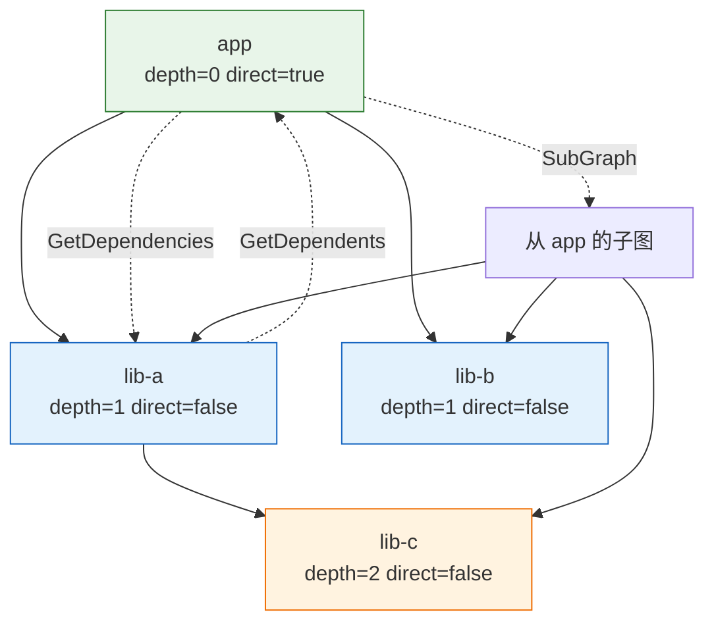

# 🕸️ 依赖图

`DependencyGraph` 建模 SBOM 组件之间的依赖关系，支持传递性漏洞分析与可达性判断。它是以节点 ID 为键的邻接表图。本模块声明图与节点类型，以及构建、遍历、查询图的操作。

## 类型：DependencyGraph

```go
type DependencyGraph struct {
    Nodes map[string]*DependencyNode `json:"nodes"`
    Edges map[string][]string        `json:"edges"`
}
```

| 字段 | 类型 | 说明 |
| --- | --- | --- |
| `Nodes` | `map[string]*DependencyNode` | 图中所有节点（nodeID → 节点） |
| `Edges` | `map[string][]string` | 边：nodeID → 所依赖的 nodeID 列表 |

## 类型：DependencyNode

```go
type DependencyNode struct {
    ID        string          `json:"id"`
    Component *SBOMComponent  `json:"component"`
    Depth     int             `json:"depth"`
    Direct    bool            `json:"direct"`
}
```

| 字段 | 类型 | 说明 |
| --- | --- | --- |
| `ID` | `string` | 节点唯一标识符 |
| `Component` | `*SBOMComponent` | 关联的 SBOM 组件 |
| `Depth` | `int` | 在依赖树中的深度（0 = 直接依赖） |
| `Direct` | `bool` | 是否为直接依赖 |

## 🆕 NewDependencyGraph

```go
func NewDependencyGraph() *DependencyGraph
```

创建新的空依赖图，`Nodes` 与 `Edges` map 均已初始化。

| 返回值 | 类型 | 说明 |
| --- | --- | --- |
| #1 | `*DependencyGraph` | 新的空图 |

```go
g := cpeskills.NewDependencyGraph()
```

## ➕ AddComponent

```go
func (g *DependencyGraph) AddComponent(component *SBOMComponent, dependencies []*SBOMComponent)
```

向图中添加一个组件及其依赖。该组件注册为直接节点（深度 0）；每个依赖注册为传递性节点（深度 1），并记录从组件到各依赖的边。节点 ID 来自 `component.BomRef`，为空时自动生成。

| 参数 | 类型 | 说明 |
| --- | --- | --- |
| `component` | `*SBOMComponent` | 待添加的组件 |
| `dependencies` | `[]*SBOMComponent` | 该组件的直接依赖 |

```go
g.AddComponent(app, []*cpeskills.SBOMComponent{dep1, dep2})
```

## ➕ AddNode

```go
func (g *DependencyGraph) AddNode(component *SBOMComponent)
```

将独立组件添加为直接节点，不添加任何边。节点 ID 来自 `component.BomRef`，为空时自动生成。

| 参数 | 类型 | 说明 |
| --- | --- | --- |
| `component` | `*SBOMComponent` | 待添加的组件 |

```go
g.AddNode(root)
```

## 🔗 AddEdge

```go
func (g *DependencyGraph) AddEdge(from, to string)
```

添加从 `from` 到 `to` 的依赖边。若任一节点尚不存在，则为其创建空节点（`from` 标记为直接，`to` 标记为传递）。

| 参数 | 类型 | 说明 |
| --- | --- | --- |
| `from` | `string` | 依赖方节点 ID |
| `to` | `string` | 被依赖节点 ID |

```go
g.AddEdge("app", "lib-a")
```

## 👇 GetDependencies

```go
func (g *DependencyGraph) GetDependencies(nodeID string) []*DependencyNode
```

返回 `nodeID` 的直接依赖节点；该节点无出边时返回 `nil`。

| 参数 | 类型 | 说明 |
| --- | --- | --- |
| `nodeID` | `string` | 待查询的节点 |

| 返回值 | 类型 | 说明 |
| --- | --- | --- |
| #1 | `[]*DependencyNode` | 直接依赖节点，或 `nil` |

```go
deps := g.GetDependencies("app")
for _, d := range deps {
    fmt.Println(d.ID)
}
```

## 👆 GetDependents

```go
func (g *DependencyGraph) GetDependents(nodeID string) []*DependencyNode
```

返回依赖 `nodeID` 的节点（反向依赖）。

| 参数 | 类型 | 说明 |
| --- | --- | --- |
| `nodeID` | `string` | 待查询的节点 |

| 返回值 | 类型 | 说明 |
| --- | --- | --- |
| #1 | `[]*DependencyNode` | 依赖 `nodeID` 的节点 |

```go
revDeps := g.GetDependents("lib-a")
```

## 🛣️ GetDependencyPath

```go
func (g *DependencyGraph) GetDependencyPath(from, to string) ([]string, error)
```

用 BFS 查找从 `from` 到 `to` 的依赖路径，返回按顺序排列的节点 ID 列表。

| 参数 | 类型 | 说明 |
| --- | --- | --- |
| `from` | `string` | 起始节点 ID |
| `to` | `string` | 目标节点 ID |

| 返回值 | 类型 | 说明 |
| --- | --- | --- |
| #1 | `[]string` | 从 `from` 到 `to` 的节点 ID 路径 |
| #2 | `error` | 节点缺失或无路径时非 nil |

```go
path, err := g.GetDependencyPath("app", "lib-c")
if err != nil {
    log.Fatal(err)
}
fmt.Println(strings.Join(path, " -> "))
```

## 🔢 TopologicalSort

```go
func (g *DependencyGraph) TopologicalSort() ([]*DependencyNode, error)
```

返回图节点的拓扑排序。图含环时返回错误。

| 返回值 | 类型 | 说明 |
| --- | --- | --- |
| #1 | `[]*DependencyNode` | 拓扑序节点 |
| #2 | `error` | 图含环时非 nil |

```go
sorted, err := g.TopologicalSort()
if err != nil {
    log.Fatal(err) // graph contains a cycle
}
```

## 🌲 SubGraph

```go
func (g *DependencyGraph) SubGraph(rootID string) *DependencyGraph
```

用 DFS 提取从 `rootID` 可达的子图。

| 参数 | 类型 | 说明 |
| --- | --- | --- |
| `rootID` | `string` | 子图根节点 ID |

| 返回值 | 类型 | 说明 |
| --- | --- | --- |
| #1 | `*DependencyGraph` | 仅含可达节点与边的新图 |

```go
sub := g.SubGraph("app")
```

## 🐛 FindTransitiveVulnerabilities

```go
func (g *DependencyGraph) FindTransitiveVulnerabilities(cveData *NVDCPEData) []*VulnerabilityFinding
```

遍历图，对每个 CPE 命中 `cveData` 中 CVE 的组件（含直接与传递依赖）返回漏洞发现。每个发现的 `Reachability` 依据节点 `Direct` 标志设为 `"direct"` 或 `"transitive"`。

| 参数 | 类型 | 说明 |
| --- | --- | --- |
| `cveData` | `*NVDCPEData` | 待查询的 NVD CPE 数据集 |

| 返回值 | 类型 | 说明 |
| --- | --- | --- |
| #1 | `[]*VulnerabilityFinding` | 受影响组件的发现 |

```go
findings := g.FindTransitiveVulnerabilities(nvdData)
```

## 🔢 NodeCount

```go
func (g *DependencyGraph) NodeCount() int
```

返回图中节点数量。

| 返回值 | 类型 | 说明 |
| --- | --- | --- |
| #1 | `int` | 节点数 |

```go
fmt.Println(g.NodeCount())
```

## 🔢 EdgeCount

```go
func (g *DependencyGraph) EdgeCount() int
```

返回图中边的总数。

| 返回值 | 类型 | 说明 |
| --- | --- | --- |
| #1 | `int` | 边数 |

```go
fmt.Println(g.EdgeCount())
```

## 👇 GetDirectDependencies

```go
func (g *DependencyGraph) GetDirectDependencies() []*DependencyNode
```

返回所有直接依赖节点，按 `Depth` 升序排列。

| 返回值 | 类型 | 说明 |
| --- | --- | --- |
| #1 | `[]*DependencyNode` | 按深度排序的直接依赖节点 |

```go
direct := g.GetDirectDependencies()
```

## 👇 GetTransitiveDependencies

```go
func (g *DependencyGraph) GetTransitiveDependencies() []*DependencyNode
```

返回所有传递性依赖节点（`Direct == false` 的节点）。

| 返回值 | 类型 | 说明 |
| --- | --- | --- |
| #1 | `[]*DependencyNode` | 传递性依赖节点 |

```go
trans := g.GetTransitiveDependencies()
```

## 📊 ComputeDepths

```go
func (g *DependencyGraph) ComputeDepths()
```

从每个根节点（无入边的节点）出发用 BFS 计算所有节点的 `Depth`。根节点深度为 0，其直接依赖为 1，依此类推。

```go
g.ComputeDepths()
for _, n := range g.Nodes {
    fmt.Println(n.ID, n.Depth)
}
```

## 📐 依赖图示意图


