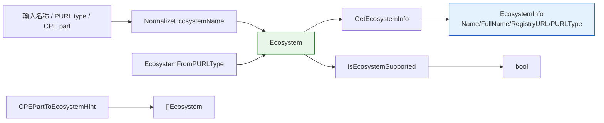

# 🌐 软件生态系统

`Ecosystem` 标识软件包所属的包管理器/注册表，是 PURL 与 SBOM 处理的核心概念。本模块声明 `Ecosystem` 类型、所有导出的生态系统常量、`EcosystemInfo` 元数据结构体，以及查询、标准化和基于 CPE 推断的辅助函数。

## 类型：Ecosystem

```go
type Ecosystem string
```

包生态系统的字符串类型标识符。

## 常量

```go
const (
    EcosystemNPM      Ecosystem = "npm"
    EcosystemMaven    Ecosystem = "maven"
    EcosystemPyPI     Ecosystem = "pypi"
    EcosystemGo       Ecosystem = "golang"
    EcosystemNuGet    Ecosystem = "nuget"
    EcosystemDocker   Ecosystem = "docker"
    EcosystemRubyGems Ecosystem = "gem"
    EcosystemCargo    Ecosystem = "cargo"
    EcosystemComposer Ecosystem = "composer"
    EcosystemConan    Ecosystem = "conan"
    EcosystemConda    Ecosystem = "conda"
    EcosystemHex      Ecosystem = "hex"
    EcosystemPub      Ecosystem = "pub"
    EcosystemSwift    Ecosystem = "swift"
    EcosystemAlpine   Ecosystem = "alpine"
    EcosystemDebian   Ecosystem = "deb"
    EcosystemRPM      Ecosystem = "rpm"
    EcosystemGeneric  Ecosystem = "generic"
)
```

| 常量 | 值 | 说明 |
| --- | --- | --- |
| `EcosystemNPM` | `npm` | Node.js 包管理器（npm） |
| `EcosystemMaven` | `maven` | Java/Kotlin 项目（Maven Central、Google Android） |
| `EcosystemPyPI` | `pypi` | Python 包索引 |
| `EcosystemGo` | `golang` | Go 模块 |
| `EcosystemNuGet` | `nuget` | .NET 包管理器 |
| `EcosystemDocker` | `docker` | Docker 容器镜像 |
| `EcosystemRubyGems` | `gem` | Ruby 包管理器 |
| `EcosystemCargo` | `cargo` | Rust 包管理器 |
| `EcosystemComposer` | `composer` | PHP 包管理器 |
| `EcosystemConan` | `conan` | C/C++ 包管理器 |
| `EcosystemConda` | `conda` | 跨语言包管理器 |
| `EcosystemHex` | `hex` | Elixir/Erlang 生态系统 |
| `EcosystemPub` | `pub` | Dart/Flutter 包管理器 |
| `EcosystemSwift` | `swift` | Swift 包管理器 |
| `EcosystemAlpine` | `alpine` | Alpine Linux（apk）包 |
| `EcosystemDebian` | `deb` | Debian/Ubuntu（deb）包 |
| `EcosystemRPM` | `rpm` | Red Hat/Fedora（rpm）包 |
| `EcosystemGeneric` | `generic` | 通用/未知生态系统 |

## 类型：EcosystemInfo

```go
type EcosystemInfo struct {
    Name        string
    FullName    string
    RegistryURL string
    PURLType    string
}
```

| 字段 | 类型 | 说明 |
| --- | --- | --- |
| `Name` | `string` | 生态系统名称 |
| `FullName` | `string` | 生态系统全名 |
| `RegistryURL` | `string` | 默认注册表 URL |
| `PURLType` | `string` | PURL `type` 字段值 |

## ℹ️ GetEcosystemInfo

```go
func GetEcosystemInfo(ecosystem Ecosystem) (EcosystemInfo, error)
```

返回指定生态系统的元数据。

| 参数 | 类型 | 说明 |
| --- | --- | --- |
| `ecosystem` | `Ecosystem` | 待查询的生态系统 |

| 返回值 | 类型 | 说明 |
| --- | --- | --- |
| #1 | `EcosystemInfo` | 生态系统元数据，出错时为零值 |
| #2 | `error` | 生态系统未知时非 nil |

```go
info, err := cpeskills.GetEcosystemInfo(cpeskills.EcosystemMaven)
if err != nil {
    log.Fatal(err)
}
fmt.Println(info.FullName, info.RegistryURL)
// Maven Central https://repo.maven.apache.org/maven2
```

## 📜 ListEcosystems

```go
func ListEcosystems() []Ecosystem
```

返回所有已注册的生态系统。顺序未指定（按 map 迭代顺序）。

| 返回值 | 类型 | 说明 |
| --- | --- | --- |
| #1 | `[]Ecosystem` | 所有已注册生态系统 |

```go
for _, eco := range cpeskills.ListEcosystems() {
    fmt.Println(eco)
}
```

## 🔁 EcosystemFromPURLType

```go
func EcosystemFromPURLType(purlType string) Ecosystem
```

将 PURL `type` 字段映射为 `Ecosystem`，无匹配时返回 `EcosystemGeneric`。

| 参数 | 类型 | 说明 |
| --- | --- | --- |
| `purlType` | `string` | PURL type 字符串 |

| 返回值 | 类型 | 说明 |
| --- | --- | --- |
| #1 | `Ecosystem` | 匹配的生态系统，或 `EcosystemGeneric` |

```go
fmt.Println(cpeskills.EcosystemFromPURLType("cargo")) // cargo
fmt.Println(cpeskills.EcosystemFromPURLType("unknown")) // generic
```

## ✅ IsEcosystemSupported

```go
func IsEcosystemSupported(ecosystem Ecosystem) bool
```

检查生态系统是否已注册。

| 参数 | 类型 | 说明 |
| --- | --- | --- |
| `ecosystem` | `Ecosystem` | 待检查的生态系统 |

| 返回值 | 类型 | 说明 |
| --- | --- | --- |
| #1 | `bool` | 已注册时为 `true` |

```go
fmt.Println(cpeskills.IsEcosystemSupported(cpeskills.EcosystemNPM)) // true
```

## 💡 CPEPartToEcosystemHint

```go
func CPEPartToEcosystemHint(part *Part) []Ecosystem
```

按启发式返回 CPE `Part` 可能所属的生态系统列表，用于辅助 CPE→PURL 映射。应用程序（`a`）映射到大多数包生态系统；操作系统（`o`）映射到 Linux 发行版生态系统；硬件（`h`）映射到 `EcosystemGeneric`。`part` 为 nil 时返回 `nil`。

| 参数 | 类型 | 说明 |
| --- | --- | --- |
| `part` | `*Part` | CPE part |

| 返回值 | 类型 | 说明 |
| --- | --- | --- |
| #1 | `[]Ecosystem` | 候选生态系统，`part` 为 nil 时为 `nil` |

```go
hints := cpeskills.CPEPartToEcosystemHint(cpeskills.PartApplication)
fmt.Println(hints) // [npm maven pypi golang ...]
```

## 🧹 NormalizeEcosystemName

```go
func NormalizeEcosystemName(name string) (Ecosystem, error)
```

标准化生态系统名称，支持常见别名，如 `node.js` → `EcosystemNPM`、`java` → `EcosystemMaven`、`python` → `EcosystemPyPI`。无别名匹配时回退为 `Ecosystem(name)` 直接匹配。

| 参数 | 类型 | 说明 |
| --- | --- | --- |
| `name` | `string` | 待标准化的名称或别名 |

| 返回值 | 类型 | 说明 |
| --- | --- | --- |
| #1 | `Ecosystem` | 标准化后的生态系统，出错时为空 |
| #2 | `error` | 名称未知时非 nil |

```go
eco, err := cpeskills.NormalizeEcosystemName("node.js")
if err != nil {
    log.Fatal(err)
}
fmt.Println(eco) // npm
```

## 📐 生态系统注册表图


