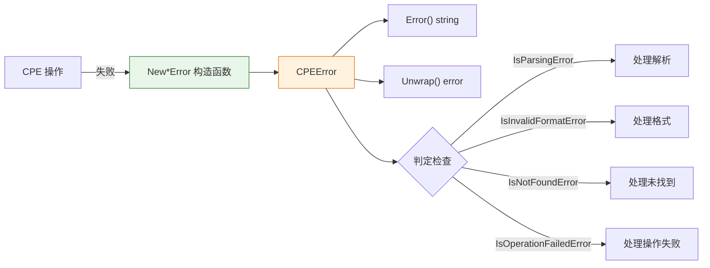

# ⚠️ 错误类型

`cpeskills` 包提供统一的错误类型 `CPEError`，以及一组按类型构造的构造函数和判定辅助函数，使调用者可以按具体失败类别分支处理。

## 类型：ErrorType

```go
type ErrorType int
```

枚举 CPE 操作过程中可能出现的错误类别。

### 常量

| 常量 | 类型 | 值 | 说明 |
| --- | --- | --- | --- |
| `ErrorTypeParsingFailed` | `ErrorType` | `0` (iota) | CPE 字符串解析失败 |
| `ErrorTypeInvalidFormat` | `ErrorType` | `1` | CPE 格式无效 |
| `ErrorTypeInvalidPart` | `ErrorType` | `2` | CPE 部件值无效 |
| `ErrorTypeInvalidAttribute` | `ErrorType` | `3` | CPE 属性值无效 |
| `ErrorTypeNotFound` | `ErrorType` | `4` | 未找到请求的资源或对象 |
| `ErrorTypeOperationFailed` | `ErrorType` | `5` | CPE 相关操作执行失败 |

```go
_ = cpeskills.ErrorTypeParsingFailed
_ = cpeskills.ErrorTypeInvalidFormat
_ = cpeskills.ErrorTypeInvalidPart
_ = cpeskills.ErrorTypeInvalidAttribute
_ = cpeskills.ErrorTypeNotFound
_ = cpeskills.ErrorTypeOperationFailed
```

## 类型：CPEError

```go
type CPEError struct {
    Type      ErrorType
    Message   string
    CPEString string
    Err       error
}
```

所有 CPE 操作的统一错误结构体。

| 字段 | 类型 | 说明 |
| --- | --- | --- |
| `Type` | `ErrorType` | 错误类型 |
| `Message` | `string` | 人类可读的错误描述 |
| `CPEString` | `string` | 与错误相关的 CPE 字符串 |
| `Err` | `error` | 导致此错误的原始错误（若有） |

## 📝 Error

```go
func (e *CPEError) Error() string
```

实现标准 `error` 接口。若 `CPEString` 已设置，消息格式为 `Message: CPEString`。

| 返回值 | 类型 | 说明 |
| --- | --- | --- |
| 第 1 个 | `string` | 格式化后的错误消息 |

```go
err := cpeskills.NewInvalidFormatError("cpe:2.3:INVALID FORMAT")
fmt.Println(err.Error()) // invalid CPE format: cpe:2.3:INVALID FORMAT
```

## 🔗 Unwrap

```go
func (e *CPEError) Unwrap() error
```

返回被包装的原始错误，支持 `errors.Is` 和 `errors.As`（Go 1.13+ 错误链）。

| 返回值 | 类型 | 说明 |
| --- | --- | --- |
| 第 1 个 | `error` | 原始错误，不存在则为 `nil` |

```go
if cpeErr, ok := err.(*cpeskills.CPEError); ok {
    if inner := cpeErr.Unwrap(); inner != nil {
        log.Println("caused by:", inner)
    }
}
```

## 🆕 NewParsingError

```go
func NewParsingError(cpeString string, err error) *CPEError
```

创建表示 CPE 字符串解析失败的错误。

| 参数 | 类型 | 说明 |
| --- | --- | --- |
| `cpeString` | `string` | 无法解析的 CPE 字符串 |
| `err` | `error` | 导致解析失败的原始错误 |

| 返回值 | 类型 | 说明 |
| --- | --- | --- |
| 第 1 个 | `*CPEError` | `Type == ErrorTypeParsingFailed` 的 CPEError |

```go
return cpeskills.NewParsingError(cpeStr, err)
```

## 🚫 NewInvalidFormatError

```go
func NewInvalidFormatError(cpeString string) *CPEError
```

创建表示 CPE 格式无效的错误。

| 参数 | 类型 | 说明 |
| --- | --- | --- |
| `cpeString` | `string` | 格式无效的 CPE 字符串 |

| 返回值 | 类型 | 说明 |
| --- | --- | --- |
| 第 1 个 | `*CPEError` | `Type == ErrorTypeInvalidFormat` 的 CPEError |

```go
return cpeskills.NewInvalidFormatError(cpeStr)
```

## 🧩 NewInvalidPartError

```go
func NewInvalidPartError(part string) *CPEError
```

创建表示 CPE 部件值无效的错误。

| 参数 | 类型 | 说明 |
| --- | --- | --- |
| `part` | `string` | 无效的部件值 |

| 返回值 | 类型 | 说明 |
| --- | --- | --- |
| 第 1 个 | `*CPEError` | `Type == ErrorTypeInvalidPart` 的 CPEError |

```go
return cpeskills.NewInvalidPartError(part)
```

## 🏷️ NewInvalidAttributeError

```go
func NewInvalidAttributeError(attribute, value string) *CPEError
```

创建表示 CPE 属性值无效的错误。

| 参数 | 类型 | 说明 |
| --- | --- | --- |
| `attribute` | `string` | 属性名称 |
| `value` | `string` | 无效的属性值 |

| 返回值 | 类型 | 说明 |
| --- | --- | --- |
| 第 1 个 | `*CPEError` | `Type == ErrorTypeInvalidAttribute` 的 CPEError |

```go
return cpeskills.NewInvalidAttributeError("product", product)
```

## 🔍 NewNotFoundError

```go
func NewNotFoundError(what string) *CPEError
```

创建表示资源未找到的错误。

| 参数 | 类型 | 说明 |
| --- | --- | --- |
| `what` | `string` | 未找到的资源描述 |

| 返回值 | 类型 | 说明 |
| --- | --- | --- |
| 第 1 个 | `*CPEError` | `Type == ErrorTypeNotFound` 的 CPEError |

```go
return cpeskills.NewNotFoundError(fmt.Sprintf("CPE with ID %s", cpeID))
```

## ⚙️ NewOperationFailedError

```go
func NewOperationFailedError(operation string, err error) *CPEError
```

创建表示操作执行失败的错误。

| 参数 | 类型 | 说明 |
| --- | --- | --- |
| `operation` | `string` | 失败操作的描述 |
| `err` | `error` | 导致操作失败的原始错误 |

| 返回值 | 类型 | 说明 |
| --- | --- | --- |
| 第 1 个 | `*CPEError` | `Type == ErrorTypeOperationFailed` 的 CPEError |

```go
return cpeskills.NewOperationFailedError("save CPE to storage", err)
```

## ❓ IsParsingError

```go
func IsParsingError(err error) bool
```

判断 `err` 是否为 `Type == ErrorTypeParsingFailed` 的 `*CPEError`。

| 参数 | 类型 | 说明 |
| --- | --- | --- |
| `err` | `error` | 要检查的错误 |

| 返回值 | 类型 | 说明 |
| --- | --- | --- |
| 第 1 个 | `bool` | 是解析错误时返回 `true` |

```go
if cpeskills.IsParsingError(err) {
    log.Printf("parsing error: %v", err)
}
```

## ❓ IsInvalidFormatError

```go
func IsInvalidFormatError(err error) bool
```

判断 `err` 是否为 `Type == ErrorTypeInvalidFormat` 的 `*CPEError`。

| 参数 | 类型 | 说明 |
| --- | --- | --- |
| `err` | `error` | 要检查的错误 |

| 返回值 | 类型 | 说明 |
| --- | --- | --- |
| 第 1 个 | `bool` | 是格式无效错误时返回 `true` |

```go
if cpeskills.IsInvalidFormatError(err) { /* ... */ }
```

## ❓ IsInvalidPartError

```go
func IsInvalidPartError(err error) bool
```

判断 `err` 是否为 `Type == ErrorTypeInvalidPart` 的 `*CPEError`。

| 参数 | 类型 | 说明 |
| --- | --- | --- |
| `err` | `error` | 要检查的错误 |

| 返回值 | 类型 | 说明 |
| --- | --- | --- |
| 第 1 个 | `bool` | 是部件无效错误时返回 `true` |

```go
if cpeskills.IsInvalidPartError(err) { /* ... */ }
```

## ❓ IsInvalidAttributeError

```go
func IsInvalidAttributeError(err error) bool
```

判断 `err` 是否为 `Type == ErrorTypeInvalidAttribute` 的 `*CPEError`。

| 参数 | 类型 | 说明 |
| --- | --- | --- |
| `err` | `error` | 要检查的错误 |

| 返回值 | 类型 | 说明 |
| --- | --- | --- |
| 第 1 个 | `bool` | 是属性无效错误时返回 `true` |

```go
if cpeskills.IsInvalidAttributeError(err) { /* ... */ }
```

## ❓ IsNotFoundError

```go
func IsNotFoundError(err error) bool
```

判断 `err` 是否为 `Type == ErrorTypeNotFound` 的 `*CPEError`。

| 参数 | 类型 | 说明 |
| --- | --- | --- |
| `err` | `error` | 要检查的错误 |

| 返回值 | 类型 | 说明 |
| --- | --- | --- |
| 第 1 个 | `bool` | 是未找到错误时返回 `true` |

```go
if cpeskills.IsNotFoundError(err) { /* ... */ }
```

## ❓ IsOperationFailedError

```go
func IsOperationFailedError(err error) bool
```

判断 `err` 是否为 `Type == ErrorTypeOperationFailed` 的 `*CPEError`。

| 参数 | 类型 | 说明 |
| --- | --- | --- |
| `err` | `error` | 要检查的错误 |

| 返回值 | 类型 | 说明 |
| --- | --- | --- |
| 第 1 个 | `bool` | 是操作失败错误时返回 `true` |

```go
if cpeskills.IsOperationFailedError(err) { /* ... */ }
```

## 🧭 错误处理流程


