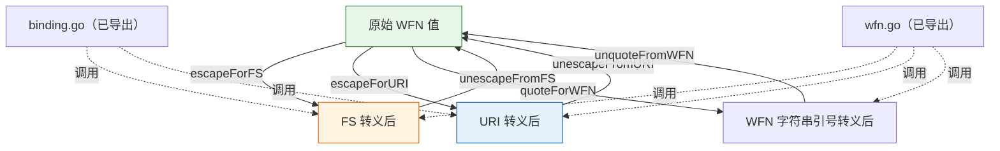

# 🔣 转义（内部）

`escaping` 模块实现 NISTIR 7695 规定的字符转义规则，用于将 `WFN` 绑定到 FS（格式化字符串）与 URI 两种形式，以及 WFN 字符串表示所用的引号转义规则。

> **本模块完全为内部实现。** `escaping.go` 中声明的所有标识符——包括全部函数以及百分号编码映射表——均以小写字母开头，因此**未导出**。本模块没有任何导出的函数、类型、变量或常量。转义行为仅通过 `binding` 模块（`BindToFS`、`UnbindFS`、`BindToURI`、`UnbindURI`）与 `wfn` 模块（`FromCPE23String`、`ToCPE23String`、`FromCPE22String`、`ToCPE22String`、`WFNString`）间接暴露给调用方。

下面列出这些未导出的辅助函数，用于说明它们各自实现的转义规则，仅供参考。它们无法从 `cpeskills` 包外部调用。

## 内部 FS 转义器

```go
func escapeForFS(value string) string
func unescapeFromFS(value string) string
```

`escapeForFS` 将原始 WFN 值转义为 CPE 2.3 FS 形式：字符 `.`、`-`、`_` 以反斜杠转义，其他非字母数字字符按 NISTIR 7695 进行百分号编码。`unescapeFromFS` 执行反向操作。逻辑值（`*`、`-`）与空字符串原样返回。

## 内部 URI 转义器

```go
func escapeForURI(value string) string
func unescapeFromURI(value string) string
```

`escapeForURI` 将原始 WFN 值转义为 CPE 2.2 URI 形式：每个非字母数字字符都进行百分号编码。`unescapeFromURI` 执行反向操作。逻辑值与空字符串原样返回。

## 内部 WFN 字符串引号转义器

```go
func quoteForWFN(value string) string
func unquoteFromWFN(value string) string
```

`quoteForWFN` 转义值中的 `"` 与 `\`，使其可嵌入 `WFN.WFNString` 产出的 `wfn:[...]` 字符串表示中。`unquoteFromWFN` 执行反向操作。

## 内部逻辑值与通配符辅助函数

```go
func isLogicalValue(value string) bool
func hasUnquotedWildcard(value string) bool
func isAlphanumeric(c byte) bool
func toHex(c byte) string
```

`isLogicalValue` 判断值是否为 `*`（ANY）或 `-`（NA）。`hasUnquotedWildcard` 判断值是否包含未被反斜杠前缀的 `*` 或 `?`，供 `WFN.IsIdentifierName` 使用。`isAlphanumeric` 与 `toHex` 是转义器用到的小工具。

## 内部扩展属性打包器

```go
func packExtendedAttributes(edition, language, swEdition, targetSw, targetHw, other string) string
func unpackExtendedAttributes(packed string) (edition, language, swEdition, targetSw, targetHw, other string)
```

将 CPE 2.2 URI 的六个扩展属性打包进、或从 `~` 分隔的段中解包。打包时去除末尾空值；解包时缺失的段以 ANY 返回。

## 内部百分号编码映射表

```go
var quotedCharToPercentEncode = map[byte]string{ /* NISTIR 7695 表 6-2 */ }
var percentEncodeToQuotedChar = /* 上表的反向映射 */
```

用于绑定到 URI / FS 时的正向与反向百分号编码表。

## 如何使用转义功能

调用方不直接调用转义辅助函数，而应使用更高层的导出 API：

| 目标 | 应使用的导出函数 |
| --- | --- |
| 构建 CPE 2.3 FS 字符串 | `BindToFS`、`WFN.ToCPE23String` |
| 解析 CPE 2.3 FS 字符串 | `UnbindFS`、`FromCPE23String` |
| 构建 CPE 2.2 URI 字符串 | `BindToURI`、`WFN.ToCPE22String` |
| 解析 CPE 2.2 URI 字符串 | `UnbindURI`、`FromCPE22String` |
| 获取 WFN 字符串表示 | `WFN.WFNString` |

## 📐 转义层示意图


