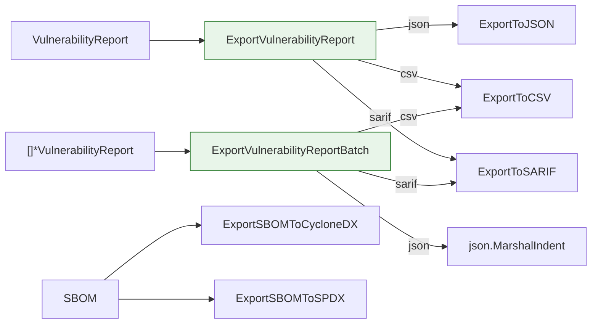

# 📤 导出格式

`cpeskills` 包提供将漏洞报告和 SBOM 序列化为行业标准交换格式的函数：JSON、CSV、SARIF、CycloneDX 和 SPDX。

## 类型：ExportFormat

```go
type ExportFormat string
```

字符串枚举，用于选择漏洞报告导出的输出格式。

### 常量

| 常量 | 类型 | 值 | 说明 |
| --- | --- | --- | --- |
| `ExportFormatJSON` | `ExportFormat` | `"json"` | JSON 格式 |
| `ExportFormatCSV` | `ExportFormat` | `"csv"` | CSV 格式 |
| `ExportFormatSARIF` | `ExportFormat` | `"sarif"` | SARIF 格式（静态分析结果交换格式） |

```go
_ = cpeskills.ExportFormatJSON
_ = cpeskills.ExportFormatCSV
_ = cpeskills.ExportFormatSARIF
```

## 📄 ExportVulnerabilityReport

```go
func ExportVulnerabilityReport(report *VulnerabilityReport, format ExportFormat) ([]byte, error)
```

将单个漏洞报告导出为指定格式。根据格式分派到对应的专用导出函数。

| 参数 | 类型 | 说明 |
| --- | --- | --- |
| `report` | `*VulnerabilityReport` | 要导出的报告 |
| `format` | `ExportFormat` | 目标格式 |

| 返回值 | 类型 | 说明 |
| --- | --- | --- |
| 第 1 个 | `[]byte` | 序列化后的报告字节 |
| 第 2 个 | `error` | 格式不支持或序列化失败时返回错误 |

```go
data, err := cpeskills.ExportVulnerabilityReport(report, cpeskills.ExportFormatJSON)
if err != nil {
    log.Fatal(err)
}
fmt.Println(string(data))
```

## 🔷 ExportToJSON

```go
func ExportToJSON(report *VulnerabilityReport) ([]byte, error)
```

将漏洞报告导出为格式化的 JSON（2 空格缩进）。

| 参数 | 类型 | 说明 |
| --- | --- | --- |
| `report` | `*VulnerabilityReport` | 要导出的报告 |

| 返回值 | 类型 | 说明 |
| --- | --- | --- |
| 第 1 个 | `[]byte` | JSON 字节 |
| 第 2 个 | `error` | `report` 为 nil 或序列化失败时返回错误 |

```go
data, err := cpeskills.ExportToJSON(report)
```

## 📊 ExportToCSV

```go
func ExportToCSV(reports []*VulnerabilityReport) ([]byte, error)
```

将多个漏洞报告导出为 CSV。表头为 `Component, Version, CVE, Severity, CVSS, EPSS, KEV, Reachability, FixAvailable, FixedVersion`，其后每个漏洞发现占一行。

| 参数 | 类型 | 说明 |
| --- | --- | --- |
| `reports` | `[]*VulnerabilityReport` | 要导出的报告列表 |

| 返回值 | 类型 | 说明 |
| --- | --- | --- |
| 第 1 个 | `[]byte` | CSV 字节 |
| 第 2 个 | `error` | 写入失败时返回错误 |

```go
data, err := cpeskills.ExportToCSV(reports)
```

## 🛡️ ExportToSARIF

```go
func ExportToSARIF(reports []*VulnerabilityReport) ([]byte, error)
```

将漏洞报告导出为 SARIF 2.1.0，即 OASIS 标准的静态分析结果交换格式，被 GitHub 和 Azure DevOps 等广泛支持。Critical/High 级别映射为 `error`，Medium 映射为 `warning`，其余映射为 `note`。

| 参数 | 类型 | 说明 |
| --- | --- | --- |
| `reports` | `[]*VulnerabilityReport` | 要导出的报告列表 |

| 返回值 | 类型 | 说明 |
| --- | --- | --- |
| 第 1 个 | `[]byte` | SARIF JSON 字节 |
| 第 2 个 | `error` | 序列化失败时返回错误 |

```go
data, err := cpeskills.ExportToSARIF(reports)
```

## 🔄 ExportSBOMToCycloneDX

```go
func ExportSBOMToCycloneDX(sbom *SBOM) ([]byte, error)
```

将 SBOM 导出为 CycloneDX JSON 格式（委托给 `sbom.ToCycloneDXJSON()`）。

| 参数 | 类型 | 说明 |
| --- | --- | --- |
| `sbom` | `*SBOM` | 要导出的 SBOM |

| 返回值 | 类型 | 说明 |
| --- | --- | --- |
| 第 1 个 | `[]byte` | CycloneDX JSON 字节 |
| 第 2 个 | `error` | 序列化失败时返回错误 |

```go
data, err := cpeskills.ExportSBOMToCycloneDX(sbom)
```

## 📋 ExportSBOMToSPDX

```go
func ExportSBOMToSPDX(sbom *SBOM) ([]byte, error)
```

将 SBOM 导出为 SPDX JSON 格式（委托给 `sbom.ToSPDXJSON()`）。

| 参数 | 类型 | 说明 |
| --- | --- | --- |
| `sbom` | `*SBOM` | 要导出的 SBOM |

| 返回值 | 类型 | 说明 |
| --- | --- | --- |
| 第 1 个 | `[]byte` | SPDX JSON 字节 |
| 第 2 个 | `error` | 序列化失败时返回错误 |

```go
data, err := cpeskills.ExportSBOMToSPDX(sbom)
```

## 📦 ExportVulnerabilityReportBatch

```go
func ExportVulnerabilityReportBatch(reports []*VulnerabilityReport, format ExportFormat) ([]byte, error)
```

批量导出漏洞报告为指定格式。JSON 会序列化整个切片；CSV/SARIF 委托给对应的批量导出函数。

| 参数 | 类型 | 说明 |
| --- | --- | --- |
| `reports` | `[]*VulnerabilityReport` | 要导出的报告列表 |
| `format` | `ExportFormat` | 目标格式 |

| 返回值 | 类型 | 说明 |
| --- | --- | --- |
| 第 1 个 | `[]byte` | 序列化后的字节 |
| 第 2 个 | `error` | 格式不支持或序列化失败时返回错误 |

```go
data, err := cpeskills.ExportVulnerabilityReportBatch(reports, cpeskills.ExportFormatCSV)
```

## 🧭 导出分派


