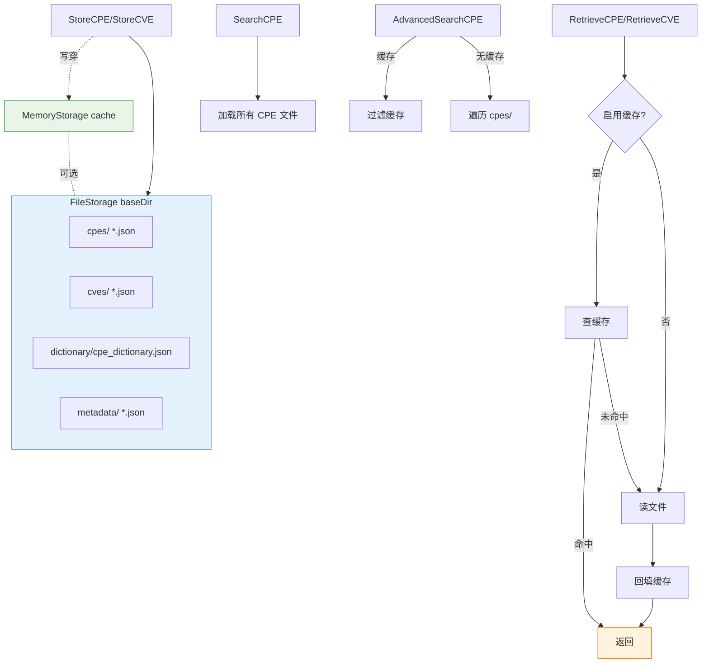

# 💾 FileStorage

`file_storage` 模块提供 `FileStorage`——`Storage` 接口的文件系统实现。CPE、CVE、字典和元数据以 JSON 文件形式持久化到基础目录下的 `cpes/`、`cves/`、`dictionary/`、`metadata/` 子目录中。可选的内存 `MemoryStorage` 缓存为读取提供加速。文件操作由 `sync.RWMutex` 保护。

## 类型：FileStorage

```go
type FileStorage struct {
    baseDir  string          // 所有数据的根目录
    cache    *MemoryStorage  // 可选的内存缓存
    useCache bool            // 是否启用缓存
    mutex    sync.RWMutex    // 保护文件操作
}
```

`FileStorage` 实现了完整的 `Storage` 接口。所有字段均为非导出，只能通过以下方法访问。构造器会创建所需的子目录树。

## 🏗️ NewFileStorage

```go
func NewFileStorage(baseDir string, useCache bool) (*FileStorage, error)
```

以 `baseDir` 为根创建 `FileStorage`，若目录不存在则创建 `baseDir` 及 `cpes`、`cves`、`dictionary`、`metadata` 子目录（权限 `0755`）。`useCache` 为 `true` 时创建并初始化内部 `MemoryStorage`。

| 参数 | 类型 | 说明 |
| --- | --- | --- |
| `baseDir` | `string` | 数据根目录；不存在则创建 |
| `useCache` | `bool` | 是否启用内存读缓存 |

| 返回值 | 类型 | 说明 |
| --- | --- | --- |
| #1 | `*FileStorage` | 新的文件存储 |
| #2 | `error` | 目录创建失败时非 `nil` |

```go
storage, err := cpeskills.NewFileStorage("/tmp/cpe-data", true)
if err != nil {
    log.Fatalf("create storage: %v", err)
}
defer storage.Close()
_ = storage.Initialize()
```

## 🟢 Initialize

```go
func (fs *FileStorage) Initialize() error
```

启用缓存时（重新）初始化内存缓存，并记录 `initialization` 修改时间戳。

| 参数 | 类型 | 说明 |
| --- | --- | --- |
| 接收者 | `*FileStorage` | 存储实例 |

| 返回值 | 类型 | 说明 |
| --- | --- | --- |
| #1 | `error` | 写时间戳文件失败时非 `nil` |

```go
_ = storage.Initialize()
```

## 🔴 Close

```go
func (fs *FileStorage) Close() error
```

启用缓存时关闭内存缓存。始终返回 `nil`。

| 参数 | 类型 | 说明 |
| --- | --- | --- |
| 接收者 | `*FileStorage` | 存储实例 |

| 返回值 | 类型 | 说明 |
| --- | --- | --- |
| #1 | `error` | 始终为 `nil` |

```go
defer storage.Close()
```

## 📂 CPEFilePath

```go
func (fs *FileStorage) CPEFilePath(id string) string
```

返回 `id` 对应 CPE 的 JSON 文件路径。id 会被哈希（简单的多项式哈希，渲染为十六进制），以保持文件名简短且对文件系统安全。

| 参数 | 类型 | 说明 |
| --- | --- | --- |
| 接收者 | `*FileStorage` | 存储实例 |
| `id` | `string` | CPE 标识符（其 URI） |

| 返回值 | 类型 | 说明 |
| --- | --- | --- |
| #1 | `string` | `<baseDir>/cpes/<hash>.json` |

```go
path := storage.CPEFilePath("cpe:2.3:a:apache:log4j:2.0:*:*:*:*:*:*:*")
```

## 📂 CVEFilePath

```go
func (fs *FileStorage) CVEFilePath(id string) string
```

返回 `id` 对应 CVE 的 JSON 文件路径。id 会被清理（不安全字符替换为 `_`）并直接用作文件名。

| 参数 | 类型 | 说明 |
| --- | --- | --- |
| 接收者 | `*FileStorage` | 存储实例 |
| `id` | `string` | CVE 标识符 |

| 返回值 | 类型 | 说明 |
| --- | --- | --- |
| #1 | `string` | `<baseDir>/cves/<sanitized>.json` |

```go
path := storage.CVEFilePath("CVE-2021-44228")
```

## 📂 DictionaryFilePath

```go
func (fs *FileStorage) DictionaryFilePath() string
```

返回字典 JSON 文件的路径。

| 参数 | 类型 | 说明 |
| --- | --- | --- |
| 接收者 | `*FileStorage` | 存储实例 |

| 返回值 | 类型 | 说明 |
| --- | --- | --- |
| #1 | `string` | `<baseDir>/dictionary/cpe_dictionary.json` |

```go
path := storage.DictionaryFilePath()
```

## 📂 MetadataFilePath

```go
func (fs *FileStorage) MetadataFilePath(key string) string
```

返回 `key` 对应元数据（时间戳）条目的 JSON 文件路径。key 会被清理（不安全字符替换为 `_`）。

| 参数 | 类型 | 说明 |
| --- | --- | --- |
| 接收者 | `*FileStorage` | 存储实例 |
| `key` | `string` | 元数据键 |

| 返回值 | 类型 | 说明 |
| --- | --- | --- |
| #1 | `string` | `<baseDir>/metadata/<sanitized>.json` |

```go
path := storage.MetadataFilePath("last_update")
```

## 💾 StoreCPE

```go
func (fs *FileStorage) StoreCPE(cpe *CPE) error
```

将 `cpe` 序列化为缩进 JSON 并写入 `CPEFilePath(cpe.GetURI())`（权限 `0644`），启用缓存时更新缓存，并记录 `last_cpe_update` 时间戳。`cpe` 为 `nil` 时返回 `ErrInvalidData`。

| 参数 | 类型 | 说明 |
| --- | --- | --- |
| 接收者 | `*FileStorage` | 存储实例 |
| `cpe` | `*CPE` | 要存储的 CPE |

| 返回值 | 类型 | 说明 |
| --- | --- | --- |
| #1 | `error` | `nil` 时为 `ErrInvalidData`；写入/时间戳失败时非 `nil` |

```go
_ = storage.StoreCPE(&cpeskills.CPE{
    Cpe23:       "cpe:2.3:a:apache:log4j:2.0:*:*:*:*:*:*:*",
    Vendor:      cpeskills.Vendor("apache"),
    ProductName: cpeskills.Product("log4j"),
    Version:     cpeskills.Version("2.0"),
})
```

## 🔍 RetrieveCPE

```go
func (fs *FileStorage) RetrieveCPE(id string) (*CPE, error)
```

返回 `id` 对应的 CPE。启用缓存时先查缓存；未命中则从磁盘读取 `CPEFilePath(id)` 并回填缓存。文件不存在时返回 `ErrNotFound`。

| 参数 | 类型 | 说明 |
| --- | --- | --- |
| 接收者 | `*FileStorage` | 存储实例 |
| `id` | `string` | CPE 标识符（其 URI） |

| 返回值 | 类型 | 说明 |
| --- | --- | --- |
| #1 | `*CPE` | CPE |
| #2 | `error` | 缺失时为 `ErrNotFound`；读取/解析失败时非 `nil` |

```go
cpe, err := storage.RetrieveCPE("cpe:2.3:a:microsoft:windows:10:*:*:*:*:*:*:*")
```

## ✏️ UpdateCPE

```go
func (f *FileStorage) UpdateCPE(cpe *CPE) error
```

通过存储新的 `cpe`（覆盖其 URI 处的任何现有文件）来更新 CPE 记录，启用缓存时更新缓存。`cpe` 为 `nil` 时返回 `ErrInvalidData`。

| 参数 | 类型 | 说明 |
| --- | --- | --- |
| 接收者 | `*FileStorage` | 存储实例 |
| `cpe` | `*CPE` | 替换用的 CPE |

| 返回值 | 类型 | 说明 |
| --- | --- | --- |
| #1 | `error` | `nil` 时为 `ErrInvalidData`；存储失败时非 `nil` |

```go
cpe.Version = cpeskills.Version("2.1")
_ = storage.UpdateCPE(cpe)
```

## 🗑️ DeleteCPE

```go
func (f *FileStorage) DeleteCPE(uri string) error
```

删除 `CPEFilePath(uri)` 处的 CPE 文件。启用缓存时先驱逐缓存条目（尽力而为）。文件不存在不算错误：方法返回 `nil`。

| 参数 | 类型 | 说明 |
| --- | --- | --- |
| 接收者 | `*FileStorage` | 存储实例 |
| `uri` | `string` | 要删除的 CPE 标识符 |

| 返回值 | 类型 | 说明 |
| --- | --- | --- |
| #1 | `error` | 仅在 `os.Stat`/`os.Remove` 失败（除 not-exist 外）时非 `nil` |

```go
_ = storage.DeleteCPE("cpe:2.3:a:apache:log4j:2.0:*:*:*:*:*:*:*")
```

## 🔎 SearchCPE

```go
func (f *FileStorage) SearchCPE(criteria *CPE, options *MatchOptions) ([]*CPE, error)
```

从 `cpes/` 目录加载所有 CPE 文件，然后返回在 `options` 规则下匹配 `criteria` 的 CPE（通过包级 `Search`）。`criteria` 为 `nil` 时返回所有 CPE。

| 参数 | 类型 | 说明 |
| --- | --- | --- |
| 接收者 | `*FileStorage` | 存储实例 |
| `criteria` | `*CPE` | 匹配条件；`nil` 匹配全部 |
| `options` | `*MatchOptions` | 匹配选项 |

| 返回值 | 类型 | 说明 |
| --- | --- | --- |
| #1 | `[]*CPE` | 匹配的 CPE |
| #2 | `error` | 始终为 `nil` |

```go
results, _ := storage.SearchCPE(&cpeskills.CPE{
    Vendor: cpeskills.Vendor("microsoft"),
}, &cpeskills.MatchOptions{IgnoreVersion: true})
```

## 📥 StoreCVE

```go
func (fs *FileStorage) StoreCVE(cve *CVEReference) error
```

将 `cve` 序列化为缩进 JSON 并写入 `CVEFilePath(cve.CVEID)`（权限 `0644`），启用缓存时更新缓存，并记录 `last_cve_update` 时间戳。`cve` 为 `nil` 或 `CVEID` 为空时返回（包装的）`ErrInvalidData`。

| 参数 | 类型 | 说明 |
| --- | --- | --- |
| 接收者 | `*FileStorage` | 存储实例 |
| `cve` | `*CVEReference` | 要存储的 CVE |

| 返回值 | 类型 | 说明 |
| --- | --- | --- |
| #1 | `error` | `nil`/空 ID 时为 `ErrInvalidData`；写入失败时非 `nil` |

```go
cve := cpeskills.NewCVEReference("CVE-2021-44228")
_ = storage.StoreCVE(cve)
```

## 🔍 RetrieveCVE

```go
func (fs *FileStorage) RetrieveCVE(cveID string) (*CVEReference, error)
```

返回 `cveID` 对应的 CVE。启用缓存时先查缓存；未命中则读取 `CVEFilePath(cveID)` 并回填缓存。文件不存在时返回 `ErrNotFound`。

| 参数 | 类型 | 说明 |
| --- | --- | --- |
| 接收者 | `*FileStorage` | 存储实例 |
| `cveID` | `string` | CVE 标识符 |

| 返回值 | 类型 | 说明 |
| --- | --- | --- |
| #1 | `*CVEReference` | CVE |
| #2 | `error` | 缺失时为 `ErrNotFound`；读取/解析失败时非 `nil` |

```go
cve, err := storage.RetrieveCVE("CVE-2021-44228")
```

## ✏️ UpdateCVE

```go
func (fs *FileStorage) UpdateCVE(cve *CVEReference) error
```

更新 `cve.CVEID` 处的 CVE。先验证文件存在（否则返回 `ErrNotFound`），然后覆盖。启用缓存时更新缓存，并记录 `last_cve_update` 时间戳。`cve` 为 `nil` 或 `CVEID` 为空时返回（包装的）`ErrInvalidData`。

| 参数 | 类型 | 说明 |
| --- | --- | --- |
| 接收者 | `*FileStorage` | 存储实例 |
| `cve` | `*CVEReference` | 替换用的 CVE |

| 返回值 | 类型 | 说明 |
| --- | --- | --- |
| #1 | `error` | `ErrInvalidData`、`ErrNotFound` 或写入错误 |

```go
cve.CVSSScore = 10.0
_ = storage.UpdateCVE(cve)
```

## 🗑️ DeleteCVE

```go
func (fs *FileStorage) DeleteCVE(cveID string) error
```

删除 `CVEFilePath(cveID)` 处的 CVE 文件，启用缓存时驱逐缓存条目。文件不存在时返回 `ErrNotFound`。

| 参数 | 类型 | 说明 |
| --- | --- | --- |
| 接收者 | `*FileStorage` | 存储实例 |
| `cveID` | `string` | 要删除的 CVE 标识符 |

| 返回值 | 类型 | 说明 |
| --- | --- | --- |
| #1 | `error` | 缺失时为 `ErrNotFound`；删除失败时非 `nil` |

```go
_ = storage.DeleteCVE("CVE-2021-44228")
```

## 🔎 SearchCVE

```go
func (fs *FileStorage) SearchCVE(query string, options *SearchOptions) ([]*CVEReference, error)
```

从磁盘（或启用缓存时从缓存）加载所有 CVE，装入临时 `MemoryStorage`，并委托其 `SearchCVE` 执行查询。支持与 `MemoryStorage.SearchCVE` 相同的子串匹配、过滤和分页。

| 参数 | 类型 | 说明 |
| --- | --- | --- |
| 接收者 | `*FileStorage` | 存储实例 |
| `query` | `string` | 子串查询 |
| `options` | `*SearchOptions` | 过滤与分页 |

| 返回值 | 类型 | 说明 |
| --- | --- | --- |
| #1 | `[]*CVEReference` | 匹配的 CVE |
| #2 | `error` | 加载 CVE 失败时非 `nil` |

```go
opts := cpeskills.NewSearchOptions()
results, _ := storage.SearchCVE("log4j", opts)
```

## 🔗 FindCVEsByCPE

```go
func (fs *FileStorage) FindCVEsByCPE(cpe *CPE) ([]*CVEReference, error)
```

将所有 CPE 和 CVE 装入临时 `MemoryStorage`，并委托其 `FindCVEsByCPE`。

| 参数 | 类型 | 说明 |
| --- | --- | --- |
| 接收者 | `*FileStorage` | 存储实例 |
| `cpe` | `*CPE` | 要查询的 CPE |

| 返回值 | 类型 | 说明 |
| --- | --- | --- |
| #1 | `[]*CVEReference` | 关联的 CVE |
| #2 | `error` | 加载 CVE 失败时非 `nil` |

```go
cves, _ := storage.FindCVEsByCPE(&cpeskills.CPE{
    Cpe23: "cpe:2.3:a:apache:log4j:2.0:*:*:*:*:*:*:*",
})
```

## 🔗 FindCPEsByCVE

```go
func (fs *FileStorage) FindCPEsByCVE(cveID string) ([]*CPE, error)
```

将所有 CPE 和 CVE 装入临时 `MemoryStorage`，并委托其 `FindCPEsByCVE`。

| 参数 | 类型 | 说明 |
| --- | --- | --- |
| 接收者 | `*FileStorage` | 存储实例 |
| `cveID` | `string` | CVE 标识符 |

| 返回值 | 类型 | 说明 |
| --- | --- | --- |
| #1 | `[]*CPE` | 关联的 CPE |
| #2 | `error` | 加载 CVE 失败时非 `nil` |

```go
cpes, _ := storage.FindCPEsByCVE("CVE-2021-44228")
```

## 📚 StoreDictionary

```go
func (fs *FileStorage) StoreDictionary(dict *CPEDictionary) error
```

将 `dict` 序列化为缩进 JSON 并写入 `DictionaryFilePath()`（权限 `0644`），启用缓存时更新缓存，并记录 `last_dictionary_update` 时间戳。`dict` 为 `nil` 时返回 `ErrInvalidData`。

| 参数 | 类型 | 说明 |
| --- | --- | --- |
| 接收者 | `*FileStorage` | 存储实例 |
| `dict` | `*CPEDictionary` | 要存储的字典 |

| 返回值 | 类型 | 说明 |
| --- | --- | --- |
| #1 | `error` | `nil` 时为 `ErrInvalidData`；写入失败时非 `nil` |

```go
dict, _ := cpeskills.ParseDictionary(file)
_ = storage.StoreDictionary(dict)
```

## 📖 RetrieveDictionary

```go
func (fs *FileStorage) RetrieveDictionary() (*CPEDictionary, error)
```

返回字典。启用缓存时先查缓存；未命中则读取 `DictionaryFilePath()` 并回填缓存。文件不存在时返回 `ErrNotFound`。

| 参数 | 类型 | 说明 |
| --- | --- | --- |
| 接收者 | `*FileStorage` | 存储实例 |

| 返回值 | 类型 | 说明 |
| --- | --- | --- |
| #1 | `*CPEDictionary` | 字典 |
| #2 | `error` | 缺失时为 `ErrNotFound`；读取/解析失败时非 `nil` |

```go
dict, err := storage.RetrieveDictionary()
```

## ⏱️ StoreModificationTimestamp

```go
func (fs *FileStorage) StoreModificationTimestamp(key string, timestamp time.Time) error
```

将 `{key, timestamp}` JSON 对象写入 `MetadataFilePath(key)`（权限 `0644`），启用缓存时更新缓存。

| 参数 | 类型 | 说明 |
| --- | --- | --- |
| 接收者 | `*FileStorage` | 存储实例 |
| `key` | `string` | 元数据键 |
| `timestamp` | `time.Time` | 要记录的时间戳 |

| 返回值 | 类型 | 说明 |
| --- | --- | --- |
| #1 | `error` | 写入失败时非 `nil` |

```go
_ = storage.StoreModificationTimestamp("last_update", time.Now())
```

## ⏱️ RetrieveModificationTimestamp

```go
func (fs *FileStorage) RetrieveModificationTimestamp(key string) (time.Time, error)
```

返回 `key` 下存储的时间戳。启用缓存时先查缓存；未命中则读取 `MetadataFilePath(key)` 并回填缓存。文件不存在时返回零值 `time.Time` 和 `ErrNotFound`。

| 参数 | 类型 | 说明 |
| --- | --- | --- |
| 接收者 | `*FileStorage` | 存储实例 |
| `key` | `string` | 元数据键 |

| 返回值 | 类型 | 说明 |
| --- | --- | --- |
| #1 | `time.Time` | 记录的时间戳 |
| #2 | `error` | 缺失时为 `ErrNotFound`；读取/解析失败时非 `nil` |

```go
ts, err := storage.RetrieveModificationTimestamp("last_update")
```

## 🎯 AdvancedSearchCPE

```go
func (f *FileStorage) AdvancedSearchCPE(criteria *CPE, options *AdvancedMatchOptions) ([]*CPE, error)
```

执行高级 CPE 搜索。启用缓存时，通过 `AdvancedMatchCPE` 过滤缓存的 CPE；未启用缓存时，遍历 `cpes/` 目录并匹配每个文件的 CPE。

| 参数 | 类型 | 说明 |
| --- | --- | --- |
| 接收者 | `*FileStorage` | 存储实例 |
| `criteria` | `*CPE` | 匹配条件 |
| `options` | `*AdvancedMatchOptions` | 高级匹配选项 |

| 返回值 | 类型 | 说明 |
| --- | --- | --- |
| #1 | `[]*CPE` | 匹配的 CPE |
| #2 | `error` | 仅在目录遍历失败（无缓存路径）时非 `nil` |

```go
results, _ := storage.AdvancedSearchCPE(criteria, &cpeskills.AdvancedMatchOptions{})
```

## 🧭 FileStorage 布局与缓存流


