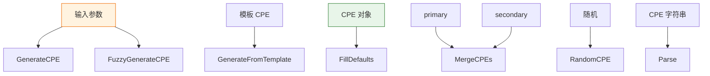

# ⚙️ CPE 生成器

本模块提供 CPE 对象的生成、模板化、合并与模糊生成等能力，便于程序化构造 CPE。

## 🏗️ GenerateCPE

```go
func GenerateCPE(part, vendor, product, version string) *CPE
```

根据组件类型、供应商、产品名和版本生成一个 CPE 对象。

| 参数 | 类型 | 说明 |
| --- | --- | --- |
| `part` | `string` | 组件类型 |
| `vendor` | `string` | 供应商 |
| `product` | `string` | 产品名 |
| `version` | `string` | 版本 |

| 返回值 | 类型 | 说明 |
| --- | --- | --- |
| 第 1 个 | `*CPE` | 生成的 CPE 对象 |

```go
cpe := cpeskills.GenerateCPE("a", "microsoft", "windows", "10")
```

## 📋 GenerateFromTemplate

```go
func GenerateFromTemplate(template *CPE, overrides map[string]string) *CPE
```

基于模板 CPE 生成新对象，使用 `overrides` 覆盖指定字段。

| 参数 | 类型 | 说明 |
| --- | --- | --- |
| `template` | `*CPE` | 模板 CPE |
| `overrides` | `map[string]string` | 字段覆盖映射 |

| 返回值 | 类型 | 说明 |
| --- | --- | --- |
| 第 1 个 | `*CPE` | 生成的新 CPE 对象 |

```go
tmpl := cpeskills.MustParse("cpe:2.3:a:microsoft:windows:10:*:*:*:*:*:*:*")
cpe := cpeskills.GenerateFromTemplate(tmpl, map[string]string{"version": "11"})
```

## 🛠️ FillDefaults

```go
func FillDefaults(cpe *CPE) *CPE
```

为 CPE 对象的空缺字段填充默认值（如 `*`）。

| 参数 | 类型 | 说明 |
| --- | --- | --- |
| `cpe` | `*CPE` | 待填充的 CPE 对象 |

| 返回值 | 类型 | 说明 |
| --- | --- | --- |
| 第 1 个 | `*CPE` | 填充后的 CPE 对象 |

```go
cpe := &cpeskills.CPE{Part: *part}
cpe = cpeskills.FillDefaults(cpe)
```

## 🔀 MergeCPEs

```go
func MergeCPEs(primary, secondary *CPE) *CPE
```

合并两个 CPE：`primary` 优先，其空缺字段由 `secondary` 补充。

| 参数 | 类型 | 说明 |
| --- | --- | --- |
| `primary` | `*CPE` | 主 CPE（优先） |
| `secondary` | `*CPE` | 备用 CPE |

| 返回值 | 类型 | 说明 |
| --- | --- | --- |
| 第 1 个 | `*CPE` | 合并后的 CPE 对象 |

```go
merged := cpeskills.MergeCPEs(primary, secondary)
```

## 🌫️ FuzzyGenerateCPE

```go
func FuzzyGenerateCPE(part, vendor, product, version string) *CPE
```

模糊生成 CPE，对输入做规范化与容错处理。

| 参数 | 类型 | 说明 |
| --- | --- | --- |
| `part` | `string` | 组件类型 |
| `vendor` | `string` | 供应商 |
| `product` | `string` | 产品名 |
| `version` | `string` | 版本 |

| 返回值 | 类型 | 说明 |
| --- | --- | --- |
| 第 1 个 | `*CPE` | 生成的 CPE 对象 |

```go
cpe := cpeskills.FuzzyGenerateCPE("a", "Microsoft", "Windows 10", "10")
```

## 🎲 RandomCPE

```go
func RandomCPE() *CPE
```

生成一个随机 CPE 对象，常用于测试。

| 返回值 | 类型 | 说明 |
| --- | --- | --- |
| 第 1 个 | `*CPE` | 随机 CPE 对象 |

```go
cpe := cpeskills.RandomCPE()
```

## 📥 Parse

```go
func Parse(cpeStr string) (*CPE, error)
```

通用解析入口，自动识别 2.2 或 2.3 格式。

| 参数 | 类型 | 说明 |
| --- | --- | --- |
| `cpeStr` | `string` | CPE 字符串 |

| 返回值 | 类型 | 说明 |
| --- | --- | --- |
| 第 1 个 | `*CPE` | 解析得到的 CPE 对象 |
| 第 2 个 | `error` | 解析失败时返回错误 |

```go
cpe, err := cpeskills.Parse("cpe:2.3:a:microsoft:windows:10:*:*:*:*:*:*:*")
```

## 🧭 生成器关系


