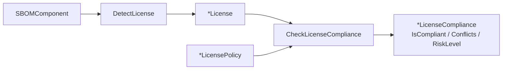
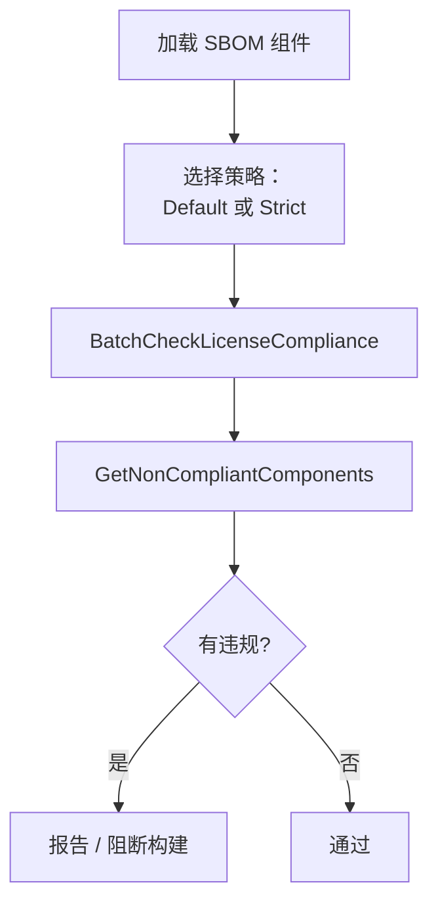

# 🛡️ 许可证检测

`license_detection` 模块（`license_detection.go`）为 SBOM 组件提供许可证合规检查。它检测声明的许可证，与可配置的策略比对，报告冲突、风险级别和总体合规情况。



## 类型

### LicenseCompliance

```go
type LicenseCompliance struct {
    Component        *SBOMComponent `json:"component"`
    DetectedLicense  *License       `json:"detectedLicense,omitempty"`
    DeclaredLicense  *License       `json:"declaredLicense,omitempty"`
    Conflicts        []string       `json:"conflicts,omitempty"`
    RiskLevel        string         `json:"riskLevel"`
    IsCompliant      bool           `json:"isCompliant"`
}
```

保存单个组件的合规检查结果。

### LicensePolicy

```go
type LicensePolicy struct {
    AllowedLicenses    []string `json:"allowedLicenses"`
    DeniedLicenses     []string `json:"deniedLicenses"`
    AllowCopyleft      bool     `json:"allowCopyleft"`
    RequireOSIApproved bool     `json:"requireOSIApproved"`
}
```

可配置策略。`AllowedLicenses` / `DeniedLicenses` 为 SPDX ID。

## 函数

### DefaultLicensePolicy

```go
func DefaultLicensePolicy() *LicensePolicy
```

返回宽松的默认策略：允许 MIT、Apache-2.0、BSD-2-Clause、BSD-3-Clause、ISC、Unlicense、CC0-1.0、Zlib、PostgreSQL；禁止 AGPL-3.0-only 与 AGPL-3.0-or-later；允许 Copyleft；要求 OSI 批准。

**返回值：**
- `*LicensePolicy` — 宽松策略

### StrictLicensePolicy

```go
func StrictLicensePolicy() *LicensePolicy
```

返回严格策略（确切允许列表请读 `license_detection.go`，比默认更窄）。

**返回值：**
- `*LicensePolicy` — 严格策略

### DetectLicense

```go
func DetectLicense(component *SBOMComponent) *License
```

从组件的 `Licenses` 字段检测许可证。

**参数：**
- `component` — SBOM 组件

**返回值：**
- `*License` — 检测到的许可证，无则为 `nil`

### CheckLicenseCompliance

```go
func CheckLicenseCompliance(component *SBOMComponent, policy *LicensePolicy) *LicenseCompliance
```

对单个组件按策略做合规检查。

**参数：**
- `component` — SBOM 组件
- `policy` — 许可证策略

**返回值：**
- `*LicenseCompliance` — 合规结果

**示例：**
```go
component := cpeskills.NewSBOMComponent("mylib", "1.0.0")
component.Licenses = []*cpeskills.License{cpeskills.NewLicense("MIT", "MIT License")}

result := cpeskills.CheckLicenseCompliance(component, cpeskills.DefaultLicensePolicy())
fmt.Println(result.IsCompliant) // true
fmt.Println(result.RiskLevel)
```

### BatchCheckLicenseCompliance

```go
func BatchCheckLicenseCompliance(components []*SBOMComponent, policy *LicensePolicy) []*LicenseCompliance
```

对多个组件按同一策略批量检查。

**参数：**
- `components` — SBOM 组件列表
- `policy` — 许可证策略

**返回值：**
- `[]*LicenseCompliance` — 每个组件一个结果

### GetNonCompliantComponents

```go
func GetNonCompliantComponents(complianceResults []*LicenseCompliance) []*LicenseCompliance
```

从合规结果列表中筛出不合规章项。

**参数：**
- `complianceResults` — `BatchCheckLicenseCompliance` 的结果

**返回值：**
- `[]*LicenseCompliance` — 仅不合规章项

**示例：**
```go
results := cpeskills.BatchCheckLicenseCompliance(components, cpeskills.StrictLicensePolicy())
violations := cpeskills.GetNonCompliantComponents(results)
for _, v := range violations {
    fmt.Printf("%s: %v\n", v.Component.Name, v.Conflicts)
}
```

## 工作流


