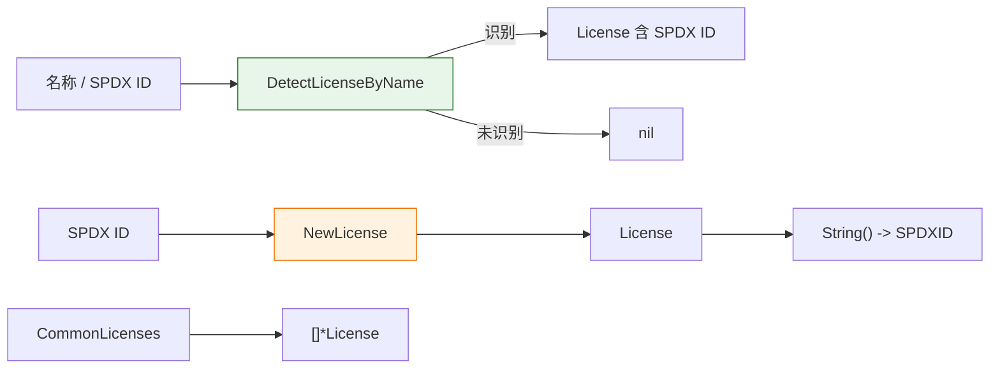

# 📜 许可证

`cpeskills` 包基于 SPDX 许可证列表标准对软件许可证建模，并提供构造、识别和检查常见许可证的辅助函数。

## 类型：License

```go
type License struct {
    SPDXID       string   `json:"id"`
    Name         string   `json:"name"`
    URL          string   `json:"url,omitempty"`
    IsCopyleft   bool     `json:"isCopyleft"`
    IsOSIApproved bool    `json:"isOSIApproved"`
    Restrictions []string `json:"restrictions,omitempty"`
}
```

基于 SPDX 许可证列表标准的软件许可证表示。

| 字段 | 类型 | JSON | 说明 |
| --- | --- | --- | --- |
| `SPDXID` | `string` | `id` | SPDX 许可证标识符（如 `"MIT"`、`"Apache-2.0"`、`"GPL-3.0-only"`） |
| `Name` | `string` | `name` | 许可证全名 |
| `URL` | `string` | `url,omitempty` | 许可证文本链接 |
| `IsCopyleft` | `bool` | `isCopyleft` | 是否为 Copyleft 许可证 |
| `IsOSIApproved` | `bool` | `isOSIApproved` | 是否为 OSI 批准 |
| `Restrictions` | `[]string` | `restrictions,omitempty` | 使用限制说明 |

## 🆕 NewLicense

```go
func NewLicense(spdxID, name string) *License
```

创建一个新的许可证。`IsOSIApproved` 和 `IsCopyleft` 由 SPDX ID 自动推导。

| 参数 | 类型 | 说明 |
| --- | --- | --- |
| `spdxID` | `string` | SPDX 许可证标识符 |
| `name` | `string` | 许可证全名 |

| 返回值 | 类型 | 说明 |
| --- | --- | --- |
| 第 1 个 | `*License` | 已填充 OSI/Copyleft 标志的 License |

```go
lic := cpeskills.NewLicense("MIT", "MIT License")
```

## 🏷️ License.String

```go
func (l *License) String() string
```

返回许可证的 SPDX 标识符。若接收者为 nil 则返回空字符串。

| 返回值 | 类型 | 说明 |
| --- | --- | --- |
| 第 1 个 | `string` | SPDX ID |

```go
lic := cpeskills.NewLicense("Apache-2.0", "Apache License 2.0")
fmt.Println(lic.String()) // Apache-2.0
```

## 📚 CommonLicenses

```go
func CommonLicenses() []*License
```

返回常见许可证列表（MIT、Apache-2.0、BSD-3-Clause、BSD-2-Clause、GPL-3.0-only、GPL-3.0-or-later、LGPL-3.0-only、MPL-2.0、ISC、Unlicense）。

| 返回值 | 类型 | 说明 |
| --- | --- | --- |
| 第 1 个 | `[]*License` | 常见 SPDX 许可证 |

```go
for _, lic := range cpeskills.CommonLicenses() {
    fmt.Println(lic.SPDXID)
}
```

## 🔍 DetectLicenseByName

```go
func DetectLicenseByName(name string) *License
```

根据人类可读名称或 SPDX ID（不区分大小写）检测许可证。识别常见别名，如 `apache 2.0`、`bsd3`、`gpl3`、`cc0` 等。无法识别时返回 `nil`。

| 参数 | 类型 | 说明 |
| --- | --- | --- |
| `name` | `string` | 许可证名称或 SPDX ID |

| 返回值 | 类型 | 说明 |
| --- | --- | --- |
| 第 1 个 | `*License` | 检测到的许可证，无法识别则为 `nil` |

```go
lic := cpeskills.DetectLicenseByName("Apache 2.0")
if lic != nil {
    fmt.Println(lic.SPDXID) // Apache-2.0
}
```

## 🧭 许可证检测


