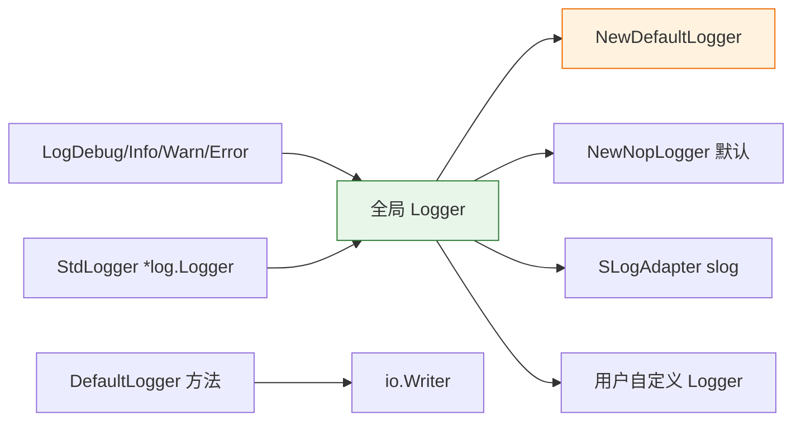

# 📋 日志

`cpeskills` 包提供结构化日志接口（`Logger`）、内置 `DefaultLogger`、包级全局 logger，以及便捷的顶层函数。该接口兼容 Go 的 `log/slog`，且不依赖任何外部库。

## 类型：LogLevel

```go
type LogLevel int
```

表示日志消息的严重程度。

### 常量

| 常量 | 类型 | 值 | 说明 |
| --- | --- | --- | --- |
| `LogLevelDebug` | `LogLevel` | `0` (iota) | 详细的调试信息 |
| `LogLevelInfo` | `LogLevel` | `1` | 信息性消息 |
| `LogLevelWarn` | `LogLevel` | `2` | 警告消息 |
| `LogLevelError` | `LogLevel` | `3` | 错误消息 |
| `LogLevelOff` | `LogLevel` | `4` | 关闭所有日志 |

```go
_ = cpeskills.LogLevelDebug
_ = cpeskills.LogLevelInfo
_ = cpeskills.LogLevelWarn
_ = cpeskills.LogLevelError
_ = cpeskills.LogLevelOff
```

## 类型：Logger

```go
type Logger interface {
    Debug(msg string, keyvals ...interface{})
    Info(msg string, keyvals ...interface{})
    Warn(msg string, keyvals ...interface{})
    Error(msg string, keyvals ...interface{})
    With(keyvals ...interface{}) Logger
    SetLevel(level LogLevel)
}
```

结构化日志接口。可接入自定义实现（slog、zap、zerolog、logrus 等），或使用内置 `DefaultLogger`。所有默认实现都是并发安全的。

## 类型：DefaultLogger

```go
type DefaultLogger struct {
    // 包含未导出字段
}
```

向 `io.Writer` 输出、采用 `key=value` 结构化格式的基础日志实现。

## 类型：SLogAdapter

```go
type SLogAdapter struct {
    // 包含未导出字段
}
```

将 Go 标准库 `log/slog` 适配为 cpe 的 `Logger` 接口。通过条件编译，仅 Go 1.21+ 可用。

## 🔤 LogLevel.String

```go
func (l LogLevel) String() string
```

返回日志级别的字符串表示（`"DEBUG"`、`"INFO"`、`"WARN"`、`"ERROR"`、`"OFF"` 或 `"UNKNOWN"`）。

| 返回值 | 类型 | 说明 |
| --- | --- | --- |
| 第 1 个 | `string` | 级别名称 |

```go
fmt.Println(cpeskills.LogLevelInfo.String()) // INFO
```

## 🆕 NewDefaultLogger

```go
func NewDefaultLogger(writer io.Writer, level LogLevel) *DefaultLogger
```

创建写入指定 writer 的新 `DefaultLogger`。`writer` 为 nil 时默认写入 `os.Stderr`。

| 参数 | 类型 | 说明 |
| --- | --- | --- |
| `writer` | `io.Writer` | 输出 writer |
| `level` | `LogLevel` | 最小日志级别 |

| 返回值 | 类型 | 说明 |
| --- | --- | --- |
| 第 1 个 | `*DefaultLogger` | 新的日志实例 |

```go
logger := cpeskills.NewDefaultLogger(os.Stderr, cpeskills.LogLevelInfo)
```

## 🚫 NewNopLogger

```go
func NewNopLogger() Logger
```

创建丢弃所有输出的日志实例。未配置任何 logger 时默认使用此实例。

| 返回值 | 类型 | 说明 |
| --- | --- | --- |
| 第 1 个 | `Logger` | 空操作日志实例 |

```go
cpeskills.SetLogger(cpeskills.NewNopLogger())
```

## 🐛 DefaultLogger.Debug

```go
func (l *DefaultLogger) Debug(msg string, keyvals ...interface{})
```

记录一条 debug 级别消息，可附带键值对。

| 参数 | 类型 | 说明 |
| --- | --- | --- |
| `msg` | `string` | 日志消息 |
| `keyvals` | `...interface{}` | 交替的键/值对 |

```go
logger.Debug("scanning", "component", comp.Name)
```

## ℹ️ DefaultLogger.Info

```go
func (l *DefaultLogger) Info(msg string, keyvals ...interface{})
```

记录一条 info 级别消息。

| 参数 | 类型 | 说明 |
| --- | --- | --- |
| `msg` | `string` | 日志消息 |
| `keyvals` | `...interface{}` | 交替的键/值对 |

```go
logger.Info("scan complete", "count", n)
```

## ⚠️ DefaultLogger.Warn

```go
func (l *DefaultLogger) Warn(msg string, keyvals ...interface{})
```

记录一条 warn 级别消息。

| 参数 | 类型 | 说明 |
| --- | --- | --- |
| `msg` | `string` | 日志消息 |
| `keyvals` | `...interface{}` | 交替的键/值对 |

```go
logger.Warn("deprecated CPE format", "cpe", cpeStr)
```

## 🚨 DefaultLogger.Error

```go
func (l *DefaultLogger) Error(msg string, keyvals ...interface{})
```

记录一条 error 级别消息。

| 参数 | 类型 | 说明 |
| --- | --- | --- |
| `msg` | `string` | 日志消息 |
| `keyvals` | `...interface{}` | 交替的键/值对 |

```go
logger.Error("scan failed", "err", err)
```

## 🏷️ DefaultLogger.With

```go
func (l *DefaultLogger) With(keyvals ...interface{}) Logger
```

返回一个新的 `Logger`，其后续每条日志都会预置给定的键值对。

| 参数 | 类型 | 说明 |
| --- | --- | --- |
| `keyvals` | `...interface{}` | 要附加的交替键/值对 |

| 返回值 | 类型 | 说明 |
| --- | --- | --- |
| 第 1 个 | `Logger` | 带前缀的子日志实例 |

```go
sub := logger.With("component", comp.Name)
sub.Info("matched")
```

## ⚙️ DefaultLogger.SetLevel

```go
func (l *DefaultLogger) SetLevel(level LogLevel)
```

动态设置最小日志级别（并发安全）。

| 参数 | 类型 | 说明 |
| --- | --- | --- |
| `level` | `LogLevel` | 新的最小日志级别 |

```go
logger.SetLevel(cpeskills.LogLevelWarn)
```

## 🌐 SetLogger

```go
func SetLogger(l Logger)
```

设置整个库使用的全局 logger。传入 `nil` 可禁用日志。

| 参数 | 类型 | 说明 |
| --- | --- | --- |
| `l` | `Logger` | 全局使用的 logger |

```go
cpeskills.SetLogger(cpeskills.NewDefaultLogger(os.Stderr, cpeskills.LogLevelInfo))
```

## 🌐 GetLogger

```go
func GetLogger() Logger
```

返回当前的全局 logger。

| 返回值 | 类型 | 说明 |
| --- | --- | --- |
| 第 1 个 | `Logger` | 当前的全局 logger |

```go
logger := cpeskills.GetLogger()
```

## 🐛 LogDebug

```go
func LogDebug(msg string, keyvals ...interface{})
```

通过全局 logger 记录一条 debug 消息。

| 参数 | 类型 | 说明 |
| --- | --- | --- |
| `msg` | `string` | 日志消息 |
| `keyvals` | `...interface{}` | 交替的键/值对 |

```go
cpeskills.LogDebug("starting scan")
```

## ℹ️ LogInfo

```go
func LogInfo(msg string, keyvals ...interface{})
```

通过全局 logger 记录一条 info 消息。

| 参数 | 类型 | 说明 |
| --- | --- | --- |
| `msg` | `string` | 日志消息 |
| `keyvals` | `...interface{}` | 交替的键/值对 |

```go
cpeskills.LogInfo("scan complete", "count", n)
```

## ⚠️ LogWarn

```go
func LogWarn(msg string, keyvals ...interface{})
```

通过全局 logger 记录一条 warn 消息。

| 参数 | 类型 | 说明 |
| --- | --- | --- |
| `msg` | `string` | 日志消息 |
| `keyvals` | `...interface{}` | 交替的键/值对 |

```go
cpeskills.LogWarn("deprecated format")
```

## 🚨 LogError

```go
func LogError(msg string, keyvals ...interface{})
```

通过全局 logger 记录一条 error 消息。

| 参数 | 类型 | 说明 |
| --- | --- | --- |
| `msg` | `string` | 日志消息 |
| `keyvals` | `...interface{}` | 交替的键/值对 |

```go
cpeskills.LogError("scan failed", "err", err)
```

## 📜 StdLogger

```go
func StdLogger() *log.Logger
```

返回一个写入全局 `Logger` 的 `*log.Logger`。适用于需要传入 `*log.Logger` 的第三方库。

| 返回值 | 类型 | 说明 |
| --- | --- | --- |
| 第 1 个 | `*log.Logger` | 桥接全局 logger 的标准库日志实例 |

```go
stdLog := cpeskills.StdLogger()
stdLog.Println("via stdlib")
```

## 🧭 日志架构


