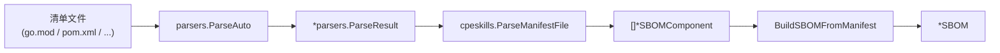
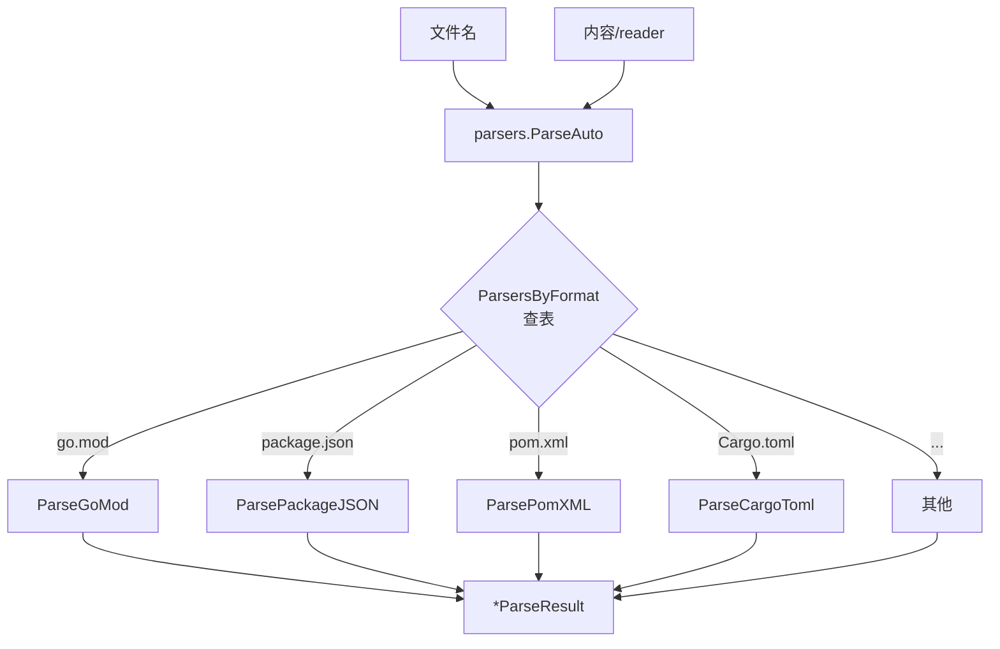

# 🌉 清单文件桥接

manifest-bridge 模块横跨两个包：

- 顶层包 `cpeskills`（`manifest_bridge.go`）—— 将解析后的清单结果桥接为 SBOM 组件与 SBOM 文档。
- 子包 `parsers`（`github.com/scagogogo/cpe-skills/pkg/parsers`，文件 `pkg/parsers/parsers.go`）—— 解析原生清单/锁文件格式（go.mod、package.json、pom.xml、Cargo.toml 等）为标准化的 `ParseResult`。

这样无需外部工具即可直接从源码仓库生成 SBOM。



## 顶层函数（`cpeskills`）

### ParseManifestFile

```go
func ParseManifestFile(filename string, content string) ([]*SBOMComponent, error)
```

解析清单文件（按文件名识别格式，内容以字符串传入），通过 `parsers.ParseAuto` 自动检测格式，返回 SBOM 组件。

**参数：**
- `filename` — 文件名（用于格式检测，如 `"go.mod"`、`"package.json"`）
- `content` — 文件内容

**返回值：**
- `[]*SBOMComponent` — 解析出的组件
- `error` — 解析错误

### ConvertMappingsToComponents

```go
func ConvertMappingsToComponents(mappings []parsers.ComponentMapping) []*SBOMComponent
```

将 `parsers.ComponentMapping`（来自 `parsers.ConvertToSBOMComponents`）转为 `SBOMComponent` 指针，填充名称、版本、group/namespace、PURL 和生态系统。

**参数：**
- `mappings` — 来自 parsers 子包的组件映射

**返回值：**
- `[]*SBOMComponent` — SBOM 组件

### BuildSBOMFromManifest

```go
func BuildSBOMFromManifest(filename string, content string, sbomName string) (*SBOM, error)
```

解析清单并组装为完整的 `SBOM` 文档，使用指定名称。

**参数：**
- `filename` — 清单文件名
- `content` — 清单内容
- `sbomName` — SBOM 文档名称

**返回值：**
- `*SBOM` — 组装好的 SBOM
- `error` — 解析错误

**示例：**
```go
content := `module example.com/myapp
go 1.23
require github.com/scagogogo/versions v1.0.0
`
sbom, err := cpeskills.BuildSBOMFromManifest("go.mod", content, "myapp-sbom")
if err != nil {
    log.Fatal(err)
}
fmt.Println(sbom.ComponentCount())
```

### ParseManifestToComponents

```go
func ParseManifestToComponents(filename string, content string) (*parsers.ParseResult, error)
```

解析清单并返回原始 `parsers.ParseResult`（尚未转为 SBOM 组件），暴露生态系统、PURL 类型和完整 `ComponentInfo` 列表。

**参数：**
- `filename` — 清单文件名
- `content` — 清单内容

**返回值：**
- `*parsers.ParseResult` — 原始解析结果
- `error` — 解析错误

## 子包类型（`parsers`）

### ParseResult

```go
type ParseResult struct {
    Ecosystem  string            `json:"ecosystem"`
    PURLType   string            `json:"purlType"`
    Components []*ComponentInfo  `json:"components"`
    Name       string            `json:"name,omitempty"`
    Version    string            `json:"version,omitempty"`
    Metadata   map[string]interface{} `json:"metadata,omitempty"`
}
```

### ComponentInfo

```go
type ComponentInfo struct {
    Name      string `json:"name"`
    Version   string `json:"version"`
    Namespace string `json:"namespace,omitempty"`
    IsDirect  bool   `json:"isDirect"`
    IsDev     bool   `json:"isDev,omitempty"`
    Scope     string `json:"scope,omitempty"`
    Checksum  string `json:"checksum,omitempty"`
    Resolved  string `json:"resolved,omitempty"`
}
```

### ParseFunc

```go
type ParseFunc func(reader io.Reader) (*ParseResult, error)
```

清单解析器函数类型。

### ComponentMapping

```go
type ComponentMapping struct { /* 字段见源码 */ }
```

供 `ConvertToSBOMComponents` 使用、随后转为 `SBOMComponent` 的中间映射。（确切字段请读 `pkg/parsers/parsers.go`。）

### ParsersByFormat

```go
var ParsersByFormat = map[string]ParseFunc{ /* ... */ }
```

将文件扩展名/文件名映射到其解析器函数的注册表。

## 子包解析函数（`parsers`）

```go
func ParseGoMod(reader io.Reader) (*ParseResult, error)
func ParsePackageJSON(reader io.Reader) (*ParseResult, error)
func ParsePackageLockJSON(reader io.Reader) (*ParseResult, error)
func ParseRequirementsTxt(reader io.Reader) (*ParseResult, error)
func ParsePomXML(reader io.Reader) (*ParseResult, error)
func ParseCargoToml(reader io.Reader) (*ParseResult, error)
func ParseComposerJSON(reader io.Reader) (*ParseResult, error)
func ParseComposerLock(reader io.Reader) (*ParseResult, error)
func ParseGemfile(reader io.Reader) (*ParseResult, error)
func ParseAuto(filename string, reader io.Reader) (*ParseResult, error)
func ConvertToSBOMComponents(result *ParseResult) []ComponentMapping
```

每个 `ParseX` 函数从 `io.Reader` 读取单一清单格式。`ParseAuto` 按文件名分派到对应解析器。`ConvertToSBOMComponents` 将 `ParseResult` 转为 `ComponentMapping`，供 `cpeskills.ConvertMappingsToComponents` 消费。

## 双包导入示例

```go
import (
    "github.com/scagogogo/cpe-skills"
    "github.com/scagogogo/cpe-skills/pkg/parsers"
    "strings"
)

func main() {
    // 直接使用 parsers 子包
    pr, err := parsers.ParseGoMod(strings.NewReader("module example.com/app\ngo 1.23\n"))
    if err != nil {
        log.Fatal(err)
    }
    fmt.Println(pr.Ecosystem) // golang

    // 或使用顶层桥接
    sbom, err := cpeskills.BuildSBOMFromManifest("go.mod", "module example.com/app\ngo 1.23\n", "app")
    _ = sbom
}
```

## 自动检测流程


