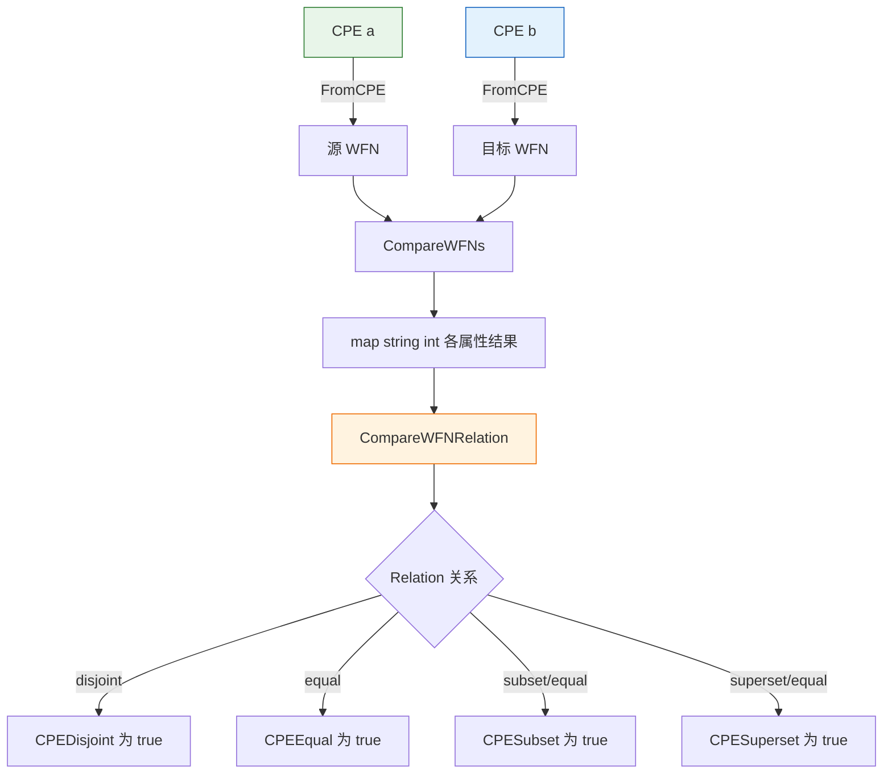

# 🧮 关系比较与匹配

`matching` 模块实现了 CPE 名称匹配规范（NISTIR 7696）。它逐属性比较两个 CPE 规范名（Well-Formed Name，WFN），并将各属性的比较结果归约为一个集合关系：相等、超集、子集、不相交或重叠。

## 类型：Relation

```go
type Relation int
```

`Relation` 枚举两个 CPE 之间可能的集合关系，依据 CPE 名称匹配规范定义。

```go
const (
    RelationDisjoint Relation = iota // 0，不相交，无重叠
    RelationSubset                   // 1，源是目标的子集
    RelationSuperset                 // 2，源是目标的超集
    RelationEqual                    // 3，两个 CPE 相等
    RelationOverlap                  // 4，部分重叠，互不完全包含
    RelationUnknown                  // 5，关系无法确定
)
```

## 🏷️ Relation.String

```go
func (r Relation) String() string
```

返回关系的小写字符串表示：`"disjoint"`、`"subset"`、`"superset"`、`"equal"`、`"overlap"` 或 `"unknown"`。

| 参数 | 类型 | 说明 |
| --- | --- | --- |
| 接收者 | `Relation` | 关系值 |

| 返回值 | 类型 | 说明 |
| --- | --- | --- |
| 第 1 个 | `string` | 关系名称 |

```go
a := cpeskills.MustParse("cpe:2.3:a:microsoft:windows:*:*:*:*:*:*:*:*")
b := cpeskills.MustParse("cpe:2.3:a:microsoft:windows:10:*:*:*:*:*:*:*")
fmt.Println(a.CompareTo(b).String()) // superset
```

## ⚖️ CompareAttributes

```go
func CompareAttributes(source, target string) int
```

依据 NISTIR 7696 属性比较规则比较两个 WFN 属性值。空字符串被视为 `ANY`。返回值编码了 `source` 相对于 `target` 的关系：

- `1` — `source` 是 `target` 的超集（例如 `source` 为 `ANY` 或通配符，而 `target` 更具体）
- `0` — 两个值相等
- `-1` — `source` 是 `target` 的子集
- `-2` — 两个值不相交（无任何可能重叠，包括 `NA` 与非 `NA` 值）

| 参数 | 类型 | 说明 |
| --- | --- | --- |
| `source` | `string` | 源属性值（`ANY`、`NA`、字面量或通配符模式） |
| `target` | `string` | 目标属性值 |

| 返回值 | 类型 | 说明 |
| --- | --- | --- |
| 第 1 个 | `int` | `1` 超集、`0` 相等、`-1` 子集、`-2` 不相交 |

```go
fmt.Println(cpeskills.CompareAttributes("*", "10"))   // 1  （ANY 是超集）
fmt.Println(cpeskills.CompareAttributes("10", "*"))   // -1 （字面量是 ANY 的子集）
fmt.Println(cpeskills.CompareAttributes("10", "10"))  // 0  （相等）
fmt.Println(cpeskills.CompareAttributes("10", "11"))  // -2 （不相交）
```

## 🔁 CompareWFNs

```go
func CompareWFNs(source, target *WFN) map[string]int
```

逐属性比较两个规范名，返回以属性名（`part`、`vendor`、`product`、`version`、`update`、`edition`、`language`、`sw_edition`、`target_sw`、`target_hw`、`other`）为键的映射，值为各属性的比较结果（编码与 `CompareAttributes` 相同）。`nil` 的 WFN 被视为空（全 `ANY`）的 WFN。

| 参数 | 类型 | 说明 |
| --- | --- | --- |
| `source` | `*WFN` | 源规范名，`nil` 视为空 |
| `target` | `*WFN` | 目标规范名，`nil` 视为空 |

| 返回值 | 类型 | 说明 |
| --- | --- | --- |
| 第 1 个 | `map[string]int` | 各属性的比较结果 |

```go
source := cpeskills.FromCPE(cpeskills.MustParse("cpe:2.3:a:microsoft:windows:*:*:*:*:*:*:*:*"))
target := cpeskills.FromCPE(cpeskills.MustParse("cpe:2.3:a:microsoft:windows:10:*:*:*:*:*:*:*"))
comparisons := cpeskills.CompareWFNs(source, target)
for attr, rel := range comparisons {
    fmt.Printf("%s: %d\n", attr, rel)
}
```

## 🧭 CompareWFNRelation

```go
func CompareWFNRelation(comparisons map[string]int) Relation
```

将逐属性比较映射（由 `CompareWFNs` 产生）归约为单个整体 `Relation`。判定规则：

- 任一属性为不相交（`-2`），结果为 `RelationDisjoint`。
- 同时存在超集（`1`）与子集（`-1`）属性，结果为 `RelationOverlap`。
- 仅存在超集，结果为 `RelationSuperset`。
- 仅存在子集，结果为 `RelationSubset`。
- 否则（全部相等），结果为 `RelationEqual`。

| 参数 | 类型 | 说明 |
| --- | --- | --- |
| `comparisons` | `map[string]int` | 各属性的比较结果 |

| 返回值 | 类型 | 说明 |
| --- | --- | --- |
| 第 1 个 | `Relation` | 两个 CPE 的整体关系 |

```go
comparisons := cpeskills.CompareWFNs(source, target)
switch cpeskills.CompareWFNRelation(comparisons) {
case cpeskills.RelationEqual:
    fmt.Println("相等")
case cpeskills.RelationSuperset:
    fmt.Println("源是超集")
case cpeskills.RelationDisjoint:
    fmt.Println("不相交")
}
```

## 🚫 CPEDisjoint

```go
func CPEDisjoint(a, b *CPE) bool
```

判断两个 CPE 是否不相交（无重叠）。任一参数为 `nil` 时返回 `true`。

| 参数 | 类型 | 说明 |
| --- | --- | --- |
| `a` | `*CPE` | 第一个 CPE |
| `b` | `*CPE` | 第二个 CPE |

| 返回值 | 类型 | 说明 |
| --- | --- | --- |
| 第 1 个 | `bool` | 不相交（或任一为 `nil`）返回 `true`，否则 `false` |

```go
a := cpeskills.MustParse("cpe:2.3:a:microsoft:windows:*:*:*:*:*:*:*:*")
b := cpeskills.MustParse("cpe:2.3:a:adobe:reader:*:*:*:*:*:*:*:*")
fmt.Println(cpeskills.CPEDisjoint(a, b)) // true
```

## 🟰 CPEEqual

```go
func CPEEqual(a, b *CPE) bool
```

判断两个 CPE 是否相等。任一参数为 `nil` 时返回 `false`。

| 参数 | 类型 | 说明 |
| --- | --- | --- |
| `a` | `*CPE` | 第一个 CPE |
| `b` | `*CPE` | 第二个 CPE |

| 返回值 | 类型 | 说明 |
| --- | --- | --- |
| 第 1 个 | `bool` | 相等返回 `true`，否则 `false` |

```go
a := cpeskills.MustParse("cpe:2.3:a:microsoft:windows:10:*:*:*:*:*:*:*")
b := cpeskills.MustParse("cpe:2.3:a:microsoft:windows:10:*:*:*:*:*:*:*")
fmt.Println(cpeskills.CPEEqual(a, b)) // true
```

## ⬇️ CPESubset

```go
func CPESubset(a, b *CPE) bool
```

判断 CPE `a` 是否是 CPE `b` 的子集。当整体关系为 `RelationSubset` 或 `RelationEqual` 时视为子集（相等的 CPE 平凡地互为子集）。任一参数为 `nil` 时返回 `false`。

| 参数 | 类型 | 说明 |
| --- | --- | --- |
| `a` | `*CPE` | 待判定的子集 |
| `b` | `*CPE` | 待判定的超集 |

| 返回值 | 类型 | 说明 |
| --- | --- | --- |
| 第 1 个 | `bool` | `a` 是 `b` 的子集（或相等）返回 `true` |

```go
a := cpeskills.MustParse("cpe:2.3:a:microsoft:windows:10:*:*:*:*:*:*:*")
b := cpeskills.MustParse("cpe:2.3:a:microsoft:windows:*:*:*:*:*:*:*:*")
fmt.Println(cpeskills.CPESubset(a, b)) // true
```

## ⬆️ CPESuperset

```go
func CPESuperset(a, b *CPE) bool
```

判断 CPE `a` 是否是 CPE `b` 的超集。当整体关系为 `RelationSuperset` 或 `RelationEqual` 时视为超集（相等的 CPE 平凡地互为超集）。任一参数为 `nil` 时返回 `false`。

| 参数 | 类型 | 说明 |
| --- | --- | --- |
| `a` | `*CPE` | 待判定的超集 |
| `b` | `*CPE` | 待判定的子集 |

| 返回值 | 类型 | 说明 |
| --- | --- | --- |
| 第 1 个 | `bool` | `a` 是 `b` 的超集（或相等）返回 `true` |

```go
a := cpeskills.MustParse("cpe:2.3:a:microsoft:windows:*:*:*:*:*:*:*:*")
b := cpeskills.MustParse("cpe:2.3:a:microsoft:windows:10:*:*:*:*:*:*:*")
fmt.Println(cpeskills.CPESuperset(a, b)) // true
```

## 📐 匹配流程图


