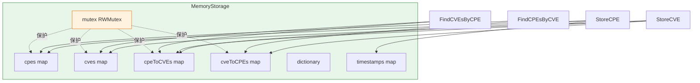

# 🧠 MemoryStorage

`memory_storage` 模块提供 `MemoryStorage`——`Storage` 接口的内存实现。所有数据（CPE、CVE、CPE↔CVE 关系、字典、时间戳）保存在由 `sync.RWMutex` 保护的 map 中，因此可安全并发使用。由于全部数据驻留在进程内存中，它速度快但不持久：进程退出即丢失数据。通常用作 `FileStorage` 之后的缓存层，或用于测试。

## 类型：MemoryStorage

```go
type MemoryStorage struct {
    cpes        map[string]*CPE          // CPE 存储，键为 CPE ID
    cves        map[string]*CVEReference // CVE 存储，键为 CVE ID
    cpeToCVEs   map[string][]string      // CPE → CVE ID 列表
    cveToCPEs   map[string][]string      // CVE → CPE ID 列表
    dictionary  *CPEDictionary           // CPE 字典
    timestamps  map[string]time.Time     // 修改时间戳
    mutex       sync.RWMutex             // 保护所有字段
}
```

`MemoryStorage` 实现了 `Storage` 接口的全部方法。所有字段均为非导出，只能通过以下方法访问。

## 🆕 NewMemoryStorage

```go
func NewMemoryStorage() *MemoryStorage
```

创建一个空的 `MemoryStorage`，所有 map 已初始化，`dictionary` 为 `nil`。

| 参数 | 类型 | 说明 |
| --- | --- | --- |
| （无） | | |

| 返回值 | 类型 | 说明 |
| --- | --- | --- |
| #1 | `*MemoryStorage` | 新的内存存储 |

```go
storage := cpeskills.NewMemoryStorage()
_ = storage.Initialize()
```

## 🟢 Initialize

```go
func (ms *MemoryStorage) Initialize() error
```

清空所有数据（CPE、CVE、关系、字典、时间戳）并记录 `initialization` 时间戳。始终返回 `nil`。

| 参数 | 类型 | 说明 |
| --- | --- | --- |
| 接收者 | `*MemoryStorage` | 存储实例 |

| 返回值 | 类型 | 说明 |
| --- | --- | --- |
| #1 | `error` | 始终为 `nil` |

```go
storage := cpeskills.NewMemoryStorage()
_ = storage.Initialize()
```

## 🔴 Close

```go
func (ms *MemoryStorage) Close() error
```

释放资源。内存存储不持有外部连接，因此为空操作，始终返回 `nil`。

| 参数 | 类型 | 说明 |
| --- | --- | --- |
| 接收者 | `*MemoryStorage` | 存储实例 |

| 返回值 | 类型 | 说明 |
| --- | --- | --- |
| #1 | `error` | 始终为 `nil` |

```go
defer storage.Close()
```

## 💾 StoreCPE

```go
func (ms *MemoryStorage) StoreCPE(cpe *CPE) error
```

以 `cpe.GetURI()` 为键存储 `cpe` 的深拷贝，并更新 `last_cpe_update` 时间戳。`cpe` 为 `nil` 时返回 `ErrInvalidData`。

| 参数 | 类型 | 说明 |
| --- | --- | --- |
| 接收者 | `*MemoryStorage` | 存储实例 |
| `cpe` | `*CPE` | 要存储的 CPE |

| 返回值 | 类型 | 说明 |
| --- | --- | --- |
| #1 | `error` | `cpe` 为 `nil` 时为 `ErrInvalidData` |

```go
_ = storage.StoreCPE(&cpeskills.CPE{
    Cpe23:       "cpe:2.3:a:apache:log4j:2.0:*:*:*:*:*:*:*",
    Vendor:      cpeskills.Vendor("apache"),
    ProductName: cpeskills.Product("log4j"),
    Version:     cpeskills.Version("2.0"),
})
```

## 🔍 RetrieveCPE

```go
func (ms *MemoryStorage) RetrieveCPE(id string) (*CPE, error)
```

返回 `id` 对应 CPE 的深拷贝。未找到时返回 `ErrNotFound`。

| 参数 | 类型 | 说明 |
| --- | --- | --- |
| 接收者 | `*MemoryStorage` | 存储实例 |
| `id` | `string` | CPE 标识符（其 URI） |

| 返回值 | 类型 | 说明 |
| --- | --- | --- |
| #1 | `*CPE` | CPE 的深拷贝 |
| #2 | `error` | 缺失时为 `ErrNotFound` |

```go
cpe, err := storage.RetrieveCPE("cpe:2.3:a:apache:log4j:2.0:*:*:*:*:*:*:*")
```

## ✏️ UpdateCPE

```go
func (ms *MemoryStorage) UpdateCPE(cpe *CPE) error
```

以 `cpe` 的深拷贝替换 `cpe.GetURI()` 处的 CPE。`cpe` 为 `nil` 时返回 `ErrInvalidData`，该 URI 下不存在 CPE 时返回 `ErrNotFound`。更新 `last_cpe_update` 时间戳。

| 参数 | 类型 | 说明 |
| --- | --- | --- |
| 接收者 | `*MemoryStorage` | 存储实例 |
| `cpe` | `*CPE` | 替换用的 CPE |

| 返回值 | 类型 | 说明 |
| --- | --- | --- |
| #1 | `error` | `ErrInvalidData` 或 `ErrNotFound` |

```go
cpe.Version = cpeskills.Version("2.1")
_ = storage.UpdateCPE(cpe)
```

## 🗑️ DeleteCPE

```go
func (ms *MemoryStorage) DeleteCPE(id string) error
```

删除 `id` 处的 CPE，并从所有 CPE↔CVE 关系 map 中清理它。不存在时返回 `ErrNotFound`。更新 `last_cpe_update` 时间戳。

| 参数 | 类型 | 说明 |
| --- | --- | --- |
| 接收者 | `*MemoryStorage` | 存储实例 |
| `id` | `string` | 要删除的 CPE 标识符 |

| 返回值 | 类型 | 说明 |
| --- | --- | --- |
| #1 | `error` | 缺失时为 `ErrNotFound` |

```go
_ = storage.DeleteCPE("cpe:2.3:a:apache:log4j:2.0:*:*:*:*:*:*:*")
```

## 🔎 SearchCPE

```go
func (ms *MemoryStorage) SearchCPE(criteria *CPE, options *MatchOptions) ([]*CPE, error)
```

返回所有在 `options` 规则下匹配 `criteria` 的 CPE 的深拷贝。`criteria` 为 `nil` 时返回所有 CPE；`options` 为 `nil` 时使用默认 `MatchOptions{}`。始终返回 `nil` 错误。

| 参数 | 类型 | 说明 |
| --- | --- | --- |
| 接收者 | `*MemoryStorage` | 存储实例 |
| `criteria` | `*CPE` | 匹配条件；`nil` 匹配全部 |
| `options` | `*MatchOptions` | 匹配选项；`nil` 使用默认值 |

| 返回值 | 类型 | 说明 |
| --- | --- | --- |
| #1 | `[]*CPE` | 匹配的 CPE（深拷贝） |
| #2 | `error` | 始终为 `nil` |

```go
results, _ := storage.SearchCPE(&cpeskills.CPE{
    Vendor: cpeskills.Vendor("apache"),
}, &cpeskills.MatchOptions{IgnoreVersion: true})
```

## 🎯 AdvancedSearchCPE

```go
func (ms *MemoryStorage) AdvancedSearchCPE(criteria *CPE, options *AdvancedMatchOptions) ([]*CPE, error)
```

与 `SearchCPE` 类似，但使用 `AdvancedMatchCPE`（版本范围、正则过滤）而非 `MatchCPE`。`criteria` 为 `nil` 时返回所有 CPE；`options` 为 `nil` 时默认为 `AdvancedMatchOptions{}`。

| 参数 | 类型 | 说明 |
| --- | --- | --- |
| 接收者 | `*MemoryStorage` | 存储实例 |
| `criteria` | `*CPE` | 匹配条件 |
| `options` | `*AdvancedMatchOptions` | 高级匹配选项 |

| 返回值 | 类型 | 说明 |
| --- | --- | --- |
| #1 | `[]*CPE` | 匹配的 CPE（深拷贝） |
| #2 | `error` | 始终为 `nil` |

```go
results, _ := storage.AdvancedSearchCPE(criteria, &cpeskills.AdvancedMatchOptions{})
```

## 📥 StoreCVE

```go
func (ms *MemoryStorage) StoreCVE(cve *CVEReference) error
```

以 `cve.CVEID` 为键存储 `cve` 的深拷贝，并重建其 CPE↔CVE 关系：`cve.AffectedCPEs` 中的每个合法 CPE URI（2.3 或 2.2）会被解析并关联。`cve` 为 `nil` 或 `CVEID` 为空时返回（包装的）`ErrInvalidData`。更新 `last_cve_update` 时间戳。

| 参数 | 类型 | 说明 |
| --- | --- | --- |
| 接收者 | `*MemoryStorage` | 存储实例 |
| `cve` | `*CVEReference` | 要存储的 CVE |

| 返回值 | 类型 | 说明 |
| --- | --- | --- |
| #1 | `error` | `cve` 为 `nil` 或 `CVEID` 为空时非 `nil` |

```go
cve := cpeskills.NewCVEReference("CVE-2021-44228")
cve.AffectedCPEs = []string{"cpe:2.3:a:apache:log4j:2.0:*:*:*:*:*:*:*"}
_ = storage.StoreCVE(cve)
```

## 🔍 RetrieveCVE

```go
func (ms *MemoryStorage) RetrieveCVE(cveID string) (*CVEReference, error)
```

返回 `cveID` 对应 CVE 的深拷贝。不存在时返回 `ErrNotFound`。

| 参数 | 类型 | 说明 |
| --- | --- | --- |
| 接收者 | `*MemoryStorage` | 存储实例 |
| `cveID` | `string` | CVE 标识符 |

| 返回值 | 类型 | 说明 |
| --- | --- | --- |
| #1 | `*CVEReference` | CVE 的深拷贝 |
| #2 | `error` | 缺失时为 `ErrNotFound` |

```go
cve, err := storage.RetrieveCVE("CVE-2021-44228")
```

## ✏️ UpdateCVE

```go
func (ms *MemoryStorage) UpdateCVE(cve *CVEReference) error
```

以 `cve` 替换 `cve.CVEID` 处的 CVE。先清除该 CVE 旧的 CPE↔CVE 关系，再根据新的 `AffectedCPEs` 重建。`cve` 为 `nil` 或 `CVEID` 为空时返回（包装的）`ErrInvalidData`，CVE 不存在时返回 `ErrNotFound`。更新 `last_cve_update` 时间戳。

| 参数 | 类型 | 说明 |
| --- | --- | --- |
| 接收者 | `*MemoryStorage` | 存储实例 |
| `cve` | `*CVEReference` | 替换用的 CVE |

| 返回值 | 类型 | 说明 |
| --- | --- | --- |
| #1 | `error` | `ErrInvalidData`、`ErrNotFound` 或 `nil` |

```go
cve.CVSSScore = 10.0
_ = storage.UpdateCVE(cve)
```

## 🗑️ DeleteCVE

```go
func (ms *MemoryStorage) DeleteCVE(cveID string) error
```

删除 `cveID` 处的 CVE，并从所有 CPE↔CVE 关系 map 中清理它。不存在时返回 `ErrNotFound`。更新 `last_cve_update` 时间戳。

| 参数 | 类型 | 说明 |
| --- | --- | --- |
| 接收者 | `*MemoryStorage` | 存储实例 |
| `cveID` | `string` | 要删除的 CVE 标识符 |

| 返回值 | 类型 | 说明 |
| --- | --- | --- |
| #1 | `error` | 缺失时为 `ErrNotFound` |

```go
_ = storage.DeleteCVE("CVE-2021-44228")
```

## 🔎 SearchCVE

```go
func (ms *MemoryStorage) SearchCVE(query string, options *SearchOptions) ([]*CVEReference, error)
```

按不区分大小写的子串匹配搜索 CVE（匹配 CVE ID、描述或参考链接）。应用 `SearchOptions` 过滤条件（CVSS 范围、日期范围、`severity`/`vendor`/`product` 过滤），再进行 `Offset`/`Limit` 分页。`query` 为空时返回所有 CVE（受过滤约束）。`options` 为 `nil` 时使用 `NewSearchOptions()`。

| 参数 | 类型 | 说明 |
| --- | --- | --- |
| 接收者 | `*MemoryStorage` | 存储实例 |
| `query` | `string` | 子串查询；空则匹配全部 |
| `options` | `*SearchOptions` | 过滤与分页；`nil` 使用默认值 |

| 返回值 | 类型 | 说明 |
| --- | --- | --- |
| #1 | `[]*CVEReference` | 匹配的 CVE（深拷贝，已分页） |
| #2 | `error` | 始终为 `nil` |

```go
opts := cpeskills.NewSearchOptions()
opts.MinCVSS = 7.0
results, _ := storage.SearchCVE("log4j", opts)
```

## 🔗 FindCVEsByCPE

```go
func (ms *MemoryStorage) FindCVEsByCPE(cpe *CPE) ([]*CVEReference, error)
```

返回与 `cpe` 关联的所有 CVE。若 `cpe.GetURI()` 没有存储的关系，则回退为通过 `MatchCPE` 将已存储 CPE 与 `cpe` 匹配，并聚合其 CVE。`cpe` 为 `nil` 时返回 `ErrInvalidData`；无匹配时返回空（非 `nil`）切片。

| 参数 | 类型 | 说明 |
| --- | --- | --- |
| 接收者 | `*MemoryStorage` | 存储实例 |
| `cpe` | `*CPE` | 要查询的 CPE |

| 返回值 | 类型 | 说明 |
| --- | --- | --- |
| #1 | `[]*CVEReference` | 关联的 CVE（深拷贝） |
| #2 | `error` | `cpe` 为 `nil` 时为 `ErrInvalidData` |

```go
cves, _ := storage.FindCVEsByCPE(&cpeskills.CPE{
    Cpe23: "cpe:2.3:a:apache:log4j:2.0:*:*:*:*:*:*:*",
})
```

## 🔗 FindCPEsByCVE

```go
func (ms *MemoryStorage) FindCPEsByCVE(cveID string) ([]*CPE, error)
```

返回与 `cveID` 关联的所有 CPE 的深拷贝。无关系时返回空（非 `nil`）切片。

| 参数 | 类型 | 说明 |
| --- | --- | --- |
| 接收者 | `*MemoryStorage` | 存储实例 |
| `cveID` | `string` | CVE 标识符 |

| 返回值 | 类型 | 说明 |
| --- | --- | --- |
| #1 | `[]*CPE` | 关联的 CPE（深拷贝） |
| #2 | `error` | 始终为 `nil` |

```go
cpes, _ := storage.FindCPEsByCVE("CVE-2021-44228")
```

## 📚 StoreDictionary

```go
func (ms *MemoryStorage) StoreDictionary(dict *CPEDictionary) error
```

存储 `dict` 的深拷贝。`dict` 为 `nil` 时返回 `ErrInvalidData`。更新 `last_dictionary_update` 时间戳。

| 参数 | 类型 | 说明 |
| --- | --- | --- |
| 接收者 | `*MemoryStorage` | 存储实例 |
| `dict` | `*CPEDictionary` | 要存储的字典 |

| 返回值 | 类型 | 说明 |
| --- | --- | --- |
| #1 | `error` | `dict` 为 `nil` 时为 `ErrInvalidData` |

```go
dict, _ := cpeskills.ParseDictionary(file)
_ = storage.StoreDictionary(dict)
```

## 📖 RetrieveDictionary

```go
func (ms *MemoryStorage) RetrieveDictionary() (*CPEDictionary, error)
```

返回已存储字典的深拷贝。未存储过字典时返回 `ErrNotFound`。

| 参数 | 类型 | 说明 |
| --- | --- | --- |
| 接收者 | `*MemoryStorage` | 存储实例 |

| 返回值 | 类型 | 说明 |
| --- | --- | --- |
| #1 | `*CPEDictionary` | 字典的深拷贝 |
| #2 | `error` | 缺失时为 `ErrNotFound` |

```go
dict, err := storage.RetrieveDictionary()
```

## ⏱️ StoreModificationTimestamp

```go
func (ms *MemoryStorage) StoreModificationTimestamp(key string, timestamp time.Time) error
```

将 `timestamp` 存储于 `key` 下。始终返回 `nil`。

| 参数 | 类型 | 说明 |
| --- | --- | --- |
| 接收者 | `*MemoryStorage` | 存储实例 |
| `key` | `string` | 时间戳键 |
| `timestamp` | `time.Time` | 要记录的时间戳 |

| 返回值 | 类型 | 说明 |
| --- | --- | --- |
| #1 | `error` | 始终为 `nil` |

```go
_ = storage.StoreModificationTimestamp("last_update", time.Now())
```

## ⏱️ RetrieveModificationTimestamp

```go
func (ms *MemoryStorage) RetrieveModificationTimestamp(key string) (time.Time, error)
```

返回 `key` 下存储的时间戳。不存在时返回零值 `time.Time` 和 `ErrNotFound`。

| 参数 | 类型 | 说明 |
| --- | --- | --- |
| 接收者 | `*MemoryStorage` | 存储实例 |
| `key` | `string` | 时间戳键 |

| 返回值 | 类型 | 说明 |
| --- | --- | --- |
| #1 | `time.Time` | 记录的时间戳 |
| #2 | `error` | 缺失时为 `ErrNotFound` |

```go
ts, err := storage.RetrieveModificationTimestamp("last_update")
```

## 🌐 ParseURI

```go
func ParseURI(uri string) (*CPE, error)
```

按前缀分派 URI 解析：`cpe:2.3:` 委托给 `ParseCpe23`，`cpe:/` 委托给 `ParseCpe22`。其他前缀返回格式无效错误。

| 参数 | 类型 | 说明 |
| --- | --- | --- |
| `uri` | `string` | CPE URI（2.2 或 2.3 形式） |

| 返回值 | 类型 | 说明 |
| --- | --- | --- |
| #1 | `*CPE` | 解析得到的 CPE |
| #2 | `error` | 格式无效时非 `nil` |

```go
cpe, err := cpeskills.ParseURI("cpe:2.3:a:apache:log4j:2.0:*:*:*:*:*:*:*")
```

## 🧭 MemoryStorage 内部结构


