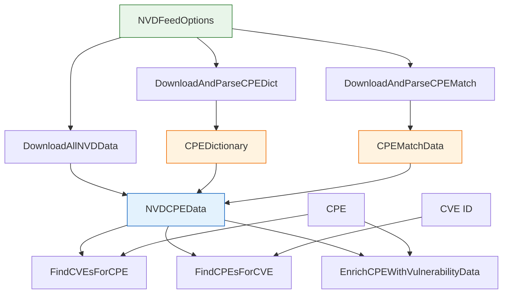

# 📡 NVD

`nvd` 模块负责下载并解析美国国家漏洞数据库（NVD）的数据 Feed：官方 CPE 字典、CPE–CVE 匹配 Feed，以及支持双向 CPE↔CVE 查询与 CPE 富化的组合 `NVDCPEData`。它还导出 NVD API 2.0 端点常量。

## 常量

```go
const (
    NVDApiBaseURL    = "https://services.nvd.nist.gov/rest/json/cves/2.0"
    NVDApiCPEsURL    = "https://services.nvd.nist.gov/rest/json/cpes/2.0"
    NVDCPEMatch      = "https://nvd.nist.gov/feeds/json/cpematch/1.0/nvdcpematch-1.0.json.gz"
    NVDCPEDict       = "https://nvd.nist.gov/feeds/xml/cpe/dictionary/official-cpe-dictionary_v2.3.xml.gz"
    NVDCVERecentURL  = "https://nvd.nist.gov/feeds/json/cve/1.1/nvdcve-1.1-recent.json.gz"
    NVDResultsPerPage = 2000
)
```

`NVDApiBaseURL` / `NVDApiCPEsURL` 是 API 2.0 的 CVE 与 CPE JSON 端点。`NVDCPEMatch` 和 `NVDCPEDict` 是旧版的 gzip Feed URL。`NVDResultsPerPage` 是分页 API 2.0 请求使用的每页数量。

## 类型：NVDFeedOptions

```go
type NVDFeedOptions struct {
    CacheDir               string        // 缓存目录；默认为 <tmp>/cpe-cache
    CacheMaxAge            int           // 缓存 TTL（小时）；默认 24
    MaxConcurrentDownloads int           // 最大并发下载数；默认 3
    ShowProgress           bool          // 向标准输出打印进度；默认 true
    HTTPClient             *http.Client  // 自定义 HTTP 客户端；默认 60 秒超时
}
```

配置下载行为。建议使用 `DefaultNVDFeedOptions()` 并仅覆盖需要的字段。

## 类型：NVDCPEData

```go
type NVDCPEData struct {
    CPEDictionary *CPEDictionary  // 所有正式注册的 CPE 条目
    CPEMatchData  *CPEMatchData   // CPE-CVE 双向映射
    DownloadTime  time.Time       // 数据下载时间
    // mu sync.RWMutex 保护并发访问缓存查询结果
}
```

将 CPE 字典与 CPE–CVE 匹配数据聚合为一个可查询对象。

## 类型：CPEMatchData

```go
type CPEMatchData struct {
    CVEToCPEs map[string][]string  // CVE ID -> 受影响的 CPE URI
    CPEToCVEs map[string][]string  // CPE URI -> 影响该 CPE 的 CVE ID
}
```

CVE ID 与 CPE URI 之间的双向映射。

## ⚙️ DefaultNVDFeedOptions

```go
func DefaultNVDFeedOptions() *NVDFeedOptions
```

返回一个带合理默认值的 `NVDFeedOptions`：`CacheDir` = `<tmp>/cpe-cache`、`CacheMaxAge` = 24、`MaxConcurrentDownloads` = 3、`ShowProgress` = true、`HTTPClient` = 60 秒超时。

| 返回值 | 类型 | 说明 |
| --- | --- | --- |
| #1 | `*NVDFeedOptions` | 默认选项；使用前可修改字段 |

```go
opts := cpeskills.DefaultNVDFeedOptions()
opts.CacheDir = "/var/cache/nvd"
```

## 📥 DownloadAndParseCPEDict

```go
func DownloadAndParseCPEDict(options *NVDFeedOptions) (*CPEDictionary, error)
```

下载（或从缓存读取）并解析 NVD 官方 CPE 字典（`NVDCPEDict`），返回包含所有已注册 CPE 条目的 `CPEDictionary`。

| 参数 | 类型 | 说明 |
| --- | --- | --- |
| `options` | `*NVDFeedOptions` | 下载/缓存选项 |

| 返回值 | 类型 | 说明 |
| --- | --- | --- |
| #1 | `*CPEDictionary` | 解析后的 CPE 字典 |
| #2 | `error` | 下载或解析错误 |

```go
dict, err := cpeskills.DownloadAndParseCPEDict(cpeskills.DefaultNVDFeedOptions())
```

## 📥 DownloadAndParseCPEMatch

```go
func DownloadAndParseCPEMatch(options *NVDFeedOptions) (*CPEMatchData, error)
```

下载（或从缓存读取）并解析 NVD CPE 匹配 Feed（`NVDCPEMatch`），返回双向 `CPEMatchData`。

| 参数 | 类型 | 说明 |
| --- | --- | --- |
| `options` | `*NVDFeedOptions` | 下载/缓存选项 |

| 返回值 | 类型 | 说明 |
| --- | --- | --- |
| #1 | `*CPEMatchData` | 解析后的 CPE–CVE 映射 |
| #2 | `error` | 下载或解析错误 |

```go
match, err := cpeskills.DownloadAndParseCPEMatch(cpeskills.DefaultNVDFeedOptions())
```

## 📦 DownloadAllNVDData

```go
func DownloadAllNVDData(options *NVDFeedOptions) (*NVDCPEData, error)
```

下载并解析 CPE 字典与 CPE 匹配 Feed 两份数据，返回组合后的 `NVDCPEData`。

| 参数 | 类型 | 说明 |
| --- | --- | --- |
| `options` | `*NVDFeedOptions` | 下载/缓存选项 |

| 返回值 | 类型 | 说明 |
| --- | --- | --- |
| #1 | `*NVDCPEData` | 字典 + 匹配数据组合 |
| #2 | `error` | 下载或解析错误 |

```go
data, err := cpeskills.DownloadAllNVDData(cpeskills.DefaultNVDFeedOptions())
```

## 🔎 FindCVEsForCPE

```go
func (data *NVDCPEData) FindCVEsForCPE(cpe *CPE) []string
```

返回影响给定 CPE 的 CVE ID，通过匹配数据的 `CPEToCVEs` 映射查找（无精确命中时回退到模糊匹配）。

| 参数 | 类型 | 说明 |
| --- | --- | --- |
| `cpe` | `*CPE` | 要查询的 CPE |

| 返回值 | 类型 | 说明 |
| --- | --- | --- |
| #1 | `[]string` | 影响该 CPE 的 CVE ID；无则为空切片 |

```go
cpe, _ := cpeskills.ParseCpe23("cpe:2.3:o:microsoft:windows:10:*:*:*:*:*:*:*")
cves := data.FindCVEsForCPE(cpe)
```

## 🔎 FindCPEsForCVE

```go
func (data *NVDCPEData) FindCPEsForCVE(cveID string) []*CPE
```

返回受给定 CVE ID 影响的 CPE，通过匹配数据的 `CVEToCPEs` 映射查找。

| 参数 | 类型 | 说明 |
| --- | --- | --- |
| `cveID` | `string` | CVE 标识符 |

| 返回值 | 类型 | 说明 |
| --- | --- | --- |
| #1 | `[]*CPE` | 受该 CVE 影响的 CPE；无则为空切片 |

```go
cpes := data.FindCPEsForCVE("CVE-2021-44228")
```

## ✨ EnrichCPEWithVulnerabilityData

```go
func (data *NVDCPEData) EnrichCPEWithVulnerabilityData(cpe *CPE)
```

就地用匹配数据派生的漏洞信息（如关联 CVE 列表）补充给定 `CPE`。

| 参数 | 类型 | 说明 |
| --- | --- | --- |
| `cpe` | `*CPE` | 要富化的 CPE（就地修改） |

```go
cpe, _ := cpeskills.ParseCpe23("cpe:2.3:a:apache:log4j:2.0:*:*:*:*:*:*:*")
data.EnrichCPEWithVulnerabilityData(cpe)
```

## 🧭 NVD 下载与查询流程


