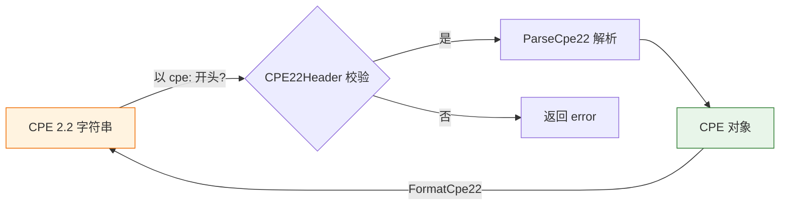

# 🔍 CPE 2.2 解析器

本模块提供 CPE 2.2 格式（带 `cpe:` 前缀的旧式 URI）的解析与格式化能力。

## 常量

```go
const CPE22Header = "cpe"
```

`CPE22Header` 是 CPE 2.2 URI 的固定前缀，所有合法的 2.2 字符串都以 `cpe:` 开头。

## 📥 ParseCpe22

```go
func ParseCpe22(cpe22 string) (*CPE, error)
```

将 CPE 2.2 格式的字符串解析为 `CPE` 对象。字符串应以 `cpe:` 前缀开头，包含 `part:vendor:product:version` 等属性。

| 参数 | 类型 | 说明 |
| --- | --- | --- |
| `cpe22` | `string` | 待解析的 CPE 2.2 字符串 |

| 返回值 | 类型 | 说明 |
| --- | --- | --- |
| 第 1 个 | `*CPE` | 解析得到的 CPE 对象 |
| 第 2 个 | `error` | 解析失败时返回错误 |

```go
package main

import (
    "fmt"
    "github.com/scagogogo/cpe-skills"
)

func main() {
    cpe, err := cpeskills.ParseCpe22("cpe:/a:microsoft:windows:10")
    if err != nil {
        panic(err)
    }
    fmt.Println(cpe.GetURI())
}
```

## 📤 FormatCpe22

```go
func FormatCpe22(cpe *CPE) string
```

将 `CPE` 对象格式化为 CPE 2.2 URI 字符串。

| 参数 | 类型 | 说明 |
| --- | --- | --- |
| `cpe` | `*CPE` | 待格式化的 CPE 对象 |

| 返回值 | 类型 | 说明 |
| --- | --- | --- |
| 第 1 个 | `string` | CPE 2.2 URI 字符串 |

```go
cpe := cpeskills.MustParse("cpe:2.3:a:microsoft:windows:10:*:*:*:*:*:*:*")
fmt.Println(cpeskills.FormatCpe22(cpe))
```

## 🔄 解析流程


