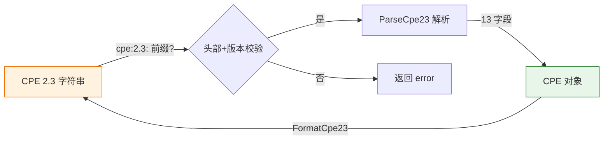

# 🔍 CPE 2.3 解析器

本模块提供 CPE 2.3 格式（以 `cpe:2.3:` 为前缀、冒号分隔的 URI）的解析与格式化能力，这是当前的标准格式。

## 常量

```go
const CPE23Header = "cpe"
const CPE23Version = "2.3"
```

`CPE23Header` 是 CPE 2.3 URI 的固定前缀，`CPE23Version` 是嵌入在每个 2.3 字符串中的版本段（`cpe:2.3:...`）。

## 📥 ParseCpe23

```go
func ParseCpe23(cpe23 string) (*CPE, error)
```

将 CPE 2.3 格式的字符串解析为 `CPE` 对象。字符串必须以 `cpe:2.3:` 开头，并包含规范定义的 13 个属性字段。

| 参数 | 类型 | 说明 |
| --- | --- | --- |
| `cpe23` | `string` | 待解析的 CPE 2.3 字符串 |

| 返回值 | 类型 | 说明 |
| --- | --- | --- |
| 第 1 个 | `*CPE` | 解析得到的 CPE 对象 |
| 第 2 个 | `error` | 解析失败时返回错误 |

```go
package main

import (
    "fmt"
    "github.com/scagogogo/cpe-skills"
)

func main() {
    cpe, err := cpeskills.ParseCpe23("cpe:2.3:a:microsoft:windows:10:*:*:*:*:*:*:*")
    if err != nil {
        panic(err)
    }
    fmt.Println(cpe.Vendor, cpe.ProductName)
}
```

## 📤 FormatCpe23

```go
func FormatCpe23(cpe *CPE) string
```

将 `CPE` 对象格式化为 CPE 2.3 URI 字符串。

| 参数 | 类型 | 说明 |
| --- | --- | --- |
| `cpe` | `*CPE` | 待格式化的 CPE 对象 |

| 返回值 | 类型 | 说明 |
| --- | --- | --- |
| 第 1 个 | `string` | CPE 2.3 URI 字符串 |

```go
cpe := cpeskills.MustParse("cpe:2.3:a:microsoft:windows:10:*:*:*:*:*:*:*")
fmt.Println(cpeskills.FormatCpe23(cpe))
```

## 🔄 解析流程


