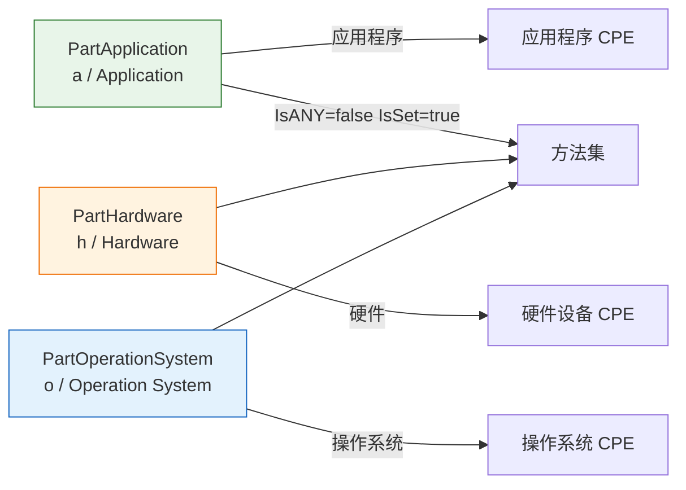

# 🧱 Part

`Part` 表示 CPE 标识的组件类型——即每个 CPE 的第一个属性，用于区分应用程序（`a`）、硬件（`h`）和操作系统（`o`）。本模块声明 `Part` 结构体、三个预定义 `Part` 值，以及 `Part` 的检查方法。

## 类型：Part

```go
type Part struct {
    ShortName   string
    LongName    string
    Description string
}
```

| 字段 | 类型 | 说明 |
| --- | --- | --- |
| `ShortName` | `string` | 用于 CPE URI 的单字符短名：`a`、`h` 或 `o` |
| `LongName` | `string` | 完整名称：`Application`、`Hardware` 或 `Operation System` |
| `Description` | `string` | 组件类型的人类可读描述 |

## 变量

```go
var PartApplication = &Part{
    ShortName:   "a",
    LongName:    "Application",
    Description: "表示软件应用程序，包括但不限于桌面应用、服务器应用、移动应用等",
}

var PartHardware = &Part{
    ShortName:   "h",
    LongName:    "Hardware",
    Description: "表示物理硬件设备，包括但不限于网络设备、服务器、存储设备等",
}

var PartOperationSystem = &Part{
    ShortName:   "o",
    LongName:    "Operation System",
    Description: "表示操作系统，用于管理计算机硬件与软件资源的系统软件",
}
```

三个预定义的 `Part` 值，以指针形式返回。用于设置 `CPE` 结构体的 `Part` 字段（按值赋值时需解引用，例如 `*cpeskills.PartApplication`）。

> 注意：变量名为 `PartOperationSystem`（与源码拼写一致），而非 `PartOperatingSystem`。

## ❓ IsANY

```go
func (p Part) IsANY() bool
```

判断 part 是否为逻辑值 ANY，即其 `ShortName` 为 `*`。

| 返回值 | 类型 | 说明 |
| --- | --- | --- |
| 第 1 个 | `bool` | `ShortName == "*"` 时返回 `true` |

```go
p := *cpeskills.PartApplication
fmt.Println(p.IsANY()) // false
```

## ❓ IsNA

```go
func (p Part) IsNA() bool
```

判断 part 是否为逻辑值 NA，即其 `ShortName` 为 `-`。

| 返回值 | 类型 | 说明 |
| --- | --- | --- |
| 第 1 个 | `bool` | `ShortName == "-"` 时返回 `true` |

```go
p := Part{ShortName: "-"}
fmt.Println(p.IsNA()) // true
```

## ✔️ IsSet

```go
func (p Part) IsSet() bool
```

判断 part 是否为真实值：`ShortName` 非空、非 ANY、非 NA。

| 返回值 | 类型 | 说明 |
| --- | --- | --- |
| 第 1 个 | `bool` | 为具体值时返回 `true` |

```go
p := *cpeskills.PartApplication
fmt.Println(p.IsSet()) // true
```

## 🧹 Normalize

```go
func (p Part) Normalize() string
```

返回小写后的 `ShortName`。

| 返回值 | 类型 | 说明 |
| --- | --- | --- |
| 第 1 个 | `string` | 小写后的短名 |

```go
p := Part{ShortName: "A"}
fmt.Println(p.Normalize()) // a
```

## 📐 Part 取值示意图


