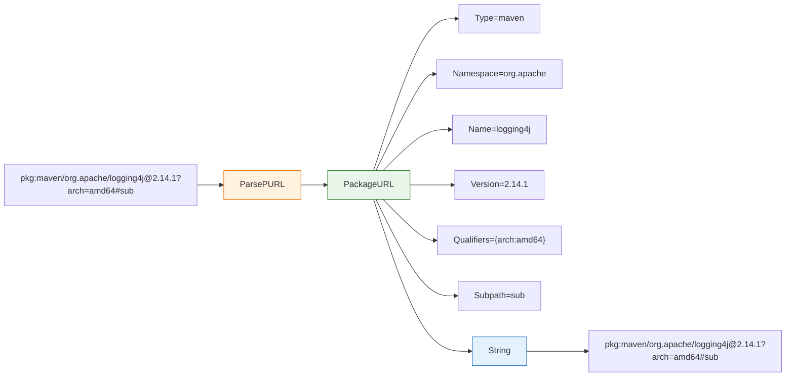

# 📦 Package URL (PURL)

`PackageURL` 表示一个 Package URL（PURL），是 SCA 工具、SBOM 和漏洞数据库中用于唯一标识软件包的标准化包标识符。格式遵循 [purl-spec](https://github.com/package-url/purl-spec)：`scheme:type/namespace/name@version?qualifiers#subpath`。本模块声明 `PackageURL` 结构体及其解析、格式化与比较辅助方法。

## 类型：PackageURL

```go
type PackageURL struct {
    Type       string
    Namespace  string
    Name       string
    Version    string
    Qualifiers map[string]string
    Subpath    string
}
```

| 字段 | 类型 | 说明 |
| --- | --- | --- |
| `Type` | `string` | 包类型/生态系统（`npm`、`maven`、`pypi`、`golang`、`nuget` 等） |
| `Namespace` | `string` | 命名空间（npm 的 `@scope`、Maven 的 groupId） |
| `Name` | `string` | 包名称 |
| `Version` | `string` | 包版本 |
| `Qualifiers` | `map[string]string` | 限定符键值对，如 `{"arch": "amd64", "os": "linux"}` |
| `Subpath` | `string` | 子路径 |

## 🔍 ParsePURL

```go
func ParsePURL(raw string) (*PackageURL, error)
```

将 PURL 字符串解析为 `PackageURL` 结构体。支持 `pkg:type/name@version`、`pkg:type/namespace/name@version`、`pkg:type/namespace/name@version?key=value&key2=value2`、`pkg:type/namespace/name@version?key=value#subpath` 等格式，各段会做 URL 解码。

| 参数 | 类型 | 说明 |
| --- | --- | --- |
| `raw` | `string` | 原始 PURL 字符串，必须以 `pkg:` 开头 |

| 返回值 | 类型 | 说明 |
| --- | --- | --- |
| #1 | `*PackageURL` | 解析后的 PURL，出错时为 `nil` |
| #2 | `error` | 字符串为空、缺少 `pkg:` 前缀或格式错误时非 nil |

```go
p, err := cpeskills.ParsePURL("pkg:maven/org.apache.logging.log4j/log4j-core@2.14.1")
if err != nil {
    log.Fatal(err)
}
fmt.Println(p.Type, p.Namespace, p.Name, p.Version)
// maven org.apache.logging.log4j log4j-core 2.14.1
```

## 📝 String

```go
func (p *PackageURL) String() string
```

将 `PackageURL` 格式化为规范 PURL 字符串。限定符键按字母序输出以保证稳定结果。`p` 为 nil 时返回空字符串。

| 返回值 | 类型 | 说明 |
| --- | --- | --- |
| #1 | `string` | 规范 PURL 字符串 |

```go
p, _ := cpeskills.ParsePURL("pkg:npm/@vue/cli@5.0.0")
fmt.Println(p.String()) // pkg:npm/%40vue/cli@5.0.0
```

## ✅ IsValid

```go
func (p *PackageURL) IsValid() bool
```

检查 PURL 是否有效：`Type` 与 `Name` 均不能为空。`p` 为 nil 时返回 `false`。

| 返回值 | 类型 | 说明 |
| --- | --- | --- |
| #1 | `bool` | `Type != ""` 且 `Name != ""` 时为 `true` |

```go
p := &cpeskills.PackageURL{Type: "npm", Name: "express"}
fmt.Println(p.IsValid()) // true
```

## 🌐 Ecosystem

```go
func (p *PackageURL) Ecosystem() Ecosystem
```

返回 PURL `Type` 对应的 `Ecosystem`，无法识别或 `p` 为 nil 时回退为 `EcosystemGeneric`。

| 返回值 | 类型 | 说明 |
| --- | --- | --- |
| #1 | `Ecosystem` | 由 `Type` 映射得到的生态系统 |

```go
p, _ := cpeskills.ParsePURL("pkg:cargo/serde@1.0")
fmt.Println(p.Ecosystem()) // cargo
```

## 🏷️ FullName

```go
func (p *PackageURL) FullName() string
```

返回包含命名空间的完整包名，如 `org.apache.logging.log4j/log4j-core`；无命名空间时仅返回 `Name`。`p` 为 nil 时返回空字符串。

| 返回值 | 类型 | 说明 |
| --- | --- | --- |
| #1 | `string` | `Namespace + "/" + Name`，或 `Namespace` 为空时的 `Name` |

```go
p, _ := cpeskills.ParsePURL("pkg:maven/org.apache.logging.log4j/log4j-core@2.14.1")
fmt.Println(p.FullName()) // org.apache.logging.log4j/log4j-core
```

## 📋 Copy

```go
func (p *PackageURL) Copy() *PackageURL
```

创建 PURL 的深拷贝，包括新建 `Qualifiers` map。`p` 为 nil 时返回 `nil`。

| 返回值 | 类型 | 说明 |
| --- | --- | --- |
| #1 | `*PackageURL` | `p` 的深拷贝 |

```go
p, _ := cpeskills.ParsePURL("pkg:pypi/django@4.2?arch=amd64")
cp := p.Copy()
cp.Version = "4.2.1"
fmt.Println(p.Version, cp.Version) // 4.2 4.2.1
```

## 🚫 WithoutVersion

```go
func (p *PackageURL) WithoutVersion() *PackageURL
```

返回清空 `Version` 字段的 PURL 副本。

| 返回值 | 类型 | 说明 |
| --- | --- | --- |
| #1 | `*PackageURL` | `Version == ""` 的 `p` 副本 |

```go
p, _ := cpeskills.ParsePURL("pkg:npm/express@4.17.1")
fmt.Println(p.WithoutVersion().String()) // pkg:npm/express
```

## 🏷️ WithVersion

```go
func (p *PackageURL) WithVersion(version string) *PackageURL
```

返回将 `Version` 字段设为 `version` 的 PURL 副本。

| 参数 | 类型 | 说明 |
| --- | --- | --- |
| `version` | `string` | 要设置的版本 |

| 返回值 | 类型 | 说明 |
| --- | --- | --- |
| #1 | `*PackageURL` | 带指定版本的 `p` 副本 |

```go
p, _ := cpeskills.ParsePURL("pkg:npm/express")
fmt.Println(p.WithVersion("4.18.0").String()) // pkg:npm/express@4.18.0
```

## ⚖️ Equals

```go
func (p *PackageURL) Equals(other *PackageURL) bool
```

比较两个 PURL 是否相等（忽略限定符顺序）。两个 nil PURL 视为相等；nil 与非 nil 不等。

| 参数 | 类型 | 说明 |
| --- | --- | --- |
| `other` | `*PackageURL` | 待比较的 PURL |

| 返回值 | 类型 | 说明 |
| --- | --- | --- |
| #1 | `bool` | type、namespace、name、version、subpath、qualifiers 全部一致时为 `true` |

```go
a, _ := cpeskills.ParsePURL("pkg:npm/express@4.17.1?os=linux&arch=amd64")
b, _ := cpeskills.ParsePURL("pkg:npm/express@4.17.1?arch=amd64&os=linux")
fmt.Println(a.Equals(b)) // true
```

## 🆕 NewPURL

```go
func NewPURL(purlType, namespace, name, version string) *PackageURL
```

构造新的 `PackageURL`，并初始化空的 `Qualifiers` map。

| 参数 | 类型 | 说明 |
| --- | --- | --- |
| `purlType` | `string` | 包类型/生态系统 |
| `namespace` | `string` | 命名空间（可为空） |
| `name` | `string` | 包名称 |
| `version` | `string` | 包版本（可为空） |

| 返回值 | 类型 | 说明 |
| --- | --- | --- |
| #1 | `*PackageURL` | 带空 qualifiers map 的新 PURL |

```go
p := cpeskills.NewPURL("npm", "@vue", "cli", "5.0.0")
fmt.Println(p.String()) // pkg:npm/%40vue/cli@5.0.0
```

## 🌐 NewPURLWithEcosystem

```go
func NewPURLWithEcosystem(ecosystem Ecosystem, namespace, name, version string) (*PackageURL, error)
```

使用 `Ecosystem` 值构造 PURL，其 `Type` 取自生态系统的 `PURLType`。生态系统未知时返回错误。

| 参数 | 类型 | 说明 |
| --- | --- | --- |
| `ecosystem` | `Ecosystem` | 用于派生 PURL type 的生态系统 |
| `namespace` | `string` | 命名空间（可为空） |
| `name` | `string` | 包名称 |
| `version` | `string` | 包版本（可为空） |

| 返回值 | 类型 | 说明 |
| --- | --- | --- |
| #1 | `*PackageURL` | 新 PURL，出错时为 `nil` |
| #2 | `error` | 生态系统未注册时非 nil |

```go
p, err := cpeskills.NewPURLWithEcosystem(cpeskills.EcosystemMaven, "org.springframework", "spring-core", "5.3.20")
if err != nil {
    log.Fatal(err)
}
fmt.Println(p.String()) // pkg:maven/org.springframework/spring-core@5.3.20
```

## 📐 PURL 结构图


