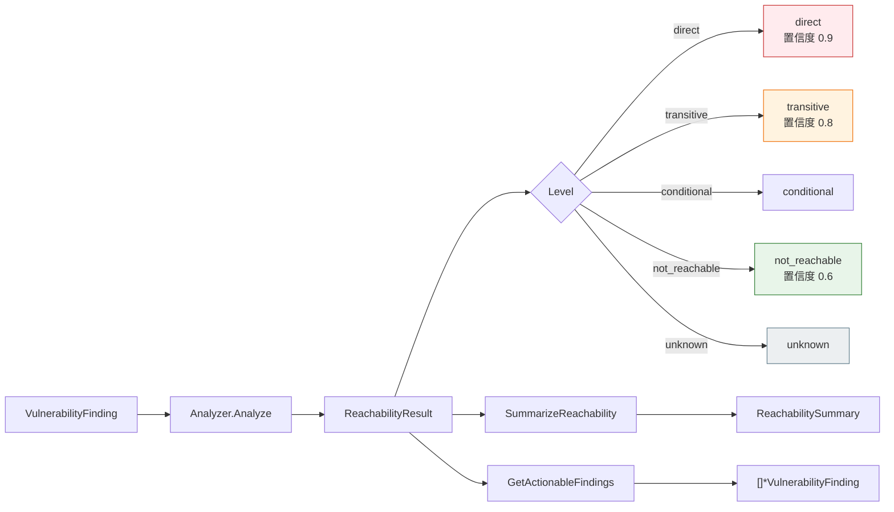

# 🎯 可达性分析

可达性模块评估漏洞经依赖图可达的直接程度——从直接使用 API（`direct`）到 `not_reachable`。它定义 `ReachabilityLevel` 类型及其常量、`ReachabilityResult` 与 `ReachabilitySummary` 结构体、可插拔的 `ReachabilityAnalyzer` 接口、默认实现 `DependencyGraphReachabilityAnalyzer`，以及批量与汇总辅助函数。

## 类型：ReachabilityLevel

```go
type ReachabilityLevel string
```

描述漏洞可达的直接程度。

## 常量

```go
const (
    ReachabilityDirect       ReachabilityLevel = "direct"
    ReachabilityTransitive   ReachabilityLevel = "transitive"
    ReachabilityConditional  ReachabilityLevel = "conditional"
    ReachabilityNotReachable ReachabilityLevel = "not_reachable"
    ReachabilityUnknown      ReachabilityLevel = "unknown"
)
```

| 常量 | 值 | 说明 |
| --- | --- | --- |
| `ReachabilityDirect` | `direct` | 漏洞位于直接使用的 API 中 |
| `ReachabilityTransitive` | `transitive` | 漏洞位于传递性依赖中 |
| `ReachabilityConditional` | `conditional` | 仅在特定条件下可达 |
| `ReachabilityNotReachable` | `not_reachable` | 漏洞不可达 |
| `ReachabilityUnknown` | `unknown` | 无法判定可达性 |

## 类型：ReachabilityResult

```go
type ReachabilityResult struct {
    Vulnerability *VulnerabilityFinding `json:"vulnerability"`
    Level         ReachabilityLevel     `json:"level"`
    Path          []string              `json:"path,omitempty"`
    Evidence      string                `json:"evidence,omitempty"`
    Confidence    float64               `json:"confidence"`
}
```

| 字段 | 类型 | 说明 |
| --- | --- | --- |
| `Vulnerability` | `*VulnerabilityFinding` | 被分析的漏洞发现 |
| `Level` | `ReachabilityLevel` | 可达性评估结果 |
| `Path` | `[]string` | 从根到受影响组件的调用/依赖路径 |
| `Evidence` | `string` | 可达性判定依据 |
| `Confidence` | `float64` | 评估置信度（`0.0`–`1.0`） |

## 类型：ReachabilityAnalyzer

```go
type ReachabilityAnalyzer interface {
    Analyze(graph *DependencyGraph, findings []*VulnerabilityFinding) ([]*ReachabilityResult, error)
    AnalyzeComponent(graph *DependencyGraph, component *SBOMComponent, findings []*VulnerabilityFinding) ([]*ReachabilityResult, error)
}
```

可插拔的可达性分析接口，允许从简单依赖图遍历到完整静态分析的多种实现。

## 类型：DependencyGraphReachabilityAnalyzer

```go
type DependencyGraphReachabilityAnalyzer struct {
    MaxDepth               int
    IncludeDevDependencies bool
}
```

默认的轻量级分析器，适用于多数 SCA 场景。依据组件是直接还是传递依赖来判定可达性。

| 字段 | 类型 | 说明 |
| --- | --- | --- |
| `MaxDepth` | `int` | 最大分析依赖深度（0 = 不限） |
| `IncludeDevDependencies` | `bool` | 是否包含开发依赖 |

## 类型：ReachabilitySummary

```go
type ReachabilitySummary struct {
    Total            int    `json:"total"`
    Direct           int    `json:"direct"`
    Transitive       int    `json:"transitive"`
    Conditional      int    `json:"conditional"`
    NotReachable     int    `json:"notReachable"`
    Unknown          int    `json:"unknown"`
    HighestRiskLevel string `json:"highestRiskLevel"`
}
```

| 字段 | 类型 | 说明 |
| --- | --- | --- |
| `Total` | `int` | 分析的漏洞总数 |
| `Direct` | `int` | 直接可达漏洞数 |
| `Transitive` | `int` | 传递可达漏洞数 |
| `Conditional` | `int` | 条件可达漏洞数 |
| `NotReachable` | `int` | 不可达漏洞数 |
| `Unknown` | `int` | 可达性未知漏洞数 |
| `HighestRiskLevel` | `string` | 数量大于 0 的最高风险可达等级 |

## 🆕 NewDependencyGraphReachabilityAnalyzer

```go
func NewDependencyGraphReachabilityAnalyzer() *DependencyGraphReachabilityAnalyzer
```

创建默认分析器：深度不限（`MaxDepth == 0`）、排除开发依赖。

| 返回值 | 类型 | 说明 |
| --- | --- | --- |
| #1 | `*DependencyGraphReachabilityAnalyzer` | 新的默认分析器 |

```go
a := cpeskills.NewDependencyGraphReachabilityAnalyzer()
```

## 🔬 Analyze

```go
func (a *DependencyGraphReachabilityAnalyzer) Analyze(graph *DependencyGraph, findings []*VulnerabilityFinding) ([]*ReachabilityResult, error)
```

针对依赖图分析所有漏洞发现的可达性。会先重算节点深度。每个发现按 CVE CPE 或 OSV 包名匹配到图节点并评估，未匹配的发现记为 `ReachabilityUnknown`。

| 参数 | 类型 | 说明 |
| --- | --- | --- |
| `graph` | `*DependencyGraph` | 依赖图 |
| `findings` | `[]*VulnerabilityFinding` | 待评估的漏洞发现 |

| 返回值 | 类型 | 说明 |
| --- | --- | --- |
| #1 | `[]*ReachabilityResult` | 每个发现的可达性结果 |
| #2 | `error` | `graph` 为 nil 时非 nil |

```go
results, err := analyzer.Analyze(graph, findings)
if err != nil {
    log.Fatal(err)
}
for _, r := range results {
    fmt.Println(r.Level, r.Confidence)
}
```

## 🔬 AnalyzeComponent

```go
func (a *DependencyGraphReachabilityAnalyzer) AnalyzeComponent(graph *DependencyGraph, component *SBOMComponent, findings []*VulnerabilityFinding) ([]*ReachabilityResult, error)
```

针对图中单个组件节点分析漏洞发现的可达性。

| 参数 | 类型 | 说明 |
| --- | --- | --- |
| `graph` | `*DependencyGraph` | 依赖图 |
| `component` | `*SBOMComponent` | 待评估的组件 |
| `findings` | `[]*VulnerabilityFinding` | 待评估的漏洞发现 |

| 返回值 | 类型 | 说明 |
| --- | --- | --- |
| #1 | `[]*ReachabilityResult` | 每个发现的可达性结果 |
| #2 | `error` | `graph` 为 nil 或组件不在图中时非 nil |

```go
results, err := analyzer.AnalyzeComponent(graph, comp, findings)
```

## ⚡ QuickReachabilityCheck

```go
func QuickReachabilityCheck(graph *DependencyGraph, component *SBOMComponent, finding *VulnerabilityFinding) *ReachabilityResult
```

便捷函数，用默认分析器评估单个组件/发现。任何错误都返回 `ReachabilityUnknown` 且 `Confidence == 0.0` 的结果。

| 参数 | 类型 | 说明 |
| --- | --- | --- |
| `graph` | `*DependencyGraph` | 依赖图 |
| `component` | `*SBOMComponent` | 待评估的组件 |
| `finding` | `*VulnerabilityFinding` | 单个待评估发现 |

| 返回值 | 类型 | 说明 |
| --- | --- | --- |
| #1 | `*ReachabilityResult` | 可达性结果（永不为 nil） |

```go
r := cpeskills.QuickReachabilityCheck(graph, comp, finding)
fmt.Println(r.Level, r.Evidence)
```

## 📦 BatchReachabilityAnalysis

```go
func BatchReachabilityAnalysis(graphs []*DependencyGraph, findings []*VulnerabilityFinding) (map[string][]*ReachabilityResult, error)
```

对多个依赖图执行可达性分析，适用于每个子项目各有依赖图的 monorepo 场景。结果键取自第一个直接根节点的组件名，回退为 `graph-<index>`。

| 参数 | 类型 | 说明 |
| --- | --- | --- |
| `graphs` | `[]*DependencyGraph` | 待分析的依赖图 |
| `findings` | `[]*VulnerabilityFinding` | 待评估的漏洞发现 |

| 返回值 | 类型 | 说明 |
| --- | --- | --- |
| #1 | `map[string][]*ReachabilityResult` | 图名到结果的映射 |
| #2 | `error` | 始终为 nil；单图失败对应 `nil` 值 |

```go
results, _ := cpeskills.BatchReachabilityAnalysis(graphs, findings)
for name, rs := range results {
    fmt.Println(name, len(rs))
}
```

## 📊 SummarizeReachability

```go
func SummarizeReachability(results []*ReachabilityResult) *ReachabilitySummary
```

将可达性结果汇总，按等级计数并确定最高风险等级。

| 参数 | 类型 | 说明 |
| --- | --- | --- |
| `results` | `[]*ReachabilityResult` | 待汇总的结果 |

| 返回值 | 类型 | 说明 |
| --- | --- | --- |
| #1 | `*ReachabilitySummary` | 汇总结果 |

```go
summary := cpeskills.SummarizeReachability(results)
fmt.Printf("direct=%d transitive=%d highest=%s\n", summary.Direct, summary.Transitive, summary.HighestRiskLevel)
```

## ✅ GetActionableFindings

```go
func GetActionableFindings(results []*ReachabilityResult) []*VulnerabilityFinding
```

筛选可采取行动的发现——等级不为 `ReachabilityNotReachable` 的结果。（保留 `ReachabilityUnknown` 的发现，因其值得调查。）

| 参数 | 类型 | 说明 |
| --- | --- | --- |
| `results` | `[]*ReachabilityResult` | 待筛选的结果 |

| 返回值 | 类型 | 说明 |
| --- | --- | --- |
| #1 | `[]*VulnerabilityFinding` | 非 `not_reachable` 的发现 |

```go
actionable := cpeskills.GetActionableFindings(results)
for _, f := range actionable {
    fmt.Println(f.CVE.CVEID)
}
```

## 📐 可达性等级图


