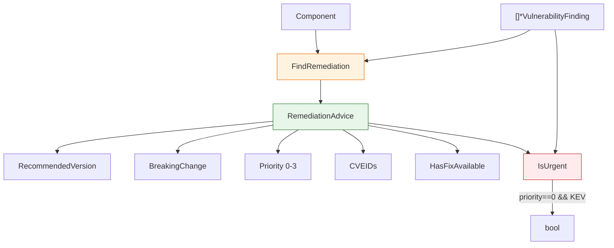

# 🛠️ 修复建议

修复模块根据组件的漏洞发现生成升级建议——推荐修复版本、升级是否破坏性变更、受影响 CVE ID 及优先级。它声明 `RemediationAdvice` 结构体、`FindRemediation` 构造函数，以及 `RemediationAdvice` 上的两个检查方法。

## 类型：RemediationAdvice

```go
type RemediationAdvice struct {
    Component          *SBOMComponent `json:"component"`
    CurrentVersion     string         `json:"currentVersion"`
    RecommendedVersion string         `json:"recommendedVersion"`
    BreakingChange     bool           `json:"breakingChange"`
    CVEIDs             []string       `json:"cveIDs"`
    Priority           int            `json:"priority"`
    Summary            string         `json:"summary"`
}
```

| 字段 | 类型 | 说明 |
| --- | --- | --- |
| `Component` | `*SBOMComponent` | 需修复的组件 |
| `CurrentVersion` | `string` | 当前版本 |
| `RecommendedVersion` | `string` | 推荐修复版本（无则空） |
| `BreakingChange` | `bool` | 升级是否为破坏性变更 |
| `CVEIDs` | `[]string` | 此修复解决的 CVE ID 列表 |
| `Priority` | `int` | 修复优先级（`0`=最高，`1`=高，`2`=中，`3`=低） |
| `Summary` | `string` | 修复建议摘要 |

## 🔎 FindRemediation

```go
func FindRemediation(component *SBOMComponent, findings []*VulnerabilityFinding) *RemediationAdvice
```

依据 `component` 的漏洞发现构建修复建议。从各发现（含 OSV 数据）收集修复版本，选取出现频率最高的版本；主版本号不同时标记为破坏性变更；汇总 CVE ID；按所见最高严重等级设置优先级（Critical → 0，High → 1，Medium → 2，其余 → 3）。

| 参数 | 类型 | 说明 |
| --- | --- | --- |
| `component` | `*SBOMComponent` | 待修复的组件 |
| `findings` | `[]*VulnerabilityFinding` | 该组件的漏洞发现 |

| 返回值 | 类型 | 说明 |
| --- | --- | --- |
| #1 | `*RemediationAdvice` | 修复建议（永不为 nil） |

```go
advice := cpeskills.FindRemediation(component, findings)
fmt.Printf("upgrade %s -> %s (priority %d): %s\n",
    advice.CurrentVersion, advice.RecommendedVersion, advice.Priority, advice.Summary)
```

## ✅ HasFixAvailable

```go
func (r *RemediationAdvice) HasFixAvailable() bool
```

报告是否找到推荐修复版本。

| 返回值 | 类型 | 说明 |
| --- | --- | --- |
| #1 | `bool` | `RecommendedVersion != ""` 时为 `true` |

```go
if advice.HasFixAvailable() {
    fmt.Println("fix:", advice.RecommendedVersion)
}
```

## 🚨 IsUrgent

```go
func (r *RemediationAdvice) IsUrgent(findings []*VulnerabilityFinding) bool
```

报告是否需要紧急修复——优先级必须为 `0`（Critical），且至少一个发现已被列入已知被利用漏洞（KEV）目录。

| 参数 | 类型 | 说明 |
| --- | --- | --- |
| `findings` | `[]*VulnerabilityFinding` | 待检查 KEV 状态的发现 |

| 返回值 | 类型 | 说明 |
| --- | --- | --- |
| #1 | `bool` | 优先级为 0 且有发现被 KEV 列出时为 `true` |

```go
if advice.IsUrgent(findings) {
    fmt.Println("紧急：Critical 且被 KEV 列出，需立即修复")
}
```

## 📐 修复流程图


