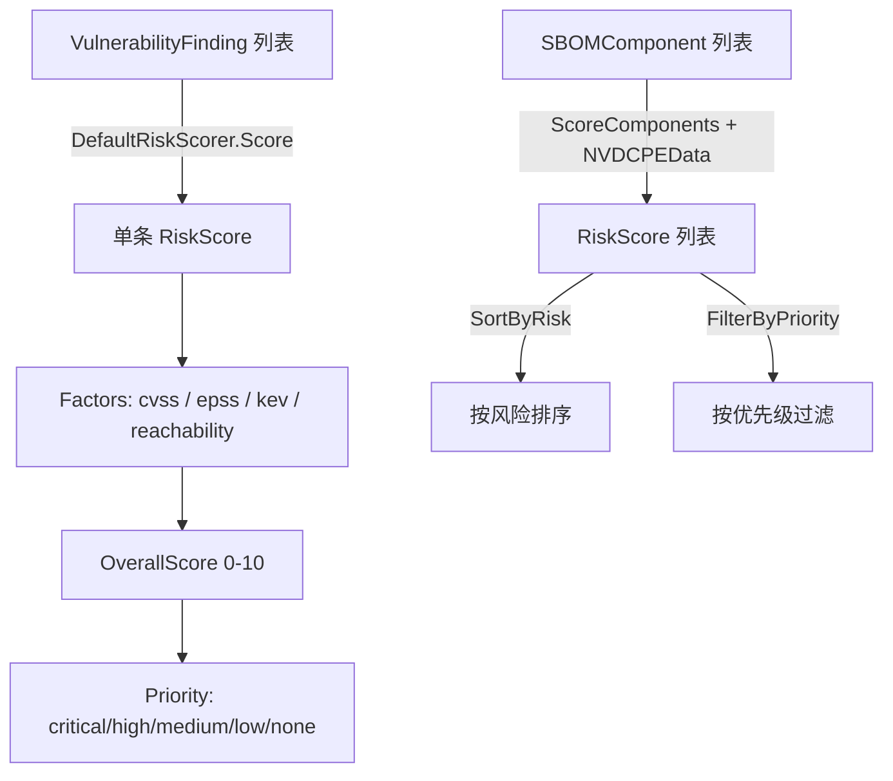

# ⚖️ 风险评分

`risk_scoring` 模块将 CVSS、EPSS、KEV 收录与可达性综合为单一 0-10 的 `OverallScore` 及 `RiskPriority`。提供 `RiskScorer` 接口、默认加权实现、批量评分及排序/过滤辅助函数。

## 类型：RiskPriority

```go
type RiskPriority string
```

枚举风险优先级。

| 常量 | 类型 | 值 |
| --- | --- | --- |
| `RiskPriorityCritical` | `RiskPriority` | `"critical"` |
| `RiskPriorityHigh` | `RiskPriority` | `"high"` |
| `RiskPriorityMedium` | `RiskPriority` | `"medium"` |
| `RiskPriorityLow` | `RiskPriority` | `"low"` |
| `RiskPriorityNone` | `RiskPriority` | `"none"` |

## 类型：RiskScore

```go
type RiskScore struct {
    Component       *SBOMComponent    // 被评估的组件
    OverallScore    float64           // 综合风险评分 (0-10)
    CVSSMax         float64           // 最高 CVSS 评分
    EPSSScore       float64           // EPSS 漏洞利用预测评分 (0.0-1.0)
    KEVListed       bool              // 是否在 CISA KEV 目录中
    ExploitMaturity string            // 漏洞利用成熟度
    Reachability    string            // 可达性
    Priority        RiskPriority      // 风险优先级
    Factors         map[string]float64 // 各因素贡献值
}
```

## 类型：RiskScorer

```go
type RiskScorer interface {
    Score(findings []*VulnerabilityFinding, component *SBOMComponent) *RiskScore
}
```

风险评分器接口。实现根据组件的漏洞发现为其计算 `RiskScore`。

## 类型：DefaultRiskScorer

```go
type DefaultRiskScorer struct {
    CVSSWeight         float64 // CVSS 评分权重
    EPSSWeight         float64 // EPSS 评分权重
    KEVWeight          float64 // KEV 收录权重
    ReachabilityWeight float64 // 可达性权重
}
```

默认评分器以可配置权重综合 CVSS、EPSS、KEV 与可达性。

## 🆕 NewDefaultRiskScorer

```go
func NewDefaultRiskScorer() *DefaultRiskScorer
```

创建一个默认评分器，权重为 `CVSSWeight: 0.5`、`EPSSWeight: 0.2`、`KEVWeight: 0.2`、`ReachabilityWeight: 0.1`。

| 返回值 | 类型 | 说明 |
| --- | --- | --- |
| #1 | `*DefaultRiskScorer` | 配置好的评分器 |

```go
scorer := cpeskills.NewDefaultRiskScorer()
```

## ⚖️ Score

```go
func (s *DefaultRiskScorer) Score(findings []*VulnerabilityFinding, component *SBOMComponent) *RiskScore
```

为单个组件计算 `RiskScore`。无发现时返回 `Priority: RiskPriorityNone` 的分数。否则提取最高 CVSS、最高 EPSS、是否 KEV 收录及可达性分数（`direct` → 1.0，`transitive` → 0.5），按权重计算 `OverallScore`（上限 10.0）。`Factors` map 记录 `cvss`、`epss`、`kev`、`reachability` 的贡献。优先级由分数阈值与 KEV 状态决定。

| 参数 | 类型 | 说明 |
| --- | --- | --- |
| `findings` | `[]*VulnerabilityFinding` | 组件的漏洞发现 |
| `component` | `*SBOMComponent` | 被评分的组件 |

| 返回值 | 类型 | 说明 |
| --- | --- | --- |
| #1 | `*RiskScore` | 计算得到的风险评分 |

```go
score := scorer.Score(findings, comp)
fmt.Printf("%.1f %s\n", score.OverallScore, score.Priority)
```

## ⚖️ ScoreComponents

```go
func ScoreComponents(components []*SBOMComponent, nvdData *NVDCPEData) []*RiskScore
```

为一批组件评分。对每个带 CPE 且 `nvdData` 非 nil 的组件，经 `nvdData.FindCVEsForCPE` 查询 CVE ID，包装为 `VulnerabilityFinding`（`Reachability: "unknown"`），再用新建的 `DefaultRiskScorer` 评分。

| 参数 | 类型 | 说明 |
| --- | --- | --- |
| `components` | `[]*SBOMComponent` | 待评分的组件 |
| `nvdData` | `*NVDCPEData` | 用于 CVE 查询的 NVD 数据（可为 nil） |

| 返回值 | 类型 | 说明 |
| --- | --- | --- |
| #1 | `[]*RiskScore` | 风险评分，每组件一条 |

```go
scores := cpeskills.ScoreComponents(sbom.Components, nvdData)
```

## ↕️ SortByRisk

```go
func SortByRisk(scores []*RiskScore)
```

按 `OverallScore` 降序原地排序。

| 参数 | 类型 | 说明 |
| --- | --- | --- |
| `scores` | `[]*RiskScore` | 待原地排序的切片 |

```go
cpeskills.SortByRisk(scores)
```

## 🔍 FilterByPriority

```go
func FilterByPriority(scores []*RiskScore, priority RiskPriority) []*RiskScore
```

返回 `Priority` 等于 `priority` 的评分。

| 参数 | 类型 | 说明 |
| --- | --- | --- |
| `scores` | `[]*RiskScore` | 输入评分 |
| `priority` | `RiskPriority` | 目标优先级 |

| 返回值 | 类型 | 说明 |
| --- | --- | --- |
| #1 | `[]*RiskScore` | 匹配的评分 |

```go
critical := cpeskills.FilterByPriority(scores, cpeskills.RiskPriorityCritical)
```

## 风险评分流水线


