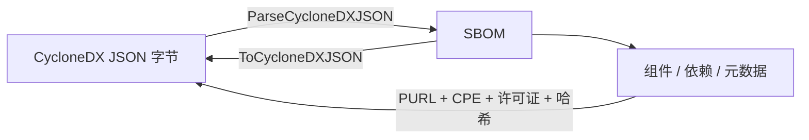

# 🔄 SBOM CycloneDX

`sbom_cyclonedx` 模块在库内厂商无关的 `SBOM` 模型与 CycloneDX JSON 格式（bom 格式 `"CycloneDX"`，规范版本 `1.5`）之间提供双向解析/序列化桥接。覆盖组件、依赖、元数据、工具、作者、许可证、哈希、属性与外部参考。

## 📥 ParseCycloneDXJSON

```go
func ParseCycloneDXJSON(data []byte) (*SBOM, error)
```

将 CycloneDX JSON 字节解析为 `SBOM`。会以 `SBOMFormatCycloneDX` 新建一个 SBOM，并从 CycloneDX 文档填充规范版本、序列号、元数据（时间戳、工具、作者、主题组件）、组件与依赖。每个组件上的 PURL 与 CPE 字符串会被解析为 `*PackageURL` 和 `*CPE`；许可证 ID/名称/URL 转为 `*License`；哈希 `alg` 以小写形式作为键。

| 参数 | 类型 | 说明 |
| --- | --- | --- |
| `data` | `[]byte` | CycloneDX JSON 文档字节 |

| 返回值 | 类型 | 说明 |
| --- | --- | --- |
| #1 | `*SBOM` | 解析后的 SBOM |
| #2 | `error` | 包装后的 `json.Unmarshal` 错误 |

```go
data, _ := os.ReadFile("bom.cdx.json")
sbom, err := cpeskills.ParseCycloneDXJSON(data)
if err != nil {
    log.Fatal(err)
}
fmt.Printf("%d 个组件\n", sbom.ComponentCount())
```

## 📤 ToCycloneDXJSON

```go
func (s *SBOM) ToCycloneDXJSON() ([]byte, error)
```

将 `SBOM` 序列化为 CycloneDX JSON（`bomFormat: "CycloneDX"`，`version: 1`），带 2 空格缩进。元数据时间戳格式化为 RFC3339（`2006-01-02T15:04:05Z`）；每个组件有效的 PURL 与 CPE URI 会被输出；许可证、哈希、供应商、属性与外部参考均转换为对应的 CycloneDX 表示。

| 返回值 | 类型 | 说明 |
| --- | --- | --- |
| #1 | `[]byte` | CycloneDX JSON 文档 |
| #2 | `error` | 序列化错误 |

```go
sbom := cpeskills.NewSBOM(cpeskills.SBOMFormatCycloneDX, "my-app")
sbom.AddComponent(cpeskills.NewSBOMComponent("log4j-core", "2.14.0"))
out, err := sbom.ToCycloneDXJSON()
if err != nil {
    log.Fatal(err)
}
os.WriteFile("bom.cdx.json", out, 0644)
```

## CycloneDX 往返流程


