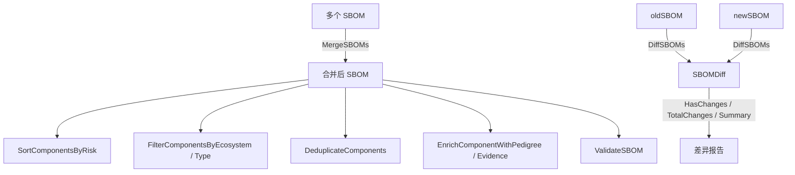

# 🧬 SBOM Enhanced

`sbom_enhanced` 模块在核心模型之上提供高级 SBOM 操作：合并多个 SBOM、对比两个 SBOM、对组件排序/过滤/去重、为组件补充谱系（pedigree）与取证（evidence）信息，以及基础校验。

## 类型：SBOMEvidence

```go
type SBOMEvidence struct {
    Field      string  // 取证字段（如 "filename"、"hash"、"snippet"）
    Value      string  // 取证值
    Confidence float64 // 检测置信度（0.0-1.0）
}
```

## 类型：SBOMPedigree

```go
type SBOMPedigree struct {
    Ancestors   []*SBOMComponent // 祖先组件
    Descendants []*SBOMComponent // 后代组件
    Variants    []*SBOMComponent // 变体组件
    Commits     []*SBOMCommit    // VCS 提交
    Patches     []*SBOMPatch     // 应用的补丁
    Notes       string           // 附加备注
}
```

## 类型：SBOMCommit

```go
type SBOMCommit struct {
    UID     string       // 提交哈希
    URL     string       // 仓库 URL
    Author  *SBOMAuthor  // 提交作者
    Message string       // 提交信息
}
```

## 类型：SBOMPatch

```go
type SBOMPatch struct {
    Type     string   // 补丁类型（backport、cherry-pick、monkey 等）
    Diff     string   // diff 内容或 URL
    Resolves []string // 此补丁解决的 issue ID 列表
}
```

## 类型：SBOMDiff

```go
type SBOMDiff struct {
    Added     []*SBOMComponent        // 新 SBOM 有而旧 SBOM 没有的组件
    Removed   []*SBOMComponent        // 旧 SBOM 有而新 SBOM 没有的组件
    Changed   []*SBOMComponentChange  // 两边都有但版本不同
    Unchanged int                     // 未变更的组件数量
}
```

## 类型：SBOMComponentChange

```go
type SBOMComponentChange struct {
    Component  *SBOMComponent // 发生变更的组件
    OldVersion string         // 旧版本
    NewVersion string         // 新版本
    ChangeType string         // upgrade、downgrade 或 sidegrade
}
```

## 🔀 MergeSBOMs

```go
func MergeSBOMs(sboms []*SBOM, format SBOMFormat, name string) (*SBOM, error)
```

将多个 SBOM 合并为一个。组件按 PURL（优先）、CPE 2.3、bom-ref、name 顺序去重；发现重复时保留版本更高者（由 `CompareVersions` 判定）。所有源 SBOM 的依赖与元数据工具/作者均保留。

| 参数 | 类型 | 说明 |
| --- | --- | --- |
| `sboms` | `[]*SBOM` | 源 SBOM 列表 |
| `format` | `SBOMFormat` | 合并后 SBOM 的格式 |
| `name` | `string` | 合并后文档名称 |

| 返回值 | 类型 | 说明 |
| --- | --- | --- |
| #1 | `*SBOM` | 合并后的 SBOM |
| #2 | `error` | 输入切片为空时非空 |

```go
merged, err := cpeskills.MergeSBOMs([]*cpeskills.SBOM{sbom1, sbom2}, cpeskills.SBOMFormatCycloneDX, "merged")
```

## 🔍 DiffSBOMs

```go
func DiffSBOMs(oldSBOM, newSBOM *SBOM) *SBOMDiff
```

计算两个 SBOM 之间的差异，返回包含新增、移除、变更组件及未变更计数的 `SBOMDiff`。变更组件的 `ChangeType` 在新版本更高时为 `"upgrade"`，更低时为 `"downgrade"`（由 `CompareVersions` 判定）。任一参数为 nil 时，另一边的全部组件计入新增/移除。

| 参数 | 类型 | 说明 |
| --- | --- | --- |
| `oldSBOM` | `*SBOM` | 基线 SBOM |
| `newSBOM` | `*SBOM` | 当前 SBOM |

| 返回值 | 类型 | 说明 |
| --- | --- | --- |
| #1 | `*SBOMDiff` | 计算得到的差异 |

```go
diff := cpeskills.DiffSBOMs(oldSBOM, newSBOM)
fmt.Println(diff.Summary())
```

## ❓ HasChanges

```go
func (d *SBOMDiff) HasChanges() bool
```

当差异中存在新增、移除或变更组件时返回 true。

| 返回值 | 类型 | 说明 |
| --- | --- | --- |
| #1 | `bool` | 存在任意变更时为 true |

```go
if diff.HasChanges() {
    fmt.Println("SBOM 发生变化")
}
```

## 🔢 TotalChanges

```go
func (d *SBOMDiff) TotalChanges() int
```

返回新增、移除、变更组件的总数。

| 返回值 | 类型 | 说明 |
| --- | --- | --- |
| #1 | `int` | 变更总数 |

```go
fmt.Printf("共 %d 处变更\n", diff.TotalChanges())
```

## 📝 Summary

```go
func (d *SBOMDiff) Summary() string
```

返回可读摘要，如 `"3 added, 1 removed, 2 changed"`。无变更时返回 `"No changes (N components unchanged)"`。

| 返回值 | 类型 | 说明 |
| --- | --- | --- |
| #1 | `string` | 摘要文本 |

```go
fmt.Println(diff.Summary())
```

## ↕️ SortComponentsByName

```go
func SortComponentsByName(components []*SBOMComponent)
```

按组件 `Name` 字母序升序原地排序。

| 参数 | 类型 | 说明 |
| --- | --- | --- |
| `components` | `[]*SBOMComponent` | 待原地排序的切片 |

```go
cpeskills.SortComponentsByName(sbom.Components)
```

## ↕️ SortComponentsByRisk

```go
func SortComponentsByRisk(components []*SBOMComponent, nvdData *NVDCPEData) []*RiskScore
```

通过 `ScoreComponents`（使用 `nvdData`）为组件评分，再经 `SortByRisk` 按风险降序排序后返回分数。输入切片本身不会被重排。

| 参数 | 类型 | 说明 |
| --- | --- | --- |
| `components` | `[]*SBOMComponent` | 待评分的组件 |
| `nvdData` | `*NVDCPEData` | 用于 CVE 查询的 NVD 数据 |

| 返回值 | 类型 | 说明 |
| --- | --- | --- |
| #1 | `[]*RiskScore` | 按 `OverallScore` 降序排列的分数 |

```go
scores := cpeskills.SortComponentsByRisk(sbom.Components, nvdData)
for _, s := range scores {
    fmt.Printf("%s: %.1f\n", s.Component.Name, s.OverallScore)
}
```

## 🔍 FilterComponentsByEcosystem

```go
func FilterComponentsByEcosystem(components []*SBOMComponent, ecosystem Ecosystem) []*SBOMComponent
```

返回 PURL 映射到指定生态系统（经 `PackageURL.Ecosystem()`）的组件。

| 参数 | 类型 | 说明 |
| --- | --- | --- |
| `components` | `[]*SBOMComponent` | 输入组件 |
| `ecosystem` | `Ecosystem` | 目标生态系统 |

| 返回值 | 类型 | 说明 |
| --- | --- | --- |
| #1 | `[]*SBOMComponent` | 匹配的组件 |

```go
maven := cpeskills.FilterComponentsByEcosystem(sbom.Components, cpeskills.EcosystemMaven)
```

## 🔍 FilterComponentsByType

```go
func FilterComponentsByType(components []*SBOMComponent, compType string) []*SBOMComponent
```

返回 `Type` 与 `compType` 大小写不敏感匹配的组件。

| 参数 | 类型 | 说明 |
| --- | --- | --- |
| `components` | `[]*SBOMComponent` | 输入组件 |
| `compType` | `string` | 目标类型（如 `"library"`） |

| 返回值 | 类型 | 说明 |
| --- | --- | --- |
| #1 | `[]*SBOMComponent` | 匹配的组件 |

```go
libs := cpeskills.FilterComponentsByType(sbom.Components, "library")
```

## 🧹 DeduplicateComponents

```go
func DeduplicateComponents(components []*SBOMComponent) []*SBOMComponent
```

按 PURL（优先）、CPE 2.3、bom-ref、name 标识去重，保留首次出现的组件。

| 参数 | 类型 | 说明 |
| --- | --- | --- |
| `components` | `[]*SBOMComponent` | 输入组件 |

| 返回值 | 类型 | 说明 |
| --- | --- | --- |
| #1 | `[]*SBOMComponent` | 去重后的组件 |

```go
deduped := cpeskills.DeduplicateComponents(allComponents)
```

## 🧬 EnrichComponentWithPedigree

```go
func EnrichComponentWithPedigree(component *SBOMComponent, pedigree *SBOMPedigree)
```

通过设置 `Properties["cpe:hasPedigree"] = "true"` 标记组件拥有谱系信息。（谱系对象本身不会由此函数附加到组件上。）

| 参数 | 类型 | 说明 |
| --- | --- | --- |
| `component` | `*SBOMComponent` | 待补充的组件 |
| `pedigree` | `*SBOMPedigree` | 谱系信息 |

```go
pedigree := cpeskills.NewSBOMPedigree()
cpeskills.EnrichComponentWithPedigree(comp, pedigree)
```

## 🔬 EnrichComponentWithEvidence

```go
func EnrichComponentWithEvidence(component *SBOMComponent, evidence []*SBOMEvidence)
```

将取证信息写入组件 `Properties`，每条以 `cpe:evidence:<i>:field` 与 `cpe:evidence:<i>:value` 为键。

| 参数 | 类型 | 说明 |
| --- | --- | --- |
| `component` | `*SBOMComponent` | 待补充的组件 |
| `evidence` | `[]*SBOMEvidence` | 取证条目列表 |

```go
ev := []*cpeskills.SBOMEvidence{
    cpeskills.NewSBOMEvidence("filename", "log4j-core.jar", 0.95),
}
cpeskills.EnrichComponentWithEvidence(comp, ev)
```

## ⚙️ SetComponentCopyright

```go
func SetComponentCopyright(component *SBOMComponent, copyright string)
```

将版权信息存入 `Properties["cpe:copyright"]`。

| 参数 | 类型 | 说明 |
| --- | --- | --- |
| `component` | `*SBOMComponent` | 待更新的组件 |
| `copyright` | `string` | 版权文本 |

```go
cpeskills.SetComponentCopyright(comp, "Copyright 2026 Acme")
```

## 🆕 NewSBOMEvidence

```go
func NewSBOMEvidence(field, value string, confidence float64) *SBOMEvidence
```

创建一条新的取证条目。

| 参数 | 类型 | 说明 |
| --- | --- | --- |
| `field` | `string` | 取证字段 |
| `value` | `string` | 取证值 |
| `confidence` | `float64` | 置信度 0.0-1.0 |

| 返回值 | 类型 | 说明 |
| --- | --- | --- |
| #1 | `*SBOMEvidence` | 取证条目 |

```go
ev := cpeskills.NewSBOMEvidence("hash", "sha256:...", 1.0)
```

## 🆕 NewSBOMPedigree

```go
func NewSBOMPedigree() *SBOMPedigree
```

创建一个空的谱系，所有切片字段均初始化。

| 返回值 | 类型 | 说明 |
| --- | --- | --- |
| #1 | `*SBOMPedigree` | 空谱系 |

```go
pedigree := cpeskills.NewSBOMPedigree()
```

## ➕ AddAncestor

```go
func (p *SBOMPedigree) AddAncestor(component *SBOMComponent)
```

向谱系追加一个祖先组件。

| 参数 | 类型 | 说明 |
| --- | --- | --- |
| `component` | `*SBOMComponent` | 祖先组件 |

```go
pedigree.AddAncestor(ancestorComp)
```

## ➕ AddCommit

```go
func (p *SBOMPedigree) AddCommit(uid, url, message string)
```

向谱系的 `Commits` 追加一条 VCS 提交。

| 参数 | 类型 | 说明 |
| --- | --- | --- |
| `uid` | `string` | 提交哈希 |
| `url` | `string` | 仓库 URL |
| `message` | `string` | 提交信息 |

```go
pedigree.AddCommit("9f1b2c4", "https://github.com/acme/lib", "fix: vuln")
```

## ✅ ValidateSBOM

```go
func ValidateSBOM(sbom *SBOM) []string
```

执行基础校验并返回问题字符串列表。检查：nil SBOM（`["SBOM is nil"]`）、未知格式、空名称、`BomRef` 为空的组件，以及不匹配任何组件 `BomRef` 的依赖引用/目标。

| 参数 | 类型 | 说明 |
| --- | --- | --- |
| `sbom` | `*SBOM` | 待校验的 SBOM |

| 返回值 | 类型 | 说明 |
| --- | --- | --- |
| #1 | `[]string` | 校验问题列表 |

```go
issues := cpeskills.ValidateSBOM(sbom)
for _, issue := range issues {
    fmt.Println(issue)
}
```

## ⏱️ UpdateSBOMTimestamp

```go
func UpdateSBOMTimestamp(sbom *SBOM)
```

将 `sbom.CreatedAt` 与 `sbom.Metadata.Timestamp` 设置为当前时间。

| 参数 | 类型 | 说明 |
| --- | --- | --- |
| `sbom` | `*SBOM` | 待刷新的 SBOM |

```go
cpeskills.UpdateSBOMTimestamp(sbom)
```

## SBOM 增强操作


