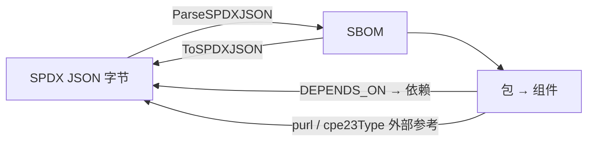

# 📄 SBOM SPDX

`sbom_spdx` 模块在库内厂商无关的 `SBOM` 模型与 SPDX JSON 格式（SPDX 2.3）之间提供双向解析/序列化桥接。包映射为组件；`DEPENDS_ON` 关系映射为依赖；类型为 `purl`、`cpe23Type`、`cpe22Type` 的外部参考用于填充 PURL/CPE。

## 📥 ParseSPDXJSON

```go
func ParseSPDXJSON(data []byte) (*SBOM, error)
```

将 SPDX JSON 字节解析为 `SBOM`。以 `SBOMFormatSPDX` 和文档 `name` 新建 SBOM；规范版本取自 `spdxVersion`。从 `creationInfo` 中解析 `created` 时间戳，并将 `creators`（按 `": "` 分割）转为 `SBOMAuthor`。每个 SPDX 包转为组件，其 `BomRef` 为包的 `SPDXID`（缺省时回退为 `pkg-<index>`）。`checksums` 填充 `Hashes`（算法键小写）；`purl`/`cpe23Type`/`cpe22Type` 外部参考填充 PURL/CPE；非 `NOASSERTION`/`NONE` 的声明许可证转为 `*License`。`DEPENDS_ON` 关系转为依赖边。

| 参数 | 类型 | 说明 |
| --- | --- | --- |
| `data` | `[]byte` | SPDX JSON 文档字节 |

| 返回值 | 类型 | 说明 |
| --- | --- | --- |
| #1 | `*SBOM` | 解析后的 SBOM |
| #2 | `error` | 包装后的 `json.Unmarshal` 错误 |

```go
data, _ := os.ReadFile("bom.spdx.json")
sbom, err := cpeskills.ParseSPDXJSON(data)
if err != nil {
    log.Fatal(err)
}
fmt.Printf("SPDX %s，%d 个包\n", sbom.SpecVersion, sbom.ComponentCount())
```

## 📤 ToSPDXJSON

```go
func (s *SBOM) ToSPDXJSON() ([]byte, error)
```

将 `SBOM` 序列化为 SPDX 2.3 JSON 文档，带 2 空格缩进。文档 `SPDXID` 为 `SPDXRef-DOCUMENT`，数据许可证为 `CC0-1.0`，创建者为 `Organization: cpe-skills` 与 `Tool: cpe-skills-sbom`。每个组件转为包（`downloadLocation: NOASSERTION`、`filesAnalyzed: false`、`copyrightText: NOASSERTION`）。PURL 与 CPE 作为 `PACKAGE-MANAGER`/`SECURITY` 外部参考输出；声明/结论许可证以 ` AND ` 连接，缺省为 `NOASSERTION`。每条依赖转为一条 `DEPENDS_ON` 关系，`documentDescribes` 列出所有包。

| 返回值 | 类型 | 说明 |
| --- | --- | --- |
| #1 | `[]byte` | SPDX JSON 文档 |
| #2 | `error` | 序列化错误 |

```go
sbom := cpeskills.NewSBOM(cpeskills.SBOMFormatSPDX, "my-app")
sbom.AddComponent(cpeskills.NewSBOMComponent("log4j-core", "2.14.0"))
out, err := sbom.ToSPDXJSON()
if err != nil {
    log.Fatal(err)
}
os.WriteFile("bom.spdx.json", out, 0644)
```

## SPDX 往返流程


