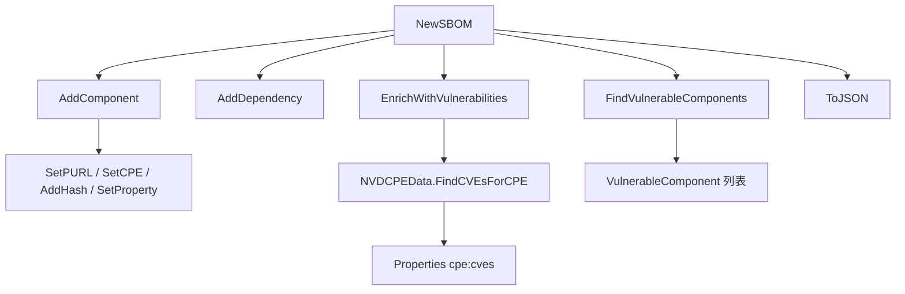

# 📦 SBOM

`sbom` 模块提供厂商无关的软件物料清单（SBOM）数据模型，可同时映射到 CycloneDX 与 SPDX。作为 SCA 系统的核心数据结构，`SBOM` 持有组件列表、依赖关系和元数据，并提供漏洞查找与 JSON 序列化方法。

## 类型：SBOMFormat

```go
type SBOMFormat string
```

枚举支持的 SBOM 文档格式。

| 常量 | 类型 | 值 |
| --- | --- | --- |
| `SBOMFormatCycloneDX` | `SBOMFormat` | `"cyclonedx"` |
| `SBOMFormatSPDX` | `SBOMFormat` | `"spdx"` |
| `SBOMFormatUnknown` | `SBOMFormat` | `"unknown"` |

## 类型：SBOM

```go
type SBOM struct {
    Format       SBOMFormat        // SBOM 格式 (CycloneDX, SPDX)
    SpecVersion  string            // 规范版本
    SerialNumber string            // 序列号，唯一标识此文档
    Name         string            // 文档名称
    Components   []*SBOMComponent  // 组件列表
    Dependencies []*SBOMDependency // 依赖关系列表
    Metadata     *SBOMMetadata     // 文档元数据
    CreatedAt    time.Time         // 创建时间
}
```

## 类型：SBOMComponent

```go
type SBOMComponent struct {
    BomRef             string               // 组件唯一引用标识符
    Type               string               // application, framework, library, container, operating-system, device, file
    Name               string               // 组件名称
    Version            string               // 组件版本
    Group              string               // 分组（如 Maven groupId）
    PURL               *PackageURL          // 包 URL
    CPE                *CPE                 // CPE
    Licenses           []*License           // 许可证列表
    Hashes             map[string]string    // 算法 → 哈希值
    Supplier           string               // 供应商
    Description        string               // 描述
    Properties         map[string]string    // 自定义属性
    ExternalReferences []*ExternalReference // 外部参考
}
```

## 类型：SBOMDependency

```go
type SBOMDependency struct {
    Ref        string   // 依赖方组件的 BomRef
    DependsOn  []string // 被依赖方组件的 BomRef 列表
}
```

## 类型：SBOMMetadata

```go
type SBOMMetadata struct {
    Timestamp  time.Time         // 生成时间戳
    Tools      []*SBOMTool       // 生成工具列表
    Authors    []*SBOMAuthor     // 作者列表
    Component  *SBOMComponent    // 顶层主题组件
    Licenses   []*License        // 文档级许可证
    Properties map[string]string // 自定义属性
}
```

## 类型：SBOMTool

```go
type SBOMTool struct {
    Name    string // 工具名称
    Vendor  string // 工具供应商
    Version string // 工具版本
}
```

## 类型：SBOMAuthor

```go
type SBOMAuthor struct {
    Name  string // 作者姓名
    Email string // 作者邮箱
}
```

## 类型：ExternalReference

```go
type ExternalReference struct {
    Type    string // 参考类型（website, issue-tracker, vcs 等）
    URL     string // 参考链接
    Comment string // 备注
}
```

## 类型：VulnerableComponent

```go
type VulnerableComponent struct {
    Component       *SBOMComponent            // 组件信息
    Vulnerabilities []*VulnerabilityFinding   // 关联的漏洞列表
    MaxCVSS         float64                   // 最高 CVSS 评分
    MaxSeverity     string                    // 最高严重级别
    CveCount        int                       // 漏洞总数
}
```

## 🆕 NewSBOM

```go
func NewSBOM(format SBOMFormat, name string) *SBOM
```

以给定格式和名称创建一个新的 `SBOM`。会生成唯一序列号（`urn:uuid:<uuid>`），CycloneDX 默认规范版本为 `"1.5"`，SPDX 为 `"2.3"`，组件/依赖切片与元数据均初始化。

| 参数 | 类型 | 说明 |
| --- | --- | --- |
| `format` | `SBOMFormat` | 目标 SBOM 格式 |
| `name` | `string` | 文档名称 |

| 返回值 | 类型 | 说明 |
| --- | --- | --- |
| #1 | `*SBOM` | 初始化后的 SBOM |

```go
sbom := cpeskills.NewSBOM(cpeskills.SBOMFormatCycloneDX, "my-app")
fmt.Println(sbom.SpecVersion)  // 1.5
fmt.Println(sbom.SerialNumber) // urn:uuid:...
```

## ➕ AddComponent

```go
func (s *SBOM) AddComponent(component *SBOMComponent)
```

追加一个组件。若 `component.BomRef` 为空，则按 PURL、CPE URI、`name@version` 的顺序自动生成。传入 nil 组件会被忽略。

| 参数 | 类型 | 说明 |
| --- | --- | --- |
| `component` | `*SBOMComponent` | 要添加的组件 |

```go
sbom := cpeskills.NewSBOM(cpeskills.SBOMFormatCycloneDX, "app")
comp := cpeskills.NewSBOMComponent("log4j-core", "2.14.0")
sbom.AddComponent(comp)
```

## ➕ AddDependency

```go
func (s *SBOM) AddDependency(ref string, dependsOn []string)
```

追加一条依赖边：`ref` 标识的组件依赖于 `dependsOn` 列出的组件。

| 参数 | 类型 | 说明 |
| --- | --- | --- |
| `ref` | `string` | 依赖方组件的 BomRef |
| `dependsOn` | `[]string` | 被依赖方组件的 BomRef 列表 |

```go
sbom.AddDependency("pkg:app@1.0", []string{"pkg:lib/log4j@2.14.0"})
```

## 🔍 GetComponent

```go
func (s *SBOM) GetComponent(bomRef string) *SBOMComponent
```

返回 `BomRef` 等于 `bomRef` 的组件；无匹配时返回 `nil`。

| 参数 | 类型 | 说明 |
| --- | --- | --- |
| `bomRef` | `string` | 要查找的 BomRef |

| 返回值 | 类型 | 说明 |
| --- | --- | --- |
| #1 | `*SBOMComponent` | 匹配的组件，或 `nil` |

```go
comp := sbom.GetComponent("pkg:lib/log4j@2.14.0")
```

## 🔍 FindVulnerableComponents

```go
func (s *SBOM) FindVulnerableComponents(cves []*CVEReference) []*VulnerableComponent
```

根据每个组件的 CPE 和 PURL 将 SBOM 组件与提供的 CVE 列表进行匹配，并为每个受影响组件返回一个 `VulnerableComponent`，包含其漏洞发现、最高 CVSS 分数、最高严重级别和 CVE 总数。

| 参数 | 类型 | 说明 |
| --- | --- | --- |
| `cves` | `[]*CVEReference` | 用于匹配的 CVE 引用列表 |

| 返回值 | 类型 | 说明 |
| --- | --- | --- |
| #1 | `[]*VulnerableComponent` | 至少有一条匹配发现的组件列表 |

```go
vuln := sbom.FindVulnerableComponents([]*cpeskills.CVEReference{cveRef})
for _, v := range vuln {
    fmt.Printf("%s: %d 个 CVE，最高 CVSS %.1f\n", v.Component.Name, v.CveCount, v.MaxCVSS)
}
```

## 🧪 EnrichWithVulnerabilities

```go
func (s *SBOM) EnrichWithVulnerabilities(nvdData *NVDCPEData) error
```

为每个带 CPE 的组件通过 `nvdData.FindCVEsForCPE` 查询匹配的 CVE ID，并将结果写入组件 `Properties` 的 `cpe:cves`（逗号分隔列表）和 `cpe:cveCount` 键。

| 参数 | 类型 | 说明 |
| --- | --- | --- |
| `nvdData` | `*NVDCPEData` | 用于查询的 NVD CPE 数据 |

| 返回值 | 类型 | 说明 |
| --- | --- | --- |
| #1 | `error` | 当 `nvdData` 为 nil 时非空 |

```go
if err := sbom.EnrichWithVulnerabilities(nvdData); err != nil {
    log.Fatal(err)
}
```

## 📤 ToJSON

```go
func (s *SBOM) ToJSON() ([]byte, error)
```

将 SBOM 序列化为带 2 空格缩进的 JSON。

| 返回值 | 类型 | 说明 |
| --- | --- | --- |
| #1 | `[]byte` | JSON 文档 |
| #2 | `error` | 序列化错误 |

```go
data, err := sbom.ToJSON()
if err != nil {
    log.Fatal(err)
}
fmt.Println(string(data))
```

## 🔢 ComponentCount

```go
func (s *SBOM) ComponentCount() int
```

返回 SBOM 中的组件数量。

| 返回值 | 类型 | 说明 |
| --- | --- | --- |
| #1 | `int` | 组件数量 |

```go
fmt.Println(sbom.ComponentCount())
```

## 🔢 DependencyCount

```go
func (s *SBOM) DependencyCount() int
```

返回 SBOM 中的依赖边数量。

| 返回值 | 类型 | 说明 |
| --- | --- | --- |
| #1 | `int` | 依赖数量 |

```go
fmt.Println(sbom.DependencyCount())
```

## 🆕 NewSBOMComponent

```go
func NewSBOMComponent(name, version string) *SBOMComponent
```

以给定名称和版本创建一个新组件。`Hashes` 与 `Properties` 初始化为空 map。

| 参数 | 类型 | 说明 |
| --- | --- | --- |
| `name` | `string` | 组件名称 |
| `version` | `string` | 组件版本 |

| 返回值 | 类型 | 说明 |
| --- | --- | --- |
| #1 | `*SBOMComponent` | 初始化后的组件 |

```go
comp := cpeskills.NewSBOMComponent("spring-core", "5.3.0")
```

## ⚙️ SetPURL

```go
func (c *SBOMComponent) SetPURL(purl *PackageURL)
```

设置组件的 `PURL` 字段。

| 参数 | 类型 | 说明 |
| --- | --- | --- |
| `purl` | `*PackageURL` | 包 URL |

```go
purl, _ := cpeskills.ParsePURL("pkg:maven/org.springframework/spring-core@5.3.0")
comp.SetPURL(purl)
```

## ⚙️ SetCPE

```go
func (c *SBOMComponent) SetCPE(cpe *CPE)
```

设置组件的 `CPE` 字段。

| 参数 | 类型 | 说明 |
| --- | --- | --- |
| `cpe` | `*CPE` | CPE |

```go
cpe, _ := cpeskills.Parse("cpe:2.3:a:pivotal:spring-core:5.3.0:*:*:*:*:*:*:*")
comp.SetCPE(cpe)
```

## ➕ AddHash

```go
func (c *SBOMComponent) AddHash(algorithm, value string)
```

按 `algorithm` 添加或覆盖一条哈希记录。必要时初始化 `Hashes` map。

| 参数 | 类型 | 说明 |
| --- | --- | --- |
| `algorithm` | `string` | 哈希算法（如 `"SHA-256"`） |
| `value` | `string` | 十六进制摘要 |

```go
comp.AddHash("SHA-256", "e3b0c44298fc1c149afbf4c8996fb92427ae41e4649b934ca495991b7852b855")
```

## ⚙️ SetProperty

```go
func (c *SBOMComponent) SetProperty(key, value string)
```

添加或覆盖一条自定义属性。必要时初始化 `Properties` map。

| 参数 | 类型 | 说明 |
| --- | --- | --- |
| `key` | `string` | 属性键 |
| `value` | `string` | 属性值 |

```go
comp.SetProperty("cpe:copyright", "Copyright 2026 Acme")
```

## SBOM 模块数据流


