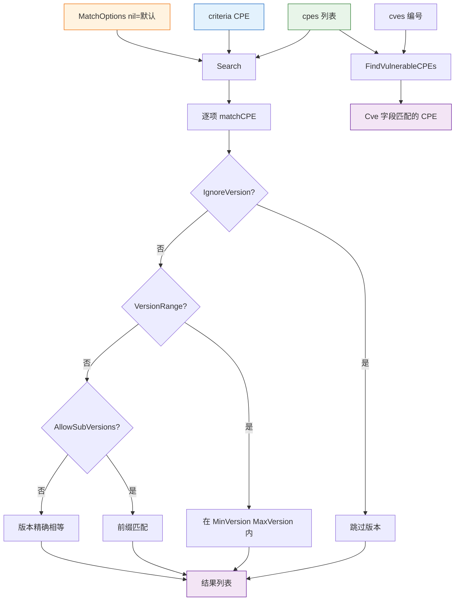

# 🔎 搜索

`search` 模块提供由条件 CPE 与 `MatchOptions` 配置驱动的 CPE 列表搜索。它支持精确匹配、子版本前缀匹配与版本范围匹配，可选地对字符串字段进行正则匹配，并提供一个便捷助手用于查找带有指定 CVE 编号的 CPE。

## 类型：MatchOptions

```go
type MatchOptions struct {
    IgnoreVersion    bool   // 为 true 时，不比较 Version 字段
    AllowSubVersions bool   // 为 true 时，criteria 版本 "1.0" 可匹配 "1.0"、"1.0.1" 等
    UseRegex         bool   // 为 true 时，Vendor/Product/Update 按正则表达式匹配
    VersionRange     bool   // 为 true 时，在 [MinVersion, MaxVersion] 范围内匹配版本
    MinVersion       string // 范围下界（含）
    MaxVersion       string // 范围上界（含）
}
```

注意：`VersionRange` 优先于 `AllowSubVersions`。当 `IgnoreVersion` 为 `true` 时，两者都被忽略。criteria 字段中的 `"*"` 是通配符，匹配任意值；空的 criteria 字段不参与匹配。

## 🛠️ DefaultMatchOptions

```go
func DefaultMatchOptions() *MatchOptions
```

返回一个带默认值的 `MatchOptions` 指针：`IgnoreVersion = false`、`AllowSubVersions = true`、`UseRegex = false`、`VersionRange = false`。

| 返回值 | 类型 | 说明 |
| --- | --- | --- |
| 第 1 个 | `*MatchOptions` | 默认匹配选项 |

```go
opts := cpeskills.DefaultMatchOptions()
opts.UseRegex = true
```

## 🔍 Search

```go
func Search(cpes []*CPE, criteria *CPE, options *MatchOptions) []*CPE
```

返回 `cpes` 中在 `options` 下匹配 `criteria` 的所有 CPE。`options` 为 `nil` 时使用默认选项。匹配为合取关系：每个非空且非 `*` 的 criteria 字段都必须匹配。版本处理遵循 `options`：

- `IgnoreVersion = true` — 跳过版本。
- `VersionRange = true` — 版本须落在 `[MinVersion, MaxVersion]`（含）内，通过 `versions` 包比较。
- 否则 `AllowSubVersions = true` — 目标版本须以 criteria 版本为字符串前缀。
- 否则 — 版本精确相等。

| 参数 | 类型 | 说明 |
| --- | --- | --- |
| `cpes` | `[]*CPE` | 待搜索的 CPE 列表 |
| `criteria` | `*CPE` | 搜索条件；空/`*` 字段被跳过 |
| `options` | `*MatchOptions` | 匹配选项，`nil` 表示默认 |

| 返回值 | 类型 | 说明 |
| --- | --- | --- |
| 第 1 个 | `[]*CPE` | 所有匹配的 CPE，无匹配时为空切片 |

```go
// 所有 Microsoft Windows 产品
criteria := &cpeskills.CPE{
    Vendor:      cpeskills.Vendor("microsoft"),
    ProductName: cpeskills.Product("windows"),
}
results := cpeskills.Search(allCPEs, criteria, nil)

// Apache 2.0–3.0 版本
criteria = &cpeskills.CPE{Vendor: cpeskills.Vendor("apache")}
opts := cpeskills.DefaultMatchOptions()
opts.VersionRange = true
opts.MinVersion = "2.0"
opts.MaxVersion = "3.0"
results = cpeskills.Search(allCPEs, criteria, opts)

// 正则：产品名包含 "sql"
criteria = &cpeskills.CPE{ProductName: cpeskills.Product(".*sql.*")}
opts = cpeskills.DefaultMatchOptions()
opts.UseRegex = true
results = cpeskills.Search(allCPEs, criteria, opts)
```

## 🐛 FindVulnerableCPEs

```go
func FindVulnerableCPEs(cpes []*CPE, cves []string) []*CPE
```

返回 `cpes` 中 `Cve` 字段等于所提供任一 CVE 编号的所有 CPE。即便一个 CPE 匹配多个 CVE，也至多出现一次。保持原始顺序。`Cve` 字段未设置的 CPE 永不匹配。

| 参数 | 类型 | 说明 |
| --- | --- | --- |
| `cpes` | `[]*CPE` | 待检查的 CPE 列表 |
| `cves` | `[]string` | 要查找的 CVE 编号 |

| 返回值 | 类型 | 说明 |
| --- | --- | --- |
| 第 1 个 | `[]*CPE` | 标记有给定 CVE 编号之一的 CPE |

```go
cveIDs := []string{"CVE-2021-44228", "CVE-2021-45046"}
vulnerable := cpeskills.FindVulnerableCPEs(allCPEs, cveIDs)
fmt.Printf("发现 %d 个受影响 CPE\n", len(vulnerable))
for _, c := range vulnerable {
    fmt.Printf("- %s: %s %s %s\n", c.Cve, c.Vendor, c.ProductName, c.Version)
}
```

## 📐 搜索流程图


