# 🗂️ CPE 集合

`set` 模块提供 `CPESet`，一个以 URI 为键的唯一 CPE 集合，具备集合代数运算（并集、交集、差集）、过滤（基本与高级）、排序、关系判断（子集/超集/相等）以及相关 CPE 发现。独立的 `FromArray` 构造函数可由切片构建集合。

## 类型：CPESet

```go
type CPESet struct {
    items       map[string]*CPE // 以 URI 为键
    Name        string
    Description string
}
```

一个唯一 CPE 集合。唯一性基于 CPE 的 URI（`GetURI`）。`items` 映射为非导出字段，请使用提供的方法读写集合。

## 🆕 NewCPESet

```go
func NewCPESet(name string, description string) *CPESet
```

创建一个带指定名称与描述的空 `CPESet`。

| 参数 | 类型 | 说明 |
| --- | --- | --- |
| `name` | `string` | 集合名称 |
| `description` | `string` | 集合描述 |

| 返回值 | 类型 | 说明 |
| --- | --- | --- |
| 第 1 个 | `*CPESet` | 新的空集合 |

```go
ms := cpeskills.NewCPESet("Microsoft Products", "Collection of Microsoft CPEs")
```

## ➕ Add

```go
func (s *CPESet) Add(cpe *CPE)
```

向集合添加一个 CPE。`nil` 或 URI 为空的 CPE 被忽略。添加已存在的 CPE（相同 URI）无效果。

| 参数 | 类型 | 说明 |
| --- | --- | --- |
| `cpe` | `*CPE` | 待添加的 CPE |

```go
windows := cpeskills.MustParse("cpe:2.3:a:microsoft:windows:10:*:*:*:*:*:*:*")
ms.Add(windows)
```

## ➖ Remove

```go
func (s *CPESet) Remove(cpe *CPE) bool
```

从集合移除一个 CPE。存在并移除返回 `true`，否则返回 `false`（包括 `nil` 或 URI 为空的输入）。

| 参数 | 类型 | 说明 |
| --- | --- | --- |
| `cpe` | `*CPE` | 待移除的 CPE |

| 返回值 | 类型 | 说明 |
| --- | --- | --- |
| 第 1 个 | `bool` | 移除返回 `true`，不存在返回 `false` |

```go
removed := ms.Remove(windows)
fmt.Println(removed) // true
```

## ❓ Contains

```go
func (s *CPESet) Contains(cpe *CPE) bool
```

判断集合是否包含具有相同 URI 的 CPE。`nil` 或 URI 为空的输入返回 `false`。

| 参数 | 类型 | 说明 |
| --- | --- | --- |
| `cpe` | `*CPE` | 待查找的 CPE |

| 返回值 | 类型 | 说明 |
| --- | --- | --- |
| 第 1 个 | `bool` | 存在返回 `true`，否则 `false` |

```go
fmt.Println(ms.Contains(windows)) // true
```

## 🔢 Size

```go
func (s *CPESet) Size() int
```

返回集合中 CPE 的数量。

| 返回值 | 类型 | 说明 |
| --- | --- | --- |
| 第 1 个 | `int` | 集合大小 |

```go
fmt.Println(ms.Size())
```

## 🧹 Clear

```go
func (s *CPESet) Clear()
```

移除集合中所有 CPE，使其为空。

```go
ms.Clear()
fmt.Println(ms.Size()) // 0
```

## ∪ Union

```go
func (s *CPESet) Union(other *CPESet) *CPESet
```

返回一个新集合，包含 `s` 或 `other` 中的所有 CPE。

| 参数 | 类型 | 说明 |
| --- | --- | --- |
| `other` | `*CPESet` | 另一个集合 |

| 返回值 | 类型 | 说明 |
| --- | --- | --- |
| 第 1 个 | `*CPESet` | 并集的新集合 |

```go
all := ms.Union(appleSet)
fmt.Println(all.Size())
```

## ∩ Intersection

```go
func (s *CPESet) Intersection(other *CPESet) *CPESet
```

返回一个新集合，仅包含同时在 `s` 与 `other` 中的 CPE。为提高效率，遍历较小的集合。

| 参数 | 类型 | 说明 |
| --- | --- | --- |
| `other` | `*CPESet` | 另一个集合 |

| 返回值 | 类型 | 说明 |
| --- | --- | --- |
| 第 1 个 | `*CPESet` | 交集的新集合 |

```go
vulnWindows := windowsSet.Intersection(vulnerableSet)
```

## ∖ Difference

```go
func (s *CPESet) Difference(other *CPESet) *CPESet
```

返回一个新集合，包含在 `s` 中但不在 `other` 中的 CPE。

| 参数 | 类型 | 说明 |
| --- | --- | --- |
| `other` | `*CPESet` | 被减去的集合 |

| 返回值 | 类型 | 说明 |
| --- | --- | --- |
| 第 1 个 | `*CPESet` | 差集 `s \ other` 的新集合 |

```go
supported := allWindowsSet.Difference(outdatedSet)
```

## 🔍 Filter

```go
func (s *CPESet) Filter(criteria *CPE, options *MatchOptions) *CPESet
```

返回一个新集合，包含 `s` 中在 `options` 下匹配 `criteria` 的 CPE（使用与 `Search` 相同的匹配逻辑）。`options == nil` 使用默认选项。

| 参数 | 类型 | 说明 |
| --- | --- | --- |
| `criteria` | `*CPE` | 过滤条件 |
| `options` | `*MatchOptions` | 匹配选项，`nil` 表示默认 |

| 返回值 | 类型 | 说明 |
| --- | --- | --- |
| 第 1 个 | `*CPESet` | 过滤后的新集合 |

```go
criteria := &cpeskills.CPE{
    Vendor:      cpeskills.Vendor("microsoft"),
    ProductName: cpeskills.Product("windows"),
}
windows := all.Filter(criteria, nil)
```

## 🎛️ AdvancedFilter

```go
func (s *CPESet) AdvancedFilter(criteria *CPE, options *AdvancedMatchOptions) *CPESet
```

返回一个新集合，包含 `s` 中在高级选项下匹配 `criteria` 的 CPE（经由 `AdvancedMatchCPE`）。`options == nil` 使用默认高级选项。

| 参数 | 类型 | 说明 |
| --- | --- | --- |
| `criteria` | `*CPE` | 过滤条件 |
| `options` | `*AdvancedMatchOptions` | 高级选项，`nil` 表示默认 |

| 返回值 | 类型 | 说明 |
| --- | --- | --- |
| 第 1 个 | `*CPESet` | 高级过滤后的新集合 |

```go
opts := cpeskills.NewAdvancedMatchOptions()
opts.MatchMode = "distance"
opts.ScoreThreshold = 0.7
related := all.AdvancedFilter(criteria, opts)
```

## 📋 ToSlice

```go
func (s *CPESet) ToSlice() []*CPE
```

返回集合中所有 CPE 的切片。顺序不保证（映射迭代顺序）。

| 返回值 | 类型 | 说明 |
| --- | --- | --- |
| 第 1 个 | `[]*CPE` | 集合中所有 CPE |

```go
for _, c := range ms.ToSlice() {
    fmt.Println(c.GetURI())
}
```

## ↕️ Sort

```go
func (s *CPESet) Sort(sortBy string, ascending bool) []*CPE
```

返回集合 CPE 排序后的切片。集合本身不被修改。`sortBy` 选择字段：`"part"`、`"vendor"`、`"product"`、`"version"`（通过 `versions` 包比较）或其他任意值（默认按 2.3 URI）。`ascending` 控制方向。

| 参数 | 类型 | 说明 |
| --- | --- | --- |
| `sortBy` | `string` | 排序字段：`part`/`vendor`/`product`/`version`/其他(URI) |
| `ascending` | `bool` | `true` 升序，`false` 降序 |

| 返回值 | 类型 | 说明 |
| --- | --- | --- |
| 第 1 个 | `[]*CPE` | 排序后的 CPE 切片 |

```go
byProduct := ms.Sort("product", true)
byVersionDesc := ms.Sort("version", false)
```

## 🟰 Equals

```go
func (s *CPESet) Equals(other *CPESet) bool
```

判断 `s` 与 `other` 是否包含完全相同的 CPE（相同 URI）。大小不同时返回 `false`。

| 参数 | 类型 | 说明 |
| --- | --- | --- |
| `other` | `*CPESet` | 待比较的集合 |

| 返回值 | 类型 | 说明 |
| --- | --- | --- |
| 第 1 个 | `bool` | 相等返回 `true`，否则 `false` |

```go
fmt.Println(set1.Equals(set2))
```

## ⊆ IsSubsetOf

```go
func (s *CPESet) IsSubsetOf(other *CPESet) bool
```

判断 `s` 中的每个 CPE 是否都在 `other` 中。当 `s` 大于 `other` 时提前返回 `false`。

| 参数 | 类型 | 说明 |
| --- | --- | --- |
| `other` | `*CPESet` | 候选超集 |

| 返回值 | 类型 | 说明 |
| --- | --- | --- |
| 第 1 个 | `bool` | `s ⊆ other` 返回 `true`，否则 `false` |

```go
fmt.Println(windows10Set.IsSubsetOf(windowsSet))
```

## ⊇ IsSupersetOf

```go
func (s *CPESet) IsSupersetOf(other *CPESet) bool
```

判断 `other` 中的每个 CPE 是否都在 `s` 中。实现为 `other.IsSubsetOf(s)`。

| 参数 | 类型 | 说明 |
| --- | --- | --- |
| `other` | `*CPESet` | 候选子集 |

| 返回值 | 类型 | 说明 |
| --- | --- | --- |
| 第 1 个 | `bool` | `s ⊇ other` 返回 `true`，否则 `false` |

```go
fmt.Println(windowsSet.IsSupersetOf(windows10Set))
```

## 📝 ToString

```go
func (s *CPESet) ToString() string
```

返回多行文本摘要：集合名称、描述、大小，以及每个 CPE 的 2.3 URI（按 URI 排序以保证稳定输出）。

| 返回值 | 类型 | 说明 |
| --- | --- | --- |
| 第 1 个 | `string` | 集合的字符串表示 |

```go
fmt.Println(ms.ToString())
```

## 🔗 FindRelated

```go
func (s *CPESet) FindRelated(cpe *CPE, options *AdvancedMatchOptions) *CPESet
```

返回与 `cpe` 相关的 CPE 新集合，使用 distance 模式高级匹配并放宽阈值（`MatchMode = "distance"`、`ScoreThreshold = 0.6`）。`options` 为 `nil` 时使用默认高级选项，随后被放宽设置覆盖。传入的 `options` 会被就地修改以设置 `MatchMode` 与 `ScoreThreshold`。

| 参数 | 类型 | 说明 |
| --- | --- | --- |
| `cpe` | `*CPE` | 参考 CPE |
| `options` | `*AdvancedMatchOptions` | 高级选项，`nil` 表示默认 |

| 返回值 | 类型 | 说明 |
| --- | --- | --- |
| 第 1 个 | `*CPESet` | 相关 CPE 的新集合 |

```go
windows10 := cpeskills.MustParse("cpe:2.3:a:microsoft:windows:10:*:*:*:*:*:*:*")
related := all.FindRelated(windows10, nil)
fmt.Printf("%d 个相关 CPE\n", related.Size())
```

## 🏗️ FromArray

```go
func FromArray(cpes []*CPE, name string, description string) *CPESet
```

由 CPE 切片创建新集合并逐个添加。切片中的 `nil` 项被 `Add` 忽略。

| 参数 | 类型 | 说明 |
| --- | --- | --- |
| `cpes` | `[]*CPE` | 用作种子的 CPE |
| `name` | `string` | 集合名称 |
| `description` | `string` | 集合描述 |

| 返回值 | 类型 | 说明 |
| --- | --- | --- |
| 第 1 个 | `*CPESet` | 包含给定 CPE 的新集合 |

```go
set := cpeskills.FromArray([]*cpeskills.CPE{w10, w11}, "Microsoft", "Windows set")
```

## 📐 CPESet 运算关系图

```mermaid
flowchart TD
    A[CPESet s] --> ADD[Add]
    A --> REM[Remove]
    A --> CON[Contains]
    A --> SZ[Size]
    A --> CLR[Clear]
    A --> UN[Union other]
    A --> IN[Intersection other]
    A --> DF[Difference other]
    A --> FL[Filter criteria MatchOptions]
    A --> AF[AdvancedFilter criteria AdvancedMatchOptions]
    A --> TS[ToSlice]
    A --> ST[Sort sortBy ascending]
    A --> EQ[Equals other]
    A --> SB[IsSubsetOf other]
    A --> SP[IsSupersetOf other]
    A --> TS2[ToString]
    A --> FR[FindRelated cpe options]
    FA[FromArray cpes name desc] --> NEW[NewCPESet + 逐个 Add]
    style A fill:#e8f5e9,stroke:#2e7d32
    style FA fill:#e3f2fd,stroke:#1565c0
    style NEW fill:#fff3e0,stroke:#ef6c00
```


