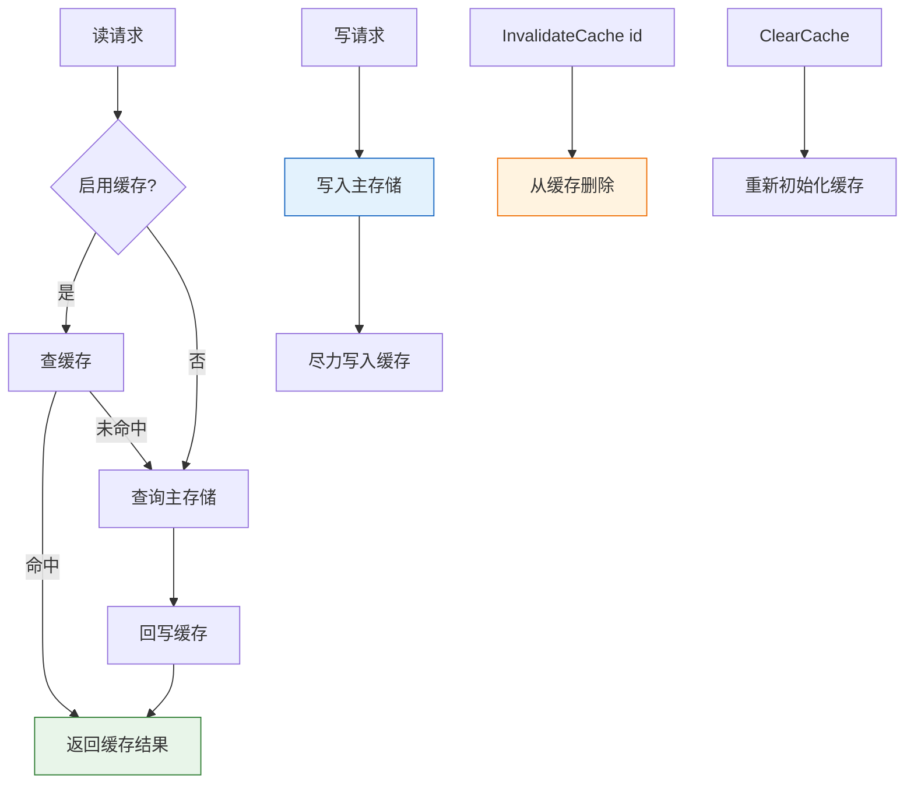

# 🗄️ Storage 接口与管理器

`storage` 模块定义了统一的 `Storage` 接口，用于持久化和查询 CPE 与 CVE 数据，并提供一个在主存储之上叠加缓存的 `StorageManager`。不同后端（内存、文件系统、数据库）实现同一接口，因此可以透明互换。

## 类型：Storage

```go
type Storage interface {
    Initialize() error
    Close() error
    StoreCPE(cpe *CPE) error
    RetrieveCPE(id string) (*CPE, error)
    UpdateCPE(cpe *CPE) error
    DeleteCPE(id string) error
    SearchCPE(criteria *CPE, options *MatchOptions) ([]*CPE, error)
    AdvancedSearchCPE(criteria *CPE, options *AdvancedMatchOptions) ([]*CPE, error)
    StoreCVE(cve *CVEReference) error
    RetrieveCVE(cveID string) (*CVEReference, error)
    UpdateCVE(cve *CVEReference) error
    DeleteCVE(cveID string) error
    SearchCVE(query string, options *SearchOptions) ([]*CVEReference, error)
    FindCVEsByCPE(cpe *CPE) ([]*CVEReference, error)
    FindCPEsByCVE(cveID string) ([]*CPE, error)
    StoreDictionary(dict *CPEDictionary) error
    RetrieveDictionary() (*CPEDictionary, error)
    StoreModificationTimestamp(key string, timestamp time.Time) error
    RetrieveModificationTimestamp(key string) (time.Time, error)
}
```

`Storage` 是每个后端都必须满足的契约。它涵盖生命周期（`Initialize`/`Close`）、CPE 增删改查与搜索、CVE 增删改查与搜索、CPE↔CVE 关系查询、字典存储以及修改时间戳跟踪。实现包括 `MemoryStorage` 和 `FileStorage`。

## 类型：SearchOptions

```go
type SearchOptions struct {
    Offset            int
    Limit             int
    SortBy            string
    SortAscending     bool
    Filters           map[string]interface{}
    FullTextQuery     string
    IncludeDeprecated bool
    DateStart         *time.Time
    DateEnd           *time.Time
    MinCVSS           float64
    MaxCVSS           float64
}
```

`SearchOptions` 控制 CVE 搜索行为：分页（`Offset`/`Limit`）、排序（`SortBy`/`SortAscending`）、自定义 `Filters`、全文查询、是否包含已弃用项、日期范围以及 CVSS 评分范围。

## 类型：StorageStats

```go
type StorageStats struct {
    TotalCPEs           int
    TotalCVEs           int
    TotalDictionaryItems int
    StorageBytes        int64
    LastUpdated         time.Time
}
```

`StorageStats` 保存由 `StorageManager.GetStats` 返回的聚合统计计数。

## 类型：StorageManager

```go
type StorageManager struct {
    Primary         Storage
    Cache           Storage
    CacheEnabled    bool
    CacheTTLSeconds int
}
```

`StorageManager` 包装一个主 `Storage` 和一个可选的缓存 `Storage`。当设置了缓存时，读操作先查缓存、未命中则回退到主存储并回写缓存；写操作同时传播到两者。

## 🆕 NewSearchOptions

```go
func NewSearchOptions() *SearchOptions
```

创建一个带有合理默认值的 `SearchOptions`：`Offset=0`、`Limit=100`、`SortBy="id"`、`SortAscending=true`、空 `Filters`、`IncludeDeprecated=false`。

| 参数 | 类型 | 说明 |
| --- | --- | --- |
| （无） | | |

| 返回值 | 类型 | 说明 |
| --- | --- | --- |
| #1 | `*SearchOptions` | 使用默认值初始化的搜索选项 |

```go
opts := cpeskills.NewSearchOptions()
opts.Limit = 50
opts.Filters["vendor"] = "microsoft"
results, _ := storage.SearchCVE("windows", opts)
```

## 🏗️ NewStorageManager

```go
func NewStorageManager(primary Storage) *StorageManager
```

在给定主存储之上创建一个 `StorageManager`。默认禁用缓存（`CacheEnabled=false`），`CacheTTLSeconds` 默认为 3600。

| 参数 | 类型 | 说明 |
| --- | --- | --- |
| `primary` | `Storage` | 持久化主存储；不能为 `nil` |

| 返回值 | 类型 | 说明 |
| --- | --- | --- |
| #1 | `*StorageManager` | 一个禁用缓存的新管理器 |

```go
primary, _ := cpeskills.NewFileStorage("/tmp/cpe-data", true)
_ = primary.Initialize()
manager := cpeskills.NewStorageManager(primary)
```

## ⚡ SetCache

```go
func (sm *StorageManager) SetCache(cache Storage)
```

附加一个缓存存储并启用缓存。调用此方法后，`GetCPE`/`GetCVE` 会穿透缓存读取，`StoreCPE` 会同时写入缓存。

| 参数 | 类型 | 说明 |
| --- | --- | --- |
| 接收者 | `*StorageManager` | 管理器 |
| `cache` | `Storage` | 缓存后端（通常是 `MemoryStorage`） |

| 返回值 | 类型 | 说明 |
| --- | --- | --- |
| （无） | | |

```go
cache := cpeskills.NewMemoryStorage()
_ = cache.Initialize()
manager.SetCache(cache)
```

## 🔍 GetCPE

```go
func (sm *StorageManager) GetCPE(id string) (*CPE, error)
```

返回 `id` 对应的 CPE。当启用缓存时，先查缓存；未命中则查询主存储并将结果回写缓存。缓存错误被吞掉；只有主存储的错误才会向上传播。

| 参数 | 类型 | 说明 |
| --- | --- | --- |
| 接收者 | `*StorageManager` | 管理器 |
| `id` | `string` | CPE 标识符（通常是 CPE 2.3 URI） |

| 返回值 | 类型 | 说明 |
| --- | --- | --- |
| #1 | `*CPE` | 找到的 CPE |
| #2 | `error` | 未找到或主存储失败时非 `nil` |

```go
cpe, err := manager.GetCPE("cpe:2.3:o:microsoft:windows:10:*:*:*:*:*:*:*")
if err != nil {
    log.Printf("get cpe: %v", err)
}
```

## 💾 StoreCPE

```go
func (sm *StorageManager) StoreCPE(cpe *CPE) error
```

将 `cpe` 持久化到主存储，并在启用缓存时同时写入缓存。缓存写入失败会被忽略，因此主存储成功时不会回滚。

| 参数 | 类型 | 说明 |
| --- | --- | --- |
| 接收者 | `*StorageManager` | 管理器 |
| `cpe` | `*CPE` | 要存储的 CPE |

| 返回值 | 类型 | 说明 |
| --- | --- | --- |
| #1 | `error` | 主存储失败时非 `nil` |

```go
_ = manager.StoreCPE(&cpeskills.CPE{
    Cpe23:       "cpe:2.3:a:apache:log4j:2.0:*:*:*:*:*:*:*",
    Vendor:      cpeskills.Vendor("apache"),
    ProductName: cpeskills.Product("log4j"),
    Version:     cpeskills.Version("2.0"),
})
```

## 🔎 GetCVE

```go
func (sm *StorageManager) GetCVE(cveID string) (*CVEReference, error)
```

返回 `cveID` 对应的 CVE 引用，具有与 `GetCPE` 相同的缓存穿透读取行为。

| 参数 | 类型 | 说明 |
| --- | --- | --- |
| 接收者 | `*StorageManager` | 管理器 |
| `cveID` | `string` | CVE 标识符，如 `CVE-2021-44228` |

| 返回值 | 类型 | 说明 |
| --- | --- | --- |
| #1 | `*CVEReference` | 找到的 CVE 引用 |
| #2 | `error` | 未找到或主存储失败时非 `nil` |

```go
cve, err := manager.GetCVE("CVE-2021-44228")
if err != nil {
    log.Printf("get cve: %v", err)
}
```

## 📋 Search

```go
func (sm *StorageManager) Search(criteria *CPE, options *MatchOptions) ([]*CPE, error)
```

在主存储中搜索匹配 `criteria`（按 `options` 规则）的 CPE（跳过缓存）。`criteria` 为 `nil` 时返回所有 CPE。

| 参数 | 类型 | 说明 |
| --- | --- | --- |
| 接收者 | `*StorageManager` | 管理器 |
| `criteria` | `*CPE` | 匹配条件；`nil` 匹配全部 |
| `options` | `*MatchOptions` | 匹配选项；`nil` 使用默认值 |

| 返回值 | 类型 | 说明 |
| --- | --- | --- |
| #1 | `[]*CPE` | 匹配的 CPE（无则空切片） |
| #2 | `error` | 存储失败时非 `nil` |

```go
results, _ := manager.Search(&cpeskills.CPE{
    Vendor:      cpeskills.Vendor("microsoft"),
    ProductName: cpeskills.Product("windows"),
}, &cpeskills.MatchOptions{})
fmt.Println(len(results))
```

## 🎯 AdvancedSearch

```go
func (sm *StorageManager) AdvancedSearch(criteria *CPE, options *AdvancedMatchOptions) ([]*CPE, error)
```

使用高级匹配选项（如版本范围和正则过滤）在主存储中搜索（跳过缓存）。

| 参数 | 类型 | 说明 |
| --- | --- | --- |
| 接收者 | `*StorageManager` | 管理器 |
| `criteria` | `*CPE` | 匹配条件 |
| `options` | `*AdvancedMatchOptions` | 高级匹配选项 |

| 返回值 | 类型 | 说明 |
| --- | --- | --- |
| #1 | `[]*CPE` | 匹配的 CPE |
| #2 | `error` | 存储失败时非 `nil` |

```go
results, _ := manager.AdvancedSearch(criteria, &cpeskills.AdvancedMatchOptions{})
```

## 🧹 InvalidateCache

```go
func (sm *StorageManager) InvalidateCache(id string)
```

从缓存中移除指定 id 的 CPE（尽力而为）。禁用缓存时为空操作。错误被吞掉。

| 参数 | 类型 | 说明 |
| --- | --- | --- |
| 接收者 | `*StorageManager` | 管理器 |
| `id` | `string` | 要驱逐的 CPE 标识符 |

| 返回值 | 类型 | 说明 |
| --- | --- | --- |
| （无） | | |

```go
manager.InvalidateCache("cpe:2.3:o:microsoft:windows:10:*:*:*:*:*:*:*")
```

## 🧽 ClearCache

```go
func (sm *StorageManager) ClearCache() error
```

通过重新初始化缓存存储来清空整个缓存。禁用缓存或缓存为 `nil` 时为空操作（返回 `nil`）。

| 参数 | 类型 | 说明 |
| --- | --- | --- |
| 接收者 | `*StorageManager` | 管理器 |

| 返回值 | 类型 | 说明 |
| --- | --- | --- |
| #1 | `error` | 缓存重新初始化失败时非 `nil` |

```go
if err := manager.ClearCache(); err != nil {
    log.Printf("clear cache: %v", err)
}
```

## 📊 GetStats

```go
func (sm *StorageManager) GetStats() (*StorageStats, error)
```

从主存储收集统计信息：CPE 总数（通过全量搜索）、CVE 总数（通过空 CVE 搜索）、字典条目数以及 `last_update` 修改时间戳（缺失时回退为 `time.Now()`）。

| 参数 | 类型 | 说明 |
| --- | --- | --- |
| 接收者 | `*StorageManager` | 管理器 |

| 返回值 | 类型 | 说明 |
| --- | --- | --- |
| #1 | `*StorageStats` | 聚合统计计数 |
| #2 | `error` | 主存储查询失败时非 `nil` |

```go
stats, _ := manager.GetStats()
fmt.Printf("CPEs=%d CVEs=%d items=%d\n", stats.TotalCPEs, stats.TotalCVEs, stats.TotalDictionaryItems)
```

## 🧭 Storage Manager 数据流


