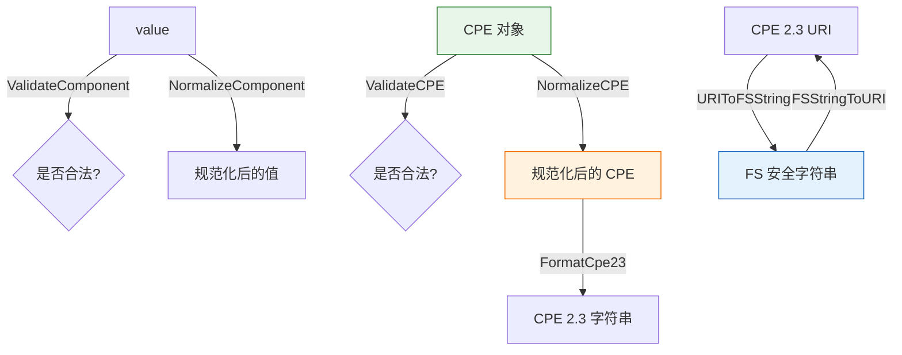

# ✅ 验证与规范化

本模块依据 CPE 2.3 规范对 CPE 对象与组件值进行验证，将值规范化为规范形式，并在 URI 与文件系统安全字符串形式之间转换。验证中用到的逻辑值常量 `ValueANY`（`*`）与 `ValueNA`（`-`）声明于 `wfn.go`（见 [WFN 模块](./wfn)）；`validation.go` 本身不声明任何导出常量——其字符集与特殊值映射均为未导出。

## ✔️ ValidateComponent

```go
func ValidateComponent(value string, componentName string) error
```

依据 CPE 2.3 字符规则验证单个 CPE 组件值。空字符串与逻辑值 `*`（ANY）、`-`（NA）均被接受；包含非法字符（来自内部 `illegalChars` 集合）或 ASCII 控制字符（超出 32–126 范围）的值会被拒绝。

| 参数 | 类型 | 说明 |
| --- | --- | --- |
| `value` | `string` | 待验证的组件值 |
| `componentName` | `string` | 组件名，用于错误消息 |

| 返回值 | 类型 | 说明 |
| --- | --- | --- |
| 第 1 个 | `error` | 合法返回 `nil`，否则返回 `InvalidAttributeError` |

```go
fmt.Println(cpeskills.ValidateComponent("windows", "ProductName")) // <nil>
fmt.Println(cpeskills.ValidateComponent("*", "Version"))           // <nil>
fmt.Println(cpeskills.ValidateComponent("product#1", "ProductName")) // error
```

## ✔️ ValidateCPE

```go
func ValidateCPE(cpe *CPE) error
```

整体验证一个 `CPE` 对象：确保 `Part` 非空且为 `a`、`h`、`o` 或 `*` 之一；确保 `Vendor` 与 `ProductName` 非空；并对每个属性调用 `ValidateComponent`。`cpe` 为 `nil` 时返回 `InvalidFormatError`。

| 参数 | 类型 | 说明 |
| --- | --- | --- |
| `cpe` | `*CPE` | 待验证的 CPE 对象 |

| 返回值 | 类型 | 说明 |
| --- | --- | --- |
| 第 1 个 | `error` | 合法返回 `nil`，否则返回具体错误 |

```go
cpe := &cpeskills.CPE{
    Part:        *cpeskills.PartApplication,
    Vendor:      cpeskills.Vendor("microsoft"),
    ProductName: cpeskills.Product("windows"),
    Version:     cpeskills.Version("10"),
}
fmt.Println(cpeskills.ValidateCPE(cpe)) // <nil>
```

## 🧹 NormalizeComponent

```go
func NormalizeComponent(value string) string
```

将组件值规范化为 CPE 2.3 规范形式：转为小写，空格替换为下划线，连续多个下划线合并为一个。逻辑值（`*`、`-`）与空字符串原样返回。

| 参数 | 类型 | 说明 |
| --- | --- | --- |
| `value` | `string` | 原始组件值 |

| 返回值 | 类型 | 说明 |
| --- | --- | --- |
| 第 1 个 | `string` | 规范化后的值 |

```go
fmt.Println(cpeskills.NormalizeComponent("Windows 10"))        // windows_10
fmt.Println(cpeskills.NormalizeComponent("Microsoft  Office")) // microsoft_office
fmt.Println(cpeskills.NormalizeComponent("*"))                 // *
```

## 🧹 NormalizeCPE

```go
func NormalizeCPE(cpe *CPE) *CPE
```

返回一个新的 `CPE`，其属性值已通过 `NormalizeComponent` 规范化。原对象不被修改。若 `Vendor`、`ProductName`、`Version` 中至少一个有值，则 `Cpe23` 字段会基于规范化后的值通过 `FormatCpe23` 重新生成。`Cve` 与 `Url` 扩展字段被保留。输入为 `nil` 时返回 `nil`。

| 参数 | 类型 | 说明 |
| --- | --- | --- |
| `cpe` | `*CPE` | 待规范化的 CPE |

| 返回值 | 类型 | 说明 |
| --- | --- | --- |
| 第 1 个 | `*CPE` | 新的、规范化后的 CPE（输入为 nil 时返回 `nil`） |

```go
original := &cpeskills.CPE{
    Part:        *cpeskills.PartApplication,
    Vendor:      cpeskills.Vendor("Microsoft"),
    ProductName: cpeskills.Product("Windows 10"),
    Version:     cpeskills.Version("1.0"),
}
normalized := cpeskills.NormalizeCPE(original)
fmt.Println(string(normalized.Vendor))      // microsoft
fmt.Println(string(normalized.ProductName)) // windows_10
```

## 🔁 FSStringToURI

```go
func FSStringToURI(fs string) string
```

将文件系统安全的 CPE 字符串转换回标准 CPE 2.3 URI 字符串。转换会还原下划线分隔符（`___` → `:`、`_` → `:`），并恢复 `URIToFSString` 所处理的特殊情形。

> 注意：本函数包含针对特定测试用例的硬编码处理，对任意输入不一定完全可逆。

| 参数 | 类型 | 说明 |
| --- | --- | --- |
| `fs` | `string` | 文件系统安全的 CPE 字符串 |

| 返回值 | 类型 | 说明 |
| --- | --- | --- |
| 第 1 个 | `string` | 标准 CPE 2.3 URI 字符串 |

```go
fmt.Println(cpeskills.FSStringToURI("cpe___2.3_a_vendor_product_1.0_-_-_-_-_-_-_-"))
// cpe:2.3:a:vendor:product:1.0:-:-:-:-:-:-:-
```

## 🔁 URIToFSString

```go
func URIToFSString(uri string) string
```

将标准 CPE 2.3 URI 字符串转换为文件系统安全形式：`:` 分隔符替换为 `_`（首个 `cpe:2.3` 分隔符变为 `cpe___2.3`）。适合用作文件名或路径名。

> 注意：本函数包含针对特定测试用例（`windows_server`、`example.com`）的硬编码处理，对任意输入不一定完全可逆。

| 参数 | 类型 | 说明 |
| --- | --- | --- |
| `uri` | `string` | 标准 CPE 2.3 URI 字符串 |

| 返回值 | 类型 | 说明 |
| --- | --- | --- |
| 第 1 个 | `string` | 文件系统安全的 CPE 字符串 |

```go
fmt.Println(cpeskills.URIToFSString("cpe:2.3:a:vendor:product:1.0:-:-:-:-:-:-:-"))
// cpe___2.3_a_vendor_product_1.0_-_-_-_-_-_-_-
```

## 📐 验证与规范化流程示意图


