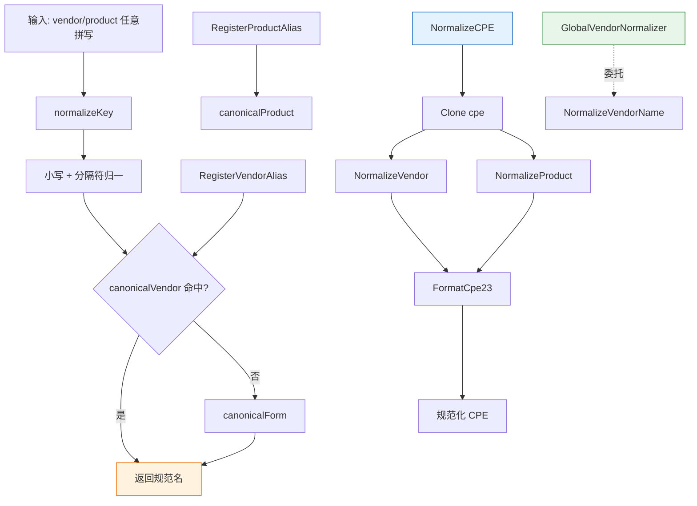

# 🏷️ 厂商归一化

`vendor_normalization` 模块用于调和同一厂商/产品在不同数据源（NVD、GitHub Advisory、OSV 等）中的多种拼写。`VendorNormalizer` 将每个已知别名映射到唯一的规范形式，从而支持跨源去重和模糊匹配。它内置了覆盖主流软件厂商、生态系统、Linux 发行版、数据库和常见产品的别名表。

## 类型：VendorNormalizer

```go
type VendorNormalizer struct {
    canonicalVendor  map[string]string         // 别名 → 规范厂商
    canonicalProduct map[string]string         // 别名 → 规范产品
    vendorProducts   map[string]map[string]bool // 规范厂商 → 已知产品集合
}
```

所有字段均为非导出。查询时会先将输入键归一化（去空白、小写、将 ` `-`-`.` 分隔符折叠为 `_`）再查别名表；未映射的名称回退为其自身的规范形式。

## 🌐 GlobalVendorNormalizer

```go
var GlobalVendorNormalizer = NewVendorNormalizer()
```

包级 `VendorNormalizer`，预加载内置别名表。便捷函数 `NormalizeVendorName`、`NormalizeProductName` 和 `NormalizeCPEVendorProduct` 均委托给它。

## 🆕 NewVendorNormalizer

```go
func NewVendorNormalizer() *VendorNormalizer
```

创建一个预分配 map 并注册了内置别名表的 `VendorNormalizer`。

| 参数 | 类型 | 说明 |
| --- | --- | --- |
| （无） | | |

| 返回值 | 类型 | 说明 |
| --- | --- | --- |
| #1 | `*VendorNormalizer` | 带内置别名的新归一化器 |

```go
n := cpeskills.NewVendorNormalizer()
fmt.Println(n.NormalizeVendor("Apache Software Foundation")) // "apache"
```

## 🔧 NormalizeVendor

```go
func (n *VendorNormalizer) NormalizeVendor(name string) string
```

返回 `name` 的规范厂商名。若 `name`（归一化后）匹配已注册别名，返回其规范形式；否则返回 `name` 自身的规范形式。

| 参数 | 类型 | 说明 |
| --- | --- | --- |
| 接收者 | `*VendorNormalizer` | 归一化器 |
| `name` | `string` | 厂商名（任意拼写） |

| 返回值 | 类型 | 说明 |
| --- | --- | --- |
| #1 | `string` | 规范厂商名 |

```go
n.NormalizeVendor("apache_software_foundation") // "apache"
```

## 🔧 NormalizeProduct

```go
func (n *VendorNormalizer) NormalizeProduct(vendor, product string) string
```

返回 `product` 的规范产品名（`vendor` 参数用于 API 对称 / 未来按厂商区分的产品规则）。已注册别名映射到其规范形式；否则返回产品名的规范形式。

| 参数 | 类型 | 说明 |
| --- | --- | --- |
| 接收者 | `*VendorNormalizer` | 归一化器 |
| `vendor` | `string` | 规范厂商（信息性） |
| `product` | `string` | 产品名（任意拼写） |

| 返回值 | 类型 | 说明 |
| --- | --- | --- |
| #1 | `string` | 规范产品名 |

```go
n.NormalizeProduct("apache", "log4j-core") // "log4j"
```

## 🔧 NormalizeCPE

```go
func (n *VendorNormalizer) NormalizeCPE(cpe *CPE) *CPE
```

返回 `cpe` 的克隆，其 `Vendor` 和 `ProductName` 归一化为规范形式，`Cpe23` 通过 `FormatCpe23` 重新格式化。`cpe` 为 `nil` 时返回 `nil`。原始 CPE 不会被修改。

| 参数 | 类型 | 说明 |
| --- | --- | --- |
| 接收者 | `*VendorNormalizer` | 归一化器 |
| `cpe` | `*CPE` | 要归一化的 CPE |

| 返回值 | 类型 | 说明 |
| --- | --- | --- |
| #1 | `*CPE` | 归一化后的克隆 |

```go
normalized := n.NormalizeCPE(cpe)
```

## ✅ AreSameVendor

```go
func (n *VendorNormalizer) AreSameVendor(a, b string) bool
```

若 `a` 和 `b` 归一化后为同一规范厂商，返回 `true`。

| 参数 | 类型 | 说明 |
| --- | --- | --- |
| 接收者 | `*VendorNormalizer` | 归一化器 |
| `a` | `string` | 第一个厂商名 |
| `b` | `string` | 第二个厂商名 |

| 返回值 | 类型 | 说明 |
| --- | --- | --- |
| #1 | `bool` | 同一规范厂商时为 `true` |

```go
n.AreSameVendor("apache_software_foundation", "Apache Software Foundation") // true
```

## ✅ AreSameProduct

```go
func (n *VendorNormalizer) AreSameProduct(vendor, productA, productB string) bool
```

若 `productA` 和 `productB`（在 `vendor` 下）归一化后为同一规范产品，返回 `true`。

| 参数 | 类型 | 说明 |
| --- | --- | --- |
| 接收者 | `*VendorNormalizer` | 归一化器 |
| `vendor` | `string` | 规范厂商 |
| `productA` | `string` | 第一个产品名 |
| `productB` | `string` | 第二个产品名 |

| 返回值 | 类型 | 说明 |
| --- | --- | --- |
| #1 | `bool` | 同一规范产品时为 `true` |

```go
n.AreSameProduct("apache", "log4j-core", "log4j2") // true
```

## ➕ RegisterVendorAlias

```go
func (n *VendorNormalizer) RegisterVendorAlias(canonical string, aliases ...string)
```

将一个或多个 `aliases` 注册为映射到 `canonical`（归一化）。规范名自身也会映射到自身，确保查询幂等。

| 参数 | 类型 | 说明 |
| --- | --- | --- |
| 接收者 | `*VendorNormalizer` | 归一化器 |
| `canonical` | `string` | 规范厂商名 |
| `aliases` | `...string` | 要注册的别名 |

| 返回值 | 类型 | 说明 |
| --- | --- | --- |
| （无） | | |

```go
n.RegisterVendorAlias("myvendor", "my_vendor", "My Vendor Inc.")
```

## ➕ RegisterProductAlias

```go
func (n *VendorNormalizer) RegisterProductAlias(canonical string, aliases ...string)
```

将一个或多个产品 `aliases` 注册为映射到 `canonical`（归一化）。规范名自身也会映射到自身。

| 参数 | 类型 | 说明 |
| --- | --- | --- |
| 接收者 | `*VendorNormalizer` | 归一化器 |
| `canonical` | `string` | 规范产品名 |
| `aliases` | `...string` | 要注册的别名 |

| 返回值 | 类型 | 说明 |
| --- | --- | --- |
| （无） | | |

```go
n.RegisterProductAlias("myproduct", "my_product", "my-product")
```

## ❓ HasVendor

```go
func (n *VendorNormalizer) HasVendor(name string) bool
```

若 `name`（归一化后）是已知厂商别名（含规范名自身），返回 `true`。

| 参数 | 类型 | 说明 |
| --- | --- | --- |
| 接收者 | `*VendorNormalizer` | 归一化器 |
| `name` | `string` | 要测试的厂商名 |

| 返回值 | 类型 | 说明 |
| --- | --- | --- |
| #1 | `bool` | 已知时为 `true` |

```go
n.HasVendor("apache") // true
```

## 📊 VendorCount

```go
func (n *VendorNormalizer) VendorCount() int
```

返回已注册的厂商别名数量（含映射到自身的规范名）。

| 参数 | 类型 | 说明 |
| --- | --- | --- |
| 接收者 | `*VendorNormalizer` | 归一化器 |

| 返回值 | 类型 | 说明 |
| --- | --- | --- |
| #1 | `int` | 已注册厂商别名数 |

```go
fmt.Println(n.VendorCount())
```

## 🌐 NormalizeVendorName

```go
func NormalizeVendorName(name string) string
```

包级便捷函数：等价于 `GlobalVendorNormalizer.NormalizeVendor(name)`。

| 参数 | 类型 | 说明 |
| --- | --- | --- |
| `name` | `string` | 厂商名 |

| 返回值 | 类型 | 说明 |
| --- | --- | --- |
| #1 | `string` | 规范厂商名 |

```go
cpeskills.NormalizeVendorName("Apache Software Foundation") // "apache"
```

## 🌐 NormalizeProductName

```go
func NormalizeProductName(vendor, product string) string
```

包级便捷函数：等价于 `GlobalVendorNormalizer.NormalizeProduct(vendor, product)`。

| 参数 | 类型 | 说明 |
| --- | --- | --- |
| `vendor` | `string` | 规范厂商 |
| `product` | `string` | 产品名 |

| 返回值 | 类型 | 说明 |
| --- | --- | --- |
| #1 | `string` | 规范产品名 |

```go
cpeskills.NormalizeProductName("apache", "log4j-core") // "log4j"
```

## 🌐 NormalizeCPEVendorProduct

```go
func NormalizeCPEVendorProduct(cpe *CPE) *CPE
```

包级便捷函数：等价于 `GlobalVendorNormalizer.NormalizeCPE(cpe)`。

| 参数 | 类型 | 说明 |
| --- | --- | --- |
| `cpe` | `*CPE` | 要归一化的 CPE |

| 返回值 | 类型 | 说明 |
| --- | --- | --- |
| #1 | `*CPE` | 归一化后的克隆 |

```go
normalized := cpeskills.NormalizeCPEVendorProduct(cpe)
```

## 🧭 厂商归一化流程


