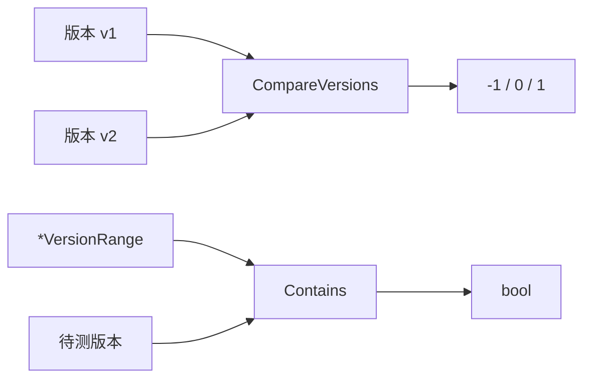
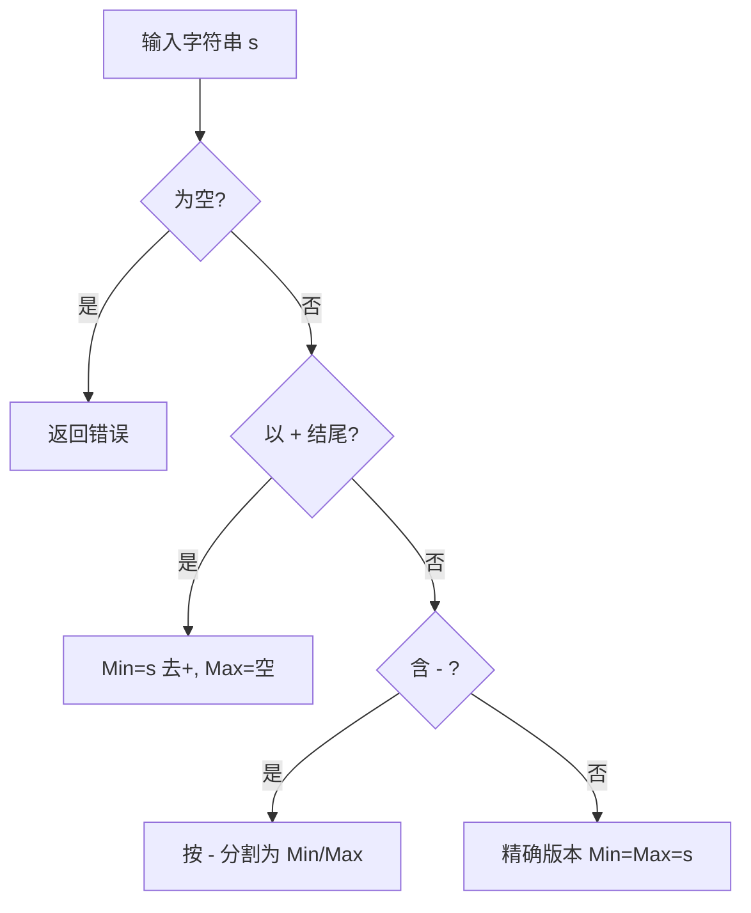

# 🔢 版本比较

`version_compare` 模块（`version_compare.go`）提供版本字符串的比较与范围判断功能。底层基于 `github.com/scagogogo/versions` 包解析版本号。



## 类型

### VersionRange

```go
type VersionRange struct {
    MinVersion string // 最小版本（包含）
    MaxVersion string // 最大版本（包含）
}
```

表示一个闭区间版本范围。

## 函数

### CompareVersions

```go
func CompareVersions(v1, v2 string) int
```

比较两个版本字符串。

**参数：**
- `v1` — 第一个版本
- `v2` — 第二个版本

**返回值：**
- `int` — `-1` 若 `v1 < v2`；`0` 若相等；`1` 若 `v1 > v2`

**示例：**
```go
fmt.Println(cpeskills.CompareVersions("1.2.0", "1.2.1")) // -1
fmt.Println(cpeskills.CompareVersions("2.0", "1.9.9"))   // 1
fmt.Println(cpeskills.CompareVersions("1.0", "1.0"))     // 0
```

### IsVersionInRange

```go
func IsVersionInRange(version, minVersion, maxVersion string) bool
```

检查版本是否在闭区间 `[minVersion, maxVersion]` 内。空字符串边界表示该侧不限制。

**参数：**
- `version` — 待测版本
- `minVersion` — 最小版本（空表示无下界）
- `maxVersion` — 最大版本（空表示无上界）

**返回值：**
- `bool` — 是否在范围内

### IsSubVersion

```go
func IsSubVersion(parentVersion, subVersion string) bool
```

检查 `subVersion` 是否是 `parentVersion` 的子版本。例如 `1.0.1` 是 `1.0` 的子版本——子版本的数字前缀需与父版本完全一致，且至少更长。

**参数：**
- `parentVersion` — 父版本
- `subVersion` — 待测子版本

**返回值：**
- `bool` — 是否为子版本

**示例：**
```go
cpeskills.IsSubVersion("1.0", "1.0.5") // true
cpeskills.IsSubVersion("1.0", "1.1")   // false
```

### ParseVersionRange

```go
func ParseVersionRange(s string) (*VersionRange, error)
```

解析版本范围字符串。支持格式：
- `"1.0"` → 精确版本（Min 与 Max 均为 `1.0`）
- `"1.0-2.0"` → 范围（从 1.0 到 2.0）
- `"1.0+"` → 1.0 及以上（Max 为空）
- `"-2.0"` → 2.0 及以下（Min 为空）

**参数：**
- `s` — 范围字符串

**返回值：**
- `*VersionRange` — 解析后的范围
- `error` — 空字符串时返回错误

**示例：**
```go
vr, err := cpeskills.ParseVersionRange("1.0-2.0")
if err != nil {
    log.Fatal(err)
}
fmt.Println(vr.MinVersion, vr.MaxVersion) // 1.0 2.0
```

### VersionRange.Contains

```go
func (vr *VersionRange) Contains(version string) bool
```

检查某版本是否落在该范围内（等价于 `IsVersionInRange(version, vr.MinVersion, vr.MaxVersion)`）。

**参数：**
- `version` — 待测版本

**返回值：**
- `bool` — 是否在范围内

## 范围解析流程


