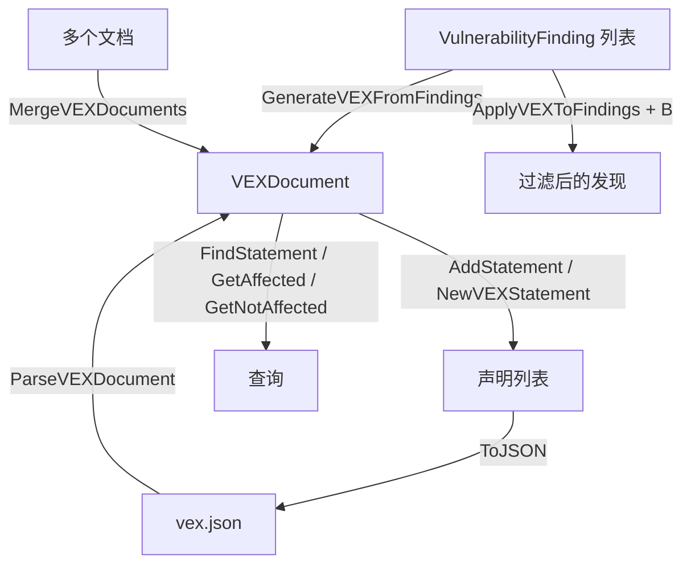

# 🚦 VEX

`vex` 模块实现 VEX（漏洞可利用性交换）声明与文档，兼容 CSAF VEX profile 与 CycloneDX VEX 扩展。VEX 文档针对特定产品声明每个已知漏洞是 affected、not_affected、fixed 还是 under_investigation。

## 类型：VEXStatus

```go
type VEXStatus string
```

枚举漏洞在产品上下文中的可利用性状态。

| 常量 | 类型 | 值 |
| --- | --- | --- |
| `VEXNotAffected` | `VEXStatus` | `"not_affected"` |
| `VEXAffected` | `VEXStatus` | `"affected"` |
| `VEXFixed` | `VEXStatus` | `"fixed"` |
| `VEXUnderInvestigation` | `VEXStatus` | `"under_investigation"` |

## 类型：VEXJustification

```go
type VEXJustification string
```

枚举产品不受影响的原因。

| 常量 | 类型 | 值 |
| --- | --- | --- |
| `VEXComponentNotPresent` | `VEXJustification` | `"component_not_present"` |
| `VEXVulnerableCodeNotPresent` | `VEXJustification` | `"vulnerable_code_not_present"` |
| `VEXVulnerableCodeNotInExecutePath` | `VEXJustification` | `"vulnerable_code_not_in_execute_path"` |
| `VEXVulnerableCodeCannotBeControlledByAdversary` | `VEXJustification` | `"vulnerable_code_cannot_be_controlled_by_adversary"` |
| `VEXInlineMitigationsExist` | `VEXJustification` | `"inline_mitigations_already_exist"` |

## 类型：VEXStatement

```go
type VEXStatement struct {
    ID                       string                 // 声明唯一 ID
    VulnerabilityID          string                 // 漏洞 ID（CVE、GHSA 等）
    VulnerabilityDescription string                 // 漏洞描述
    Status                   VEXStatus              // 可利用性状态
    Justification            VEXJustification       // not_affected 的原因
    ProductID                string                 // 产品 ID（CPE URI 或 PURL）
    ProductName              string                 // 产品名称
    ProductVersion           string                 // 产品版本
    ImpactStatement          string                 // 影响评估
    ActionStatement          string                 // 受影响产品的建议动作
    ActionStatementTimestamp time.Time              // 动作声明最后更新时间
    LastUpdated              time.Time              // 声明最后更新时间
    Source                   string                 // 声明发布方
    SourceURL                string                 // 原始来源 URL
    Metadata                 map[string]interface{} // 附加元数据
}
```

## 类型：VEXDocument

```go
type VEXDocument struct {
    Format         string          // "csaf"、"cyclonedx"、"openvex"
    ID             string          // 文档唯一 ID
    Author         string          // 文档作者
    AuthorRole     string          // 作者角色（vendor、coordinator 等）
    Timestamp      time.Time       // 创建时间
    LastUpdated    time.Time       // 最后更新时间
    Version        int             // 文档版本
    Title          string          // 文档标题
    ProductID      string          // 文档描述的产品
    ProductName    string          // 产品名称
    ProductVersion string          // 产品版本
    Supplier       string          // 产品供应商
    Statements     []*VEXStatement // VEX 声明列表
}
```

## 🆕 NewVEXDocument

```go
func NewVEXDocument(format, productID, productName, author string) *VEXDocument
```

创建一个新的 VEX 文档。会生成唯一 `ID`（`VEX-<uuid>`），`Timestamp` 与 `LastUpdated` 设为当前时间，`Version` 为 `1`，`Statements` 初始化。

| 参数 | 类型 | 说明 |
| --- | --- | --- |
| `format` | `string` | VEX 格式（`"csaf"`、`"cyclonedx"`、`"openvex"`） |
| `productID` | `string` | 产品 ID（CPE URI 或 PURL） |
| `productName` | `string` | 产品名称 |
| `author` | `string` | 文档作者 |

| 返回值 | 类型 | 说明 |
| --- | --- | --- |
| #1 | `*VEXDocument` | 初始化后的 VEX 文档 |

```go
doc := cpeskills.NewVEXDocument("cyclonedx", "pkg:app@1.0", "my-app", "security-team")
```

## ➕ AddStatement

```go
func (d *VEXDocument) AddStatement(stmt *VEXStatement)
```

追加一条声明。若 `stmt.ID` 为空则生成唯一 `VEXSTMT-<uuid>` ID；若 `stmt.LastUpdated` 为零值则设为当前时间。文档的 `LastUpdated` 会刷新。

| 参数 | 类型 | 说明 |
| --- | --- | --- |
| `stmt` | `*VEXStatement` | 待添加的声明 |

```go
stmt := cpeskills.NewVEXStatement("CVE-2021-44228", "pkg:app@1.0", cpeskills.VEXAffected)
doc.AddStatement(stmt)
```

## 🆕 NewVEXStatement

```go
func NewVEXStatement(vulnerabilityID, productID string, status VEXStatus) *VEXStatement
```

创建一条新的 VEX 声明。会生成唯一 `VEXSTMT-<uuid>` ID，`LastUpdated` 设为当前时间。

| 参数 | 类型 | 说明 |
| --- | --- | --- |
| `vulnerabilityID` | `string` | 漏洞 ID（CVE、GHSA 等） |
| `productID` | `string` | 产品 ID |
| `status` | `VEXStatus` | 可利用性状态 |

| 返回值 | 类型 | 说明 |
| --- | --- | --- |
| #1 | `*VEXStatement` | 初始化后的声明 |

```go
stmt := cpeskills.NewVEXStatement("CVE-2021-44228", "pkg:app@1.0", cpeskills.VEXNotAffected)
stmt.Justification = cpeskills.VEXComponentNotPresent
```

## 📤 ToJSON

```go
func (d *VEXDocument) ToJSON() ([]byte, error)
```

将 VEX 文档序列化为带 2 空格缩进的 JSON。

| 返回值 | 类型 | 说明 |
| --- | --- | --- |
| #1 | `[]byte` | JSON 文档 |
| #2 | `error` | 序列化错误 |

```go
data, err := doc.ToJSON()
if err != nil {
    log.Fatal(err)
}
os.WriteFile("vex.json", data, 0644)
```

## 📥 ParseVEXDocument

```go
func ParseVEXDocument(data []byte) (*VEXDocument, error)
```

将 VEX JSON 字节解析为 `VEXDocument`。

| 参数 | 类型 | 说明 |
| --- | --- | --- |
| `data` | `[]byte` | VEX JSON 字节 |

| 返回值 | 类型 | 说明 |
| --- | --- | --- |
| #1 | `*VEXDocument` | 解析后的文档 |
| #2 | `error` | 包装后的 `json.Unmarshal` 错误 |

```go
data, _ := os.ReadFile("vex.json")
doc, err := cpeskills.ParseVEXDocument(data)
if err != nil {
    log.Fatal(err)
}
```

## 🔍 FindStatement

```go
func (d *VEXDocument) FindStatement(vulnerabilityID string) *VEXStatement
```

返回第一条 `VulnerabilityID` 匹配的声明，无匹配时返回 `nil`。

| 参数 | 类型 | 说明 |
| --- | --- | --- |
| `vulnerabilityID` | `string` | 要查找的漏洞 ID |

| 返回值 | 类型 | 说明 |
| --- | --- | --- |
| #1 | `*VEXStatement` | 匹配的声明，或 `nil` |

```go
stmt := doc.FindStatement("CVE-2021-44228")
```

## 🔍 GetAffectedStatements

```go
func (d *VEXDocument) GetAffectedStatements() []*VEXStatement
```

返回所有状态为 `VEXAffected` 的声明。

| 返回值 | 类型 | 说明 |
| --- | --- | --- |
| #1 | `[]*VEXStatement` | 受影响的声明 |

```go
for _, s := range doc.GetAffectedStatements() {
    fmt.Println(s.VulnerabilityID)
}
```

## 🔍 GetNotAffectedStatements

```go
func (d *VEXDocument) GetNotAffectedStatements() []*VEXStatement
```

返回所有状态为 `VEXNotAffected` 的声明。

| 返回值 | 类型 | 说明 |
| --- | --- | --- |
| #1 | `[]*VEXStatement` | 不受影响的声明 |

```go
for _, s := range doc.GetNotAffectedStatements() {
    fmt.Println(s.VulnerabilityID)
}
```

## 🔢 StatementCount

```go
func (d *VEXDocument) StatementCount() int
```

返回文档中的声明数量。

| 返回值 | 类型 | 说明 |
| --- | --- | --- |
| #1 | `int` | 声明数量 |

```go
fmt.Println(doc.StatementCount())
```

## 🔀 MergeVEXDocuments

```go
func MergeVEXDocuments(docs []*VEXDocument) *VEXDocument
```

将多个 VEX 文档合并为一个。合并后文档继承首个文档的 `Format`、`Author`、`ProductID`、`ProductName`，并生成新的 `ID`/`Timestamp`。声明按 `VulnerabilityID` 去重，后出现的文档优先（最后为准），随后恢复原始顺序。

| 参数 | 类型 | 说明 |
| --- | --- | --- |
| `docs` | `[]*VEXDocument` | 待合并的文档 |

| 返回值 | 类型 | 说明 |
| --- | --- | --- |
| #1 | `*VEXDocument` | 合并后的文档；输入为空时返回 `nil` |

```go
merged := cpeskills.MergeVEXDocuments([]*cpeskills.VEXDocument{doc1, doc2})
```

## 🤖 GenerateVEXFromFindings

```go
func GenerateVEXFromFindings(component *SBOMComponent, findings []*VulnerabilityFinding, productID string) *VEXDocument
```

为给定组件的漏洞发现生成 CycloneDX VEX 文档（`format: "cyclonedx"`，作者 `"cpe-skills"`）。对每条发现，漏洞 ID 取自 `finding.CVE.CVEID` 或 `finding.OSV.ID`（缺省 `"unknown"`），描述同源。状态默认 `VEXAffected`，当 `finding.FixAvailable` 为 true 时为 `VEXFixed`；当 `finding.FixedVersion` 非空时附加动作声明 `"Upgrade to version <v> or later."`。

| 参数 | 类型 | 说明 |
| --- | --- | --- |
| `component` | `*SBOMComponent` | 发现所属组件 |
| `findings` | `[]*VulnerabilityFinding` | 漏洞发现列表 |
| `productID` | `string` | 声明的产品 ID |

| 返回值 | 类型 | 说明 |
| --- | --- | --- |
| #1 | `*VEXDocument` | 生成的 VEX 文档 |

```go
doc := cpeskills.GenerateVEXFromFindings(comp, findings, "pkg:app@1.0")
```

## 🎯 ApplyVEXToFindings

```go
func ApplyVEXToFindings(findings []*VulnerabilityFinding, doc *VEXDocument) []*VulnerabilityFinding
```

根据 VEX 状态过滤或调整漏洞发现。若 `doc` 为 nil 则原样返回全部发现。对每条发现，漏洞 ID 取自 `finding.CVE.CVEID` 或 `finding.OSV.ID`；无匹配声明则保留。`VEXNotAffected` 的发现被丢弃；`VEXFixed` 的发现保留并将 `FixAvailable` 置为 true；`VEXUnderInvestigation` 与 `VEXAffected` 的发现保留。

| 参数 | 类型 | 说明 |
| --- | --- | --- |
| `findings` | `[]*VulnerabilityFinding` | 输入发现列表 |
| `doc` | `*VEXDocument` | 待应用的 VEX 文档 |

| 返回值 | 类型 | 说明 |
| --- | --- | --- |
| #1 | `[]*VulnerabilityFinding` | 过滤/调整后的发现 |

```go
filtered := cpeskills.ApplyVEXToFindings(findings, doc)
```

## VEX 生命周期


