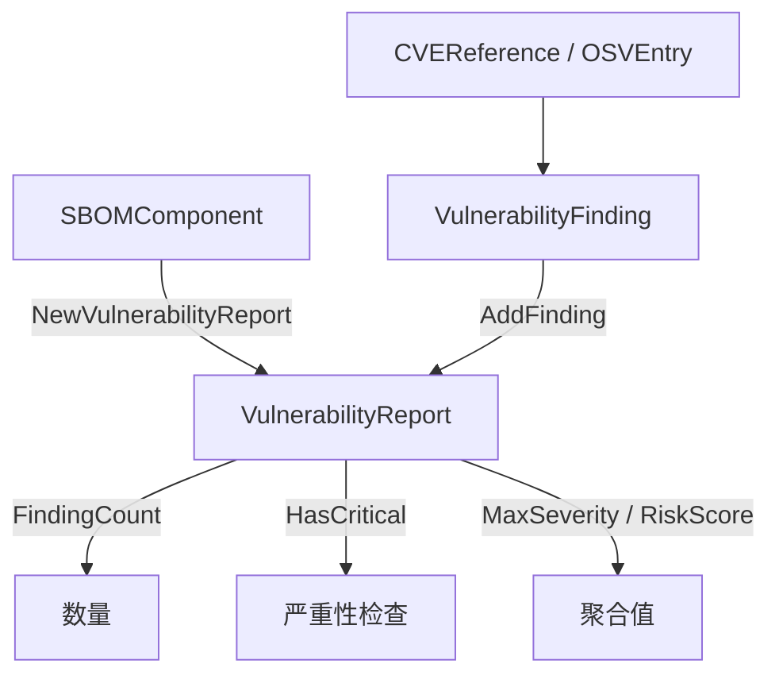

# 📋 漏洞报告

`vulnerability_report` 模块定义统一的漏洞视图 `VulnerabilityFinding`，整合 CVE、OSV、EPSS、KEV 与可达性数据，并提供按组件聚合的 `VulnerabilityReport`，含最高严重级别与风险评分。

## 类型：VulnerabilityFinding

```go
type VulnerabilityFinding struct {
    CVE          *CVEReference // CVE 引用（来自 NVD 等数据源）
    OSV          *OSVEntry     // OSV 条目（来自 OSV 数据库）
    FixedVersion string        // 修复版本号
    FixAvailable bool          // 是否有可用修复版本
    EPSSScore    float64       // EPSS 漏洞利用预测评分 (0.0-1.0)
    KEVListed    bool          // 是否在 CISA KEV 目录中
    Reachability string        // "direct"、"transitive"、"unknown"
    PublishedAt  time.Time     // 漏洞发布时间
    Source       string        // 漏洞信息来源
}
```

## 类型：OSVEntry

```go
type OSVEntry struct {
    ID               string                   // OSV 条目 ID（如 "GHSA-xxxx-xxxx-xxxx"）
    Summary          string                   // 漏洞摘要
    Details          string                   // 漏洞详情
    Aliases          []string                 // 别名（如 CVE ID）
    Modified         time.Time                // 最后修改时间
    Published        time.Time                // 发布时间
    Severity         []*OSVSeverity           // 严重性评分
    Affected         []*OSVAffected           // 受影响的包
    References       []*OSVReference          // 参考链接
    DatabaseSpecific map[string]interface{}   // 数据库特定字段
}
```

### OSVSeverity

```go
type OSVSeverity struct {
    Type  string // 评分类型（CVSS_V3、CVSS_V4）
    Score string // 评分值
}
```

### OSVAffected

```go
type OSVAffected struct {
    Package           *OSVPackage            // 包信息
    Ranges            []*OSVRange            // 版本范围
    Versions          []string               // 具体受影响版本
    EcosystemSpecific map[string]interface{} // 生态系统特定字段
    DatabaseSpecific  map[string]interface{} // 数据库特定字段
}
```

### OSVPackage

```go
type OSVPackage struct {
    Ecosystem string // 生态系统
    Name      string // 包名称
    PURL      string // 包 URL
}
```

### OSVRange

```go
type OSVRange struct {
    Type   string      // 范围类型（SEMVER、ECOSYSTEM、GIT）
    Events []*OSVEvent // 范围事件
    Repo   string      // 仓库 URL（用于 GIT 类型）
}
```

### OSVEvent

```go
type OSVEvent struct {
    Introduced   string // 引入漏洞的版本
    Fixed        string // 修复漏洞的版本
    LastAffected string // 最后受影响的版本
    Limit        string // 限制版本
}
```

### OSVReference

```go
type OSVReference struct {
    Type string // 参考类型（ADVISORY、ARTICLE、REPORT、FIX、PACKAGE、EVIDENCE、WEB）
    URL  string // 参考链接
}
```

## 类型：VulnerabilityReport

```go
type VulnerabilityReport struct {
    Component       *SBOMComponent           // 被评估的组件
    Vulnerabilities []*VulnerabilityFinding  // 发现的漏洞列表
    RiskScore       float64                  // 综合风险评分 (0-10)
    MaxSeverity     string                   // 最高严重级别
    GeneratedAt     time.Time                // 报告生成时间
    Summary         string                   // 报告摘要
}
```

## 🆕 NewVulnerabilityFinding

```go
func NewVulnerabilityFinding() *VulnerabilityFinding
```

创建一条新的漏洞发现，`Reachability` 设为 `"unknown"`。

| 返回值 | 类型 | 说明 |
| --- | --- | --- |
| #1 | `*VulnerabilityFinding` | 初始化后的发现 |

```go
f := cpeskills.NewVulnerabilityFinding()
f.CVE = cpeskills.NewCVEReference("CVE-2021-44228")
f.CVE.SetSeverity(10.0)
f.FixAvailable = true
f.FixedVersion = "2.15.0"
```

## 🆕 NewVulnerabilityReport

```go
func NewVulnerabilityReport(component *SBOMComponent) *VulnerabilityReport
```

为给定组件创建一个新报告。`Vulnerabilities` 初始化为空切片，`GeneratedAt` 设为当前时间。

| 参数 | 类型 | 说明 |
| --- | --- | --- |
| `component` | `*SBOMComponent` | 待报告的组件 |

| 返回值 | 类型 | 说明 |
| --- | --- | --- |
| #1 | `*VulnerabilityReport` | 初始化后的报告 |

```go
report := cpeskills.NewVulnerabilityReport(comp)
```

## ➕ AddFinding

```go
func (r *VulnerabilityReport) AddFinding(finding *VulnerabilityFinding)
```

追加一条发现。若 `finding.CVE` 非空，当其严重级别高于当前最高级别时（Critical > High > Medium > Low）更新报告 `MaxSeverity`，并将 `RiskScore` 更新为自身与 `finding.CVE.CVSSScore` 的较大值。

| 参数 | 类型 | 说明 |
| --- | --- | --- |
| `finding` | `*VulnerabilityFinding` | 待添加的发现 |

```go
report.AddFinding(f)
```

## 🔢 FindingCount

```go
func (r *VulnerabilityReport) FindingCount() int
```

返回报告中的发现数量。

| 返回值 | 类型 | 说明 |
| --- | --- | --- |
| #1 | `int` | 发现数量 |

```go
fmt.Println(report.FindingCount())
```

## ❓ HasCritical

```go
func (r *VulnerabilityReport) HasCritical() bool
```

当报告 `MaxSeverity` 为 `"Critical"` 时返回 true。

| 返回值 | 类型 | 说明 |
| --- | --- | --- |
| #1 | `bool` | 存在严重级别发现时为 true |

```go
if report.HasCritical() {
    fmt.Println("检测到严重漏洞")
}
```

## 漏洞报告流程


