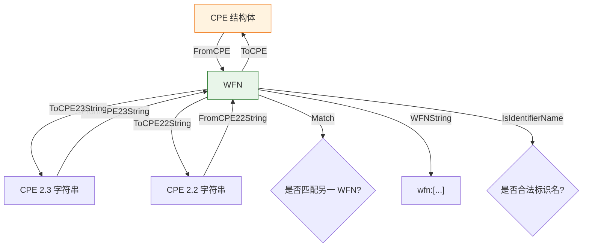

# 🧬 WFN（Well-Formed Name）

`WFN` 是 CPE 的规范化内部表示。它将 CPE 规范定义的 11 个属性（part、vendor、product、version、update、edition、language、sw_edition、target_sw、target_hw、other）以普通字符串存储，并使用逻辑值 `*`（ANY）与 `-`（NA）。本模块负责在 `WFN`、`CPE` 结构体与 CPE 2.3 / 2.2 字符串形式之间转换，并执行名称匹配。

## 常量

```go
const (
    ValueANY = "*" // 逻辑值 ANY
    ValueNA  = "-" // 逻辑值 NA
)

const (
    AttrPart            = "part"
    AttrVendor          = "vendor"
    AttrProduct         = "product"
    AttrVersion         = "version"
    AttrUpdate          = "update"
    AttrEdition         = "edition"
    AttrLanguage        = "language"
    AttrSoftwareEdition = "sw_edition"
    AttrTargetSoftware  = "target_sw"
    AttrTargetHardware  = "target_hw"
    AttrOther           = "other"
)

const (
    PartApplicationShort = "a"
    PartOSShort          = "o"
    PartHardwareShort    = "h"
)
```

`ValueANY` 与 `ValueNA` 是两个逻辑值。`Attr*` 常量是规范的属性名，供 `Get` / `Set` 及绑定逻辑使用。`Part*Short` 常量是三种 part 类型的短名。

## 类型：WFN

```go
type WFN struct {
    Part            string
    Vendor          string
    Product         string
    Version         string
    Update          string
    Edition         string
    Language        string
    SoftwareEdition string
    TargetSoftware  string
    TargetHardware  string
    Other           string
}
```

全部 11 个属性均为普通 `string` 字段。空字符串在 `Get` 中被视为 ANY。

## 变量：ValidPartValues

```go
var ValidPartValues = map[string]bool{
    "a": true,
    "o": true,
    "h": true,
    "*": true,
}
```

`Part` 属性允许取值的集合：三个短名加上 ANY 通配符。

## 🆕 NewWFN

```go
func NewWFN() *WFN
```

创建一个空的 `WFN`，其所有属性默认为 ANY。

| 返回值 | 类型 | 说明 |
| --- | --- | --- |
| 第 1 个 | `*WFN` | 指向新建空 WFN 的指针 |

```go
w := cpeskills.NewWFN()
fmt.Println(w.Get(cpeskills.AttrPart)) // *
```

## 🔁 FromCPE

```go
func FromCPE(cpe *CPE) *WFN
```

从 `CPE` 结构体构建 `WFN`，逐字段从对应的 CPE 字段复制属性。

| 参数 | 类型 | 说明 |
| --- | --- | --- |
| `cpe` | `*CPE` | 源 CPE 结构体 |

| 返回值 | 类型 | 说明 |
| --- | --- | --- |
| 第 1 个 | `*WFN` | 转换得到的 WFN |

```go
cpe := &cpeskills.CPE{
    Part:        *cpeskills.PartApplication,
    Vendor:      cpeskills.Vendor("microsoft"),
    ProductName: cpeskills.Product("windows"),
    Version:     cpeskills.Version("10"),
}
wfn := cpeskills.FromCPE(cpe)
fmt.Println(wfn.Part, wfn.Vendor, wfn.Product, wfn.Version) // a microsoft windows 10
```

## ↔️ ToCPE

```go
func (w *WFN) ToCPE() *CPE
```

将 WFN 转回 `CPE` 结构体。`Part` 短名映射到对应的预定义 `Part` 值（`a`→Application、`h`→Hardware、`o`→Operation System）；无法识别的值默认为 Application。结果 CPE 的 `Cpe23` 字段通过 `ToCPE23String` 填充。

| 返回值 | 类型 | 说明 |
| --- | --- | --- |
| 第 1 个 | `*CPE` | 转换得到的 CPE，`Cpe23` 已设置 |

```go
wfn := &cpeskills.WFN{Part: "a", Vendor: "microsoft", Product: "windows", Version: "10"}
cpe := wfn.ToCPE()
fmt.Println(cpe.Part.LongName) // Application
fmt.Println(cpe.Cpe23)         // cpe:2.3:a:microsoft:windows:10:*:*:*:*:*:*:*
```

## 📥 FromCPE23String

```go
func FromCPE23String(cpe23 string) (*WFN, error)
```

将 CPE 2.3 格式字符串解析为 `WFN`。字符串必须以 `cpe:2.3:` 开头，并恰好包含 13 个以冒号分隔的组件；除 part 外的每个组件都会被反转义。

| 参数 | 类型 | 说明 |
| --- | --- | --- |
| `cpe23` | `string` | CPE 2.3 格式字符串 |

| 返回值 | 类型 | 说明 |
| --- | --- | --- |
| 第 1 个 | `*WFN` | 解析得到的 WFN，出错时为 `nil` |
| 第 2 个 | `error` | 成功为 `nil`，否则为格式错误 |

```go
wfn, err := cpeskills.FromCPE23String("cpe:2.3:a:microsoft:windows:10:*:*:*:*:*:*:*")
if err != nil {
    panic(err)
}
fmt.Println(wfn.Part, wfn.Vendor, wfn.Product, wfn.Version)
```

## 📥 FromCPE22String

```go
func FromCPE22String(cpe22 string) (*WFN, error)
```

将 CPE 2.2 URI 字符串解析为 `WFN`。内部先将 2.2 形式转换为 2.3 形式，再委托 `FromCPE23String` 解析。

| 参数 | 类型 | 说明 |
| --- | --- | --- |
| `cpe22` | `string` | CPE 2.2 URI 字符串 |

| 返回值 | 类型 | 说明 |
| --- | --- | --- |
| 第 1 个 | `*WFN` | 解析得到的 WFN，出错时为 `nil` |
| 第 2 个 | `error` | 成功为 `nil`，否则为转换过程中的错误 |

```go
wfn, err := cpeskills.FromCPE22String("cpe:/a:microsoft:windows:10")
if err != nil {
    panic(err)
}
fmt.Println(wfn.Part, wfn.Vendor, wfn.Product, wfn.Version)
```

## 📤 ToCPE23String

```go
func (w *WFN) ToCPE23String() string
```

将 WFN 序列化为 CPE 2.3 格式字符串。每个属性按 FS 绑定规则转义；结果始终为 13 个以冒号分隔的部分，并以 `cpe:2.3:` 开头。

| 返回值 | 类型 | 说明 |
| --- | --- | --- |
| 第 1 个 | `string` | CPE 2.3 格式字符串 |

```go
wfn := &cpeskills.WFN{Part: "a", Vendor: "microsoft", Product: "windows", Version: "10"}
fmt.Println(wfn.ToCPE23String()) // cpe:2.3:a:microsoft:windows:10:*:*:*:*:*:*:*
```

## 📤 ToCPE22String

```go
func (w *WFN) ToCPE22String() string
```

将 WFN 序列化为 CPE 2.2 URI 字符串。五个主字段（part、vendor、product、version、update）以冒号分隔；扩展属性在冒号之后以 `~` 连接追加；末尾为空的扩展值会被去除。转义遵循 URI 绑定规则。

| 返回值 | 类型 | 说明 |
| --- | --- | --- |
| 第 1 个 | `string` | CPE 2.2 URI 字符串 |

```go
wfn := &cpeskills.WFN{
    Part: "a", Vendor: "microsoft", Product: "windows",
    Version: "10", Update: "sp1", Edition: "pro", Language: "zh-cn",
}
fmt.Println(wfn.ToCPE22String()) // cpe:/a:microsoft:windows:10:sp1:pro~zh-cn
```

## 🔍 Match

```go
func (w *WFN) Match(other *WFN) bool
```

依据 CPE 名称匹配规则判断当前 WFN 是否匹配 `other`：任一方为 `*`（ANY）的属性即匹配；双方均为 `-`（NA）即匹配；否则需精确、区分大小写地相等。全部 11 个属性都必须匹配。

| 参数 | 类型 | 说明 |
| --- | --- | --- |
| `other` | `*WFN` | 用于比较的目标 WFN |

| 返回值 | 类型 | 说明 |
| --- | --- | --- |
| 第 1 个 | `bool` | 全部属性匹配返回 `true`，否则 `false` |

```go
any := &cpeskills.WFN{Part: "a", Vendor: "microsoft", Product: "windows", Version: "*"}
concrete := &cpeskills.WFN{Part: "a", Vendor: "microsoft", Product: "windows", Version: "10"}
fmt.Println(any.Match(concrete))   // true
fmt.Println(concrete.Match(any))   // true
```

## 🗂️ Get

```go
func (w *WFN) Get(attr string) string
```

返回指定属性的值。空字段会被报告为 `*`（ANY）。无法识别的属性名也返回 ANY。

| 参数 | 类型 | 说明 |
| --- | --- | --- |
| `attr` | `string` | 属性名（使用 `Attr*` 常量） |

| 返回值 | 类型 | 说明 |
| --- | --- | --- |
| 第 1 个 | `string` | 属性值，未设置或未知时返回 ANY |

```go
w := cpeskills.NewWFN()
fmt.Println(w.Get(cpeskills.AttrVendor)) // *
w.Set(cpeskills.AttrVendor, "microsoft")
fmt.Println(w.Get(cpeskills.AttrVendor)) // microsoft
```

## 🗂️ Set

```go
func (w *WFN) Set(attr string, value string)
```

将指定属性设为 `value`。无法识别的属性名会被静默忽略。

| 参数 | 类型 | 说明 |
| --- | --- | --- |
| `attr` | `string` | 属性名（使用 `Attr*` 常量） |
| `value` | `string` | 新值 |

```go
w := cpeskills.NewWFN()
w.Set(cpeskills.AttrPart, "a")
w.Set(cpeskills.AttrProduct, "windows")
fmt.Println(w.Part, w.Product) // a windows
```

## 🏷️ WFNString

```go
func (w *WFN) WFNString() string
```

返回 WFN 的一种紧凑、可读的字符串表示，仅列出值不为 ANY 的属性，顺序遵循规范属性顺序。形式为 `wfn:[attr="value",...]`；当所有属性均为 ANY 时返回 `wfn:[]`。

| 返回值 | 类型 | 说明 |
| --- | --- | --- |
| 第 1 个 | `string` | WFN 字符串表示 |

```go
w := &cpeskills.WFN{Part: "a", Vendor: "microsoft", Product: "windows"}
fmt.Println(w.WFNString()) // wfn:[part="a",vendor="microsoft",product="windows"]
```

## ✔️ IsIdentifierName

```go
func (w *WFN) IsIdentifierName() bool
```

判断 WFN 是否是合法的 CPE 标识名。条件为：`part`、`vendor`、`product` 均为已设置（非 ANY、非 NA）的值，且任一属性都不含未转义的通配符（`*` 或 `?`）。

| 返回值 | 类型 | 说明 |
| --- | --- | --- |
| 第 1 个 | `bool` | 是合法标识名返回 `true` |

```go
w := &cpeskills.WFN{Part: "a", Vendor: "microsoft", Product: "windows", Version: "10"}
fmt.Println(w.IsIdentifierName()) // true

w2 := &cpeskills.WFN{Part: "a", Vendor: "microsoft", Product: "windows", Version: "*"}
fmt.Println(w2.IsIdentifierName()) // false（version 为通配符）
```

## 📐 WFN 转换与匹配示意图


