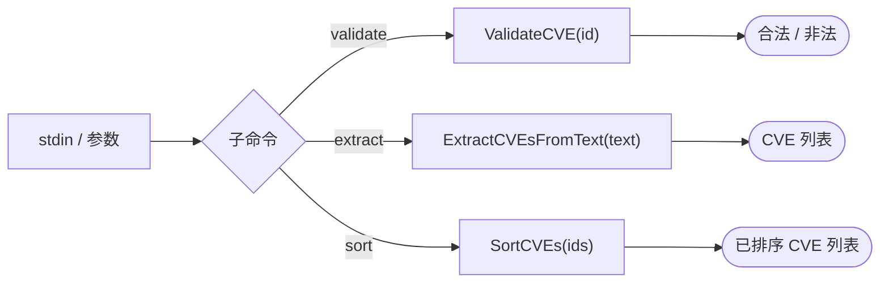

# 🧬 cpe cve

校验、提取、排序 CVE 标识符。

`cpe cve` 命令组提供离线的 CVE ID 字符串工具——检查 ID 是否格式合法、从自由文本中抽取 CVE ID、按时间排序 CVE ID。这些操作无需联网。

## 用法

```sh
cpe cve <子命令> [flags]
```

## 子命令

| 子命令              | 说明                                            |
| ------------------- | ----------------------------------------------- |
| `validate <cve-id>` | 校验 CVE ID 是否合法（格式：`CVE-YYYY-NNNN`）    |
| `extract`           | 从 stdin 文本中提取 CVE ID                       |
| `sort`              | 按时间排序 CVE ID（stdin，每行一个）             |

本命令还继承全局 flags `--output, -o`（`text`/`json`）与 `--no-color`。

## 工作原理



## 示例

### 校验 CVE ID

```sh
cpe cve validate CVE-2021-44228
```

预期输出：

```text
VALID: CVE-2021-44228
```

非法 ID 退出码为 1：

```sh
cpe cve validate INVALID-CVE
# INVALID: INVALID-CVE
```

### 从文本中提取 CVE ID

```sh
echo "See CVE-2021-44228 and CVE-2024-12345 in the advisory" | cpe cve extract
```

预期输出：

```text
CVE-2021-44228
CVE-2024-12345
```

### 按时间排序 CVE ID

```sh
printf "CVE-2024-1234\nCVE-2021-44228\nCVE-2023-12345\n" | cpe cve sort
```

预期输出：

```text
CVE-2021-44228
CVE-2023-12345
CVE-2024-1234
```

### JSON 输出

```sh
cpe cve validate -o json CVE-2021-44228
```

```json
{"cve": "CVE-2021-44228", "valid": true}
```

## 错误处理

- `validate` 对格式非法的 ID 退出 1。
- `extract` / `sort` 即便没找到 CVE 也退出 0（输出为空）。

## 相关 API 模块

- API 模块 `cve` — `ValidateCVE`、`ExtractCVEsFromText`、`SortCVEs`（离线 CVE 字符串工具）
- [NVD](./nvd) — `cpe nvd cves-for-cpe` 按 CPE 查 CVE
