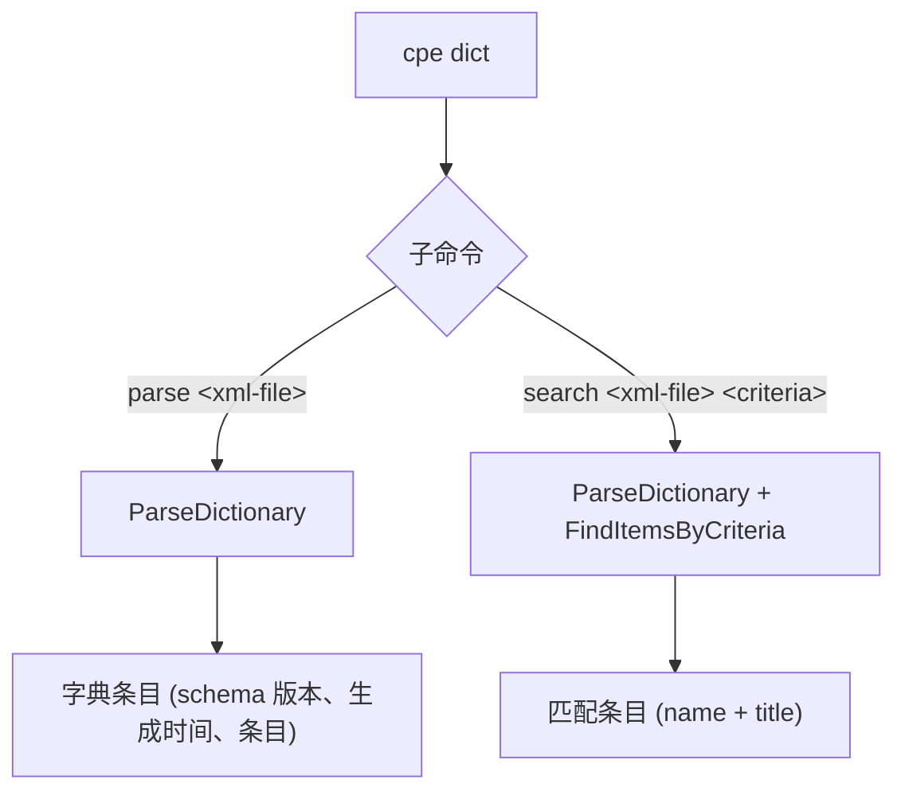

# 📚 cpe dict

对 CPE 字典的操作：解析 XML 字典文件、在字典内搜索。

CPE 字典是带有标题、引用、弃用状态等元数据的 CPE 条目集合。官方 CPE 字典由 NIST 以 XML 文件形式发布（`official-cpe-dictionary_v*.xml`）。

`dict` 是父命令——它自身没有行为，必须使用其子命令之一。

## 用法

```sh
cpe dict <subcommand> [args]
```

## 子命令

| 子命令   | 用法                                   | 说明                                                     |
| -------- | -------------------------------------- | -------------------------------------------------------- |
| `parse`  | `cpe dict parse <xml-file>`            | 解析 CPE 字典 XML 文件并列出其条目。                     |
| `search` | `cpe dict search <xml-file> <criteria-cpe>` | 在 CPE 字典内搜索匹配条件 CPE 的条目。                   |

两个子命令都继承全局 flags `--output, -o`（`text`/`json`）与 `--no-color`。`parse` 子命令支持 `json` 输出格式；`search` 始终输出文本列表。

## 子命令关系图

下图展示了 `cpe dict` 如何分发到两个子命令，以及每个子命令调用哪个库函数。



## cpe dict parse

```sh
cpe dict parse <xml-file>
```

### 参数说明

| 参数        | 说明                                              |
| ----------- | ------------------------------------------------- |
| `<xml-file>`| CPE 字典 XML 文件路径。恰好一个参数。             |

### 行为

使用 `ParseDictionary` 解析 XML 文件并打印：

- **text**（默认）：头部含 `Schema Version`、`Generated At` 与 `Items` 计数，后接每个条目 `Name`、`Title`（如有）与 `Deprecated` 状态（如已弃用）的带编号列表。
- **json**：完整的 `Dictionary` 结构体，带缩进。

### 示例

```sh
cpe dict parse official-cpe-dictionary_v2.3.xml
```

预期输出：

```text
CPE Dictionary
  Schema Version: 2.3
  Generated At:   2024-01-01T00:00:00Z
  Items:          1

1. cpe:2.3:a:microsoft:windows:10:*:*:*:*:*:*:*
   Title: Microsoft Windows 10
```

JSON 输出：

```sh
cpe -o json dict parse official-cpe-dictionary_v2.3.xml
```

## cpe dict search

```sh
cpe dict search <xml-file> <criteria-cpe>
```

### 参数说明

| 参数              | 说明                                                          |
| ----------------- | ------------------------------------------------------------- |
| `<xml-file>`      | CPE 字典 XML 文件路径。                                       |
| `<criteria-cpe>`  | 条件 CPE 字符串（2.2 或 2.3）。合计恰好两个参数。             |

### 行为

解析 XML 文件，解析条件 CPE，调用 `dict.FindItemsByCriteria(criteria, nil)`。打印 `Found N matching item(s):`，后接每个条目的 `Name` 与 `Title`（如有）。

### 示例

```sh
cpe dict search official-cpe-dictionary_v2.3.xml "cpe:2.3:a:microsoft:windows:*"
```

预期输出：

```text
Found 1 matching item(s):
1. cpe:2.3:a:microsoft:windows:10:*:*:*:*:*:*:* - Microsoft Windows 10
```

## 相关 API 模块

- [字典](../api/dictionary) — `ParseDictionary`、`Dictionary`、`DictionaryItem`、`FindItemsByCriteria`
- [解析](../api/parsing) — 条件 CPE 参数的解析
