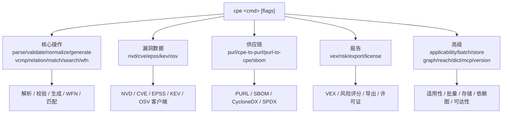

# 🛠️ CLI 概览

`cpe` 命令行工具提供了 `cpe-skills` 库核心功能的命令行访问能力——CPE（Common Platform Enumeration，通用平台枚举）标识符的解析、匹配、搜索与字典操作，此外还提供面向 AI 助手的 MCP 服务器模式。

## 安装

使用 `go install` 安装 CLI：

```sh
go install github.com/scagogogo/cpe-skills/cmd/cpe@latest
```

验证安装：

```sh
cpe version
```

预期输出：

```text
cpe CLI:     0.1.0
Git Commit:  unknown
Build Date:  unknown
Go Version:  go1.23.x
OS/Arch:     linux/amd64
```

## 全局 Flags

以下 flags 定义在根命令上，被所有子命令继承。

| Flag         | 简写 | 类型   | 默认值  | 说明                          |
| ------------ | ---- | ------ | ------- | ----------------------------- |
| `--output`   | `-o` | string | `text`  | 输出格式（`text` 或 `json`）  |
| `--no-color` |      | bool   | `false` | 禁用彩色输出                  |

## 子命令

CLI 提供 30 个子命令，按五大能力域分组。

### 核心操作

| 命令       | 说明                                                          |
| ---------- | ------------------------------------------------------------- |
| `parse`    | 解析 CPE 2.2/2.3 字符串并显示其各组件                         |
| `validate` | 校验 CPE 字符串合法性并报告问题                               |
| `normalize`| 把 CPE 字符串规范化到标准形态                                 |
| `generate` | 由 part/vendor/product/version 生成 CPE 字符串                |
| `vcmp`     | 比较两个版本号（`vcmp a b`、`vcmp in-range v ...`）           |
| `relation` | 判定两个 CPE 的集合关系（equal/subset/superset/disjoint/...） |
| `match`    | 检查两个 CPE 是否匹配（NISTIR 7696 语义）                     |
| `search`   | 从输入中搜索匹配条件 CPE 的项                                  |
| `wfn`      | Well-Formed Name 绑定转换（to-fs/to-uri/from-*）              |

### 漏洞数据

| 命令  | 说明                                                                |
| ----- | ------------------------------------------------------------------- |
| `nvd` | NVD 操作：download、cves-for-cpe、cpes-for-cve                      |
| `cve` | CVE 工具：validate、extract（stdin）、sort（stdin）                 |
| `epss`| 查询某 CVE 的 EPSS 漏洞利用预测评分                                 |
| `kev` | CISA 已知被利用漏洞（KEV）目录（is-listed/get/list）                |
| `osv` | 按 purl 或 ecosystem 查询 OSV（开源漏洞）数据库                      |

### PURL 与 SBOM

| 命令          | 说明                                                          |
| ------------- | ------------------------------------------------------------- |
| `purl`        | Package URL 工具（parse / build）                             |
| `cpe-to-purl` | CPE 转 Package URL，含置信度                                   |
| `purl-to-cpe` | Package URL 转 CPE，含置信度                                   |
| `sbom`        | SBOM 操作：parse / from-manifest / export / diff / validate    |

### VEX、风险、导出、许可证

| 命令     | 说明                                                                |
| -------- | ------------------------------------------------------------------- |
| `vex`    | 漏洞可利用性交换（VEX）：parse / build                              |
| `risk`   | SBOM 组件风险评分（`risk score --sbom --nvd`）                      |
| `export` | 把漏洞报告导出为 CSV 或 SARIF                                       |
| `license`| 许可证工具（list-common、detect-by-name）                          |

### 高级分析

| 命令            | 说明                                                              |
| --------------- | ----------------------------------------------------------------- |
| `applicability` | 适用性表达式 parse / filter                                       |
| `batch`         | 批量 CPE 匹配与 SBOM 扫描                                         |
| `store`         | 基于文件的 CPE 持久化存储（init/put/get/delete/list）             |
| `graph`         | 依赖图 build / 拓扑排序                                           |
| `reach`         | 漏洞可达性分析                                                     |
| `dict`          | CPE 字典操作（解析 / 搜索 XML）                                    |
| `mcp`           | MCP（Model Context Protocol）服务器命令                            |
| `version`       | 打印版本信息                                                       |

## 子命令关系图

下图展示了请求如何从根 `cpe` 命令分发到某个子命令组，以及每组最终调用哪类库模块。



## 速查表

```sh
# 解析一个 CPE 并显示其组件
cpe parse "cpe:2.3:a:microsoft:windows:10:*:*:*:*:*:*:*"

# 校验 CPE 合法性（合法退出 0，非法退出 1）
cpe validate "cpe:2.3:a:microsoft:windows:10:*:*:*:*:*:*:*"

# 规范化 CPE（--vendor 同时规范化厂商/产品别名）
cpe normalize --vendor "cpe:2.3:a:Microsoft Corp.:Windows:10:*:*:*:*:*:*:*"

# 由组件生成 CPE
cpe generate --part a --vendor microsoft --product windows --version 10

# 比较两个版本号（-1/0/1）
cpe vcmp 1.0 1.1

# 检查版本是否落在某区间
cpe vcmp in-range 3.5 --min 3.0 --max 4.0

# 判定两个 CPE 的集合关系
cpe relation "cpe:2.3:a:microsoft:windows:*:*:*:*:*:*:*:*" "cpe:2.3:a:microsoft:windows:10:*:*:*:*:*:*:*"

# 校验 / 提取 / 排序 CVE 标识符
cpe cve validate CVE-2021-44228
echo "see CVE-2021-44228 and CVE-2024-12345" | cpe cve extract
printf "CVE-2024-1\nCVE-2021-2\n" | cpe cve sort

# 解析 / 构建 Package URL
cpe purl parse pkg:npm/left-pad@1.3.0
cpe purl build --type npm --name left-pad --version 1.3.0

# CPE 与 PURL 互转（含置信度）
cpe cpe-to-purl "cpe:2.3:a:apache:log4j:2.14:*:*:*:*:*:*:*"
cpe purl-to-cpe pkg:npm/left-pad@1.3.0

# WFN 绑定转换
cpe wfn to-fs "cpe:2.3:a:apache:log4j:2.14:*:*:*:*:*:*:*"
cpe wfn to-uri "cpe:2.3:a:apache:log4j:2.14:*:*:*:*:*:*:*"

# 许可证工具
cpe license list-common
cpe license detect-by-name "MIT License"

# 适用性表达式
cpe applicability parse "cpe:2.3:a:microsoft:windows:10:*:*:*:*:*:*:*"

# CPE 持久化存储
cpe store init --dir ./cpe-db
cpe store put "cpe:2.3:a:apache:log4j:2.14:*:*:*:*:*:*:*" --dir ./cpe-db
cpe store get "cpe:2.3:a:apache:log4j:2.14:*:*:*:*:*:*:*" --dir ./cpe-db

# 网络命令（需联网或已缓存数据）
cpe nvd download --cache-dir ~/.cache/nvd
cpe nvd cves-for-cpe "cpe:2.3:a:apache:log4j:2.14:*:*:*:*:*:*:*" --data ~/.cache/nvd/nvd_data.json
cpe epss CVE-2021-44228
cpe kev is-listed CVE-2021-44228
cpe osv query --purl pkg:npm/left-pad@1.3.0

# SBOM 操作
cpe sbom parse --cyclonedx bom.json
cpe sbom from-manifest go.mod
cpe sbom diff old.json new.json
cpe sbom validate bom.json

# VEX / 风险 / 导出
cpe vex build --product "MyApp" --cve CVE-2021-44228 --status not_affected --justification component_not_present
cpe risk score --sbom sbom.json --nvd nvd.json --priority critical
cpe export csv --sbom sbom.json --nvd nvd.json -o report.csv
cpe export sarif --sbom sbom.json --nvd nvd.json -o report.sarif

# 批量匹配 / 依赖图 / 可达性
cpe batch match --criteria crits.txt --targets targets.txt
cpe graph topo --sbom sbom.json
cpe reach analyze --sbom sbom.json --nvd nvd.json

# 在 stdio 上启动 MCP 服务器
cpe mcp serve

# 让任意命令输出 JSON
cpe -o json parse "cpe:/a:apache:log4j:2.0"
```

## 退出码

CLI 成功时退出码为 `0`，出错时为 `1`。错误信息写入标准错误。

## 相关文档

- [API：解析](../api/parsing) — `cpe parse` 背后的解析器模块
- [API：匹配](../api/matching) — `cpe match` / `cpe search` 背后的匹配算法
- [API：字典](../api/dictionary) — `cpe dict` 背后的字典模块
- [指南：基础解析](../guide/basic-parsing) — 解析概念讲解
