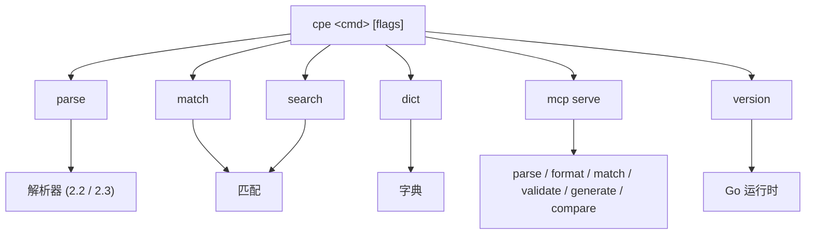

# 🛠️ CLI 概览

`cpe` 命令行工具提供了 `cpe-skills` 库核心功能的命令行访问能力——CPE（Common Platform Enumeration，通用平台枚举）标识符的解析、匹配、搜索与字典操作，此外还提供面向 AI 助手的 MCP 服务器模式。

## 安装

使用 `go install` 安装 CLI：

```sh
go install github.com/scagogogo/cpe-skills/cmd/cpe@latest
```

验证安装：

```sh
cpe version
```

预期输出：

```text
cpe CLI:     0.1.0
Git Commit:  unknown
Build Date:  unknown
Go Version:  go1.23.x
OS/Arch:     linux/amd64
```

## 全局 Flags

以下 flags 定义在根命令上，被所有子命令继承。

| Flag         | 简写 | 类型   | 默认值  | 说明                          |
| ------------ | ---- | ------ | ------- | ----------------------------- |
| `--output`   | `-o` | string | `text`  | 输出格式（`text` 或 `json`）  |
| `--no-color` |      | bool   | `false` | 禁用彩色输出                  |

## 子命令

| 命令     | 说明                                                |
| -------- | --------------------------------------------------- |
| `parse`  | 解析 CPE 2.2/2.3 字符串并显示其各组件               |
| `match`  | 检查两个 CPE 是否匹配（NISTIR 7696 语义）           |
| `search` | 从输入中搜索匹配条件 CPE 的项                       |
| `dict`   | CPE 字典操作（解析 / 搜索 XML）                     |
| `mcp`    | MCP（Model Context Protocol）服务器命令             |
| `version`| 打印版本信息                                        |

## 子命令关系图

下图展示了请求如何从根 `cpe` 命令分发到某个子命令，以及每个子命令最终调用哪个库模块。



## 速查表

```sh
# 解析一个 CPE 并显示其组件
cpe parse "cpe:2.3:a:microsoft:windows:10:*:*:*:*:*:*:*"

# 将 CPE 2.3 字符串转换为 CPE 2.2
cpe parse -t 2.2 "cpe:2.3:a:apache:log4j:2.0:*:*:*:*:*:*:*"

# 检查两个 CPE 是否匹配
cpe match "cpe:2.3:a:microsoft:windows:*" "cpe:2.3:a:microsoft:windows:10"

# 匹配时忽略版本
cpe match --ignore-version "cpe:2.3:a:microsoft:windows:10" "cpe:2.3:a:microsoft:windows:11"

# 在文件中搜索匹配条件 CPE 的项
cpe search --file cpes.txt "cpe:2.3:a:apache:*:*:*:*:*:*:*:*"

# 解析 CPE 字典 XML 文件
cpe dict parse official-cpe-dictionary_v2.3.xml

# 在 stdio 上启动 MCP 服务器
cpe mcp serve

# 让任意命令输出 JSON
cpe -o json parse "cpe:/a:apache:log4j:2.0"
```

## 退出码

CLI 成功时退出码为 `0`，出错时为 `1`。错误信息写入标准错误。

## 相关文档

- [API：解析](../api/parsing) — `cpe parse` 背后的解析器模块
- [API：匹配](../api/matching) — `cpe match` / `cpe search` 背后的匹配算法
- [API：字典](../api/dictionary) — `cpe dict` 背后的字典模块
- [指南：基础解析](../guide/basic-parsing) — 解析概念讲解
