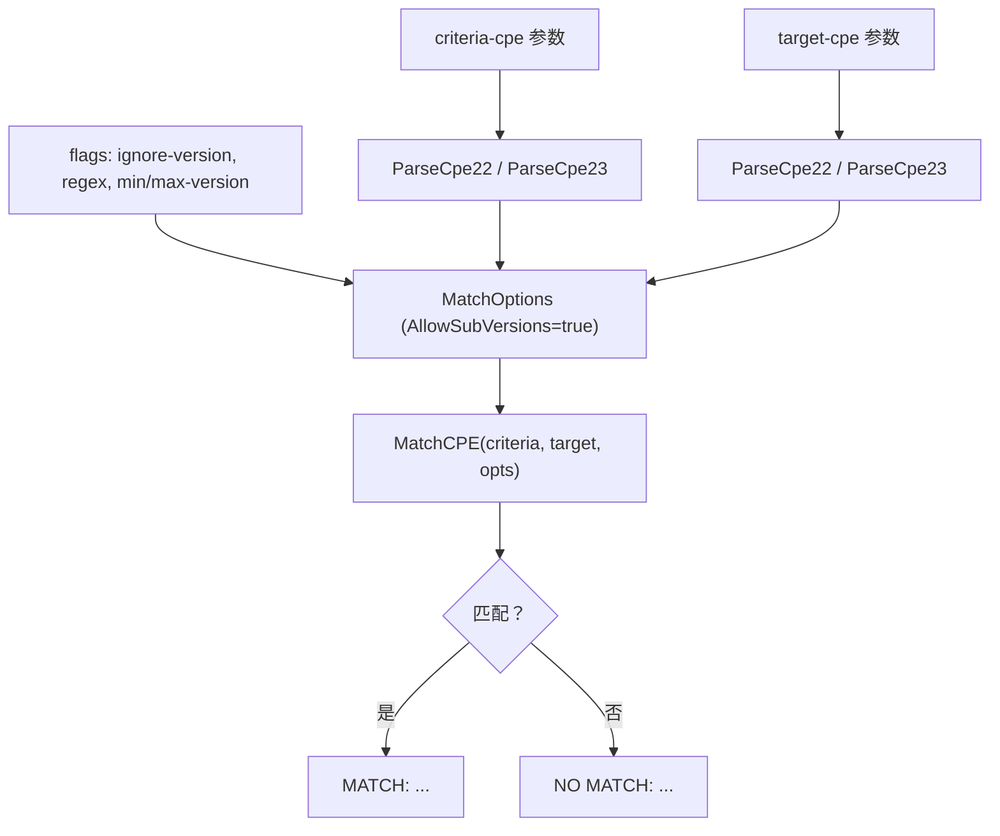

# 🤝 cpe match

比较两个 CPE 字符串，按 cpe-skills 的匹配算法检查它们是否匹配。第一个参数是**条件 CPE**（criteria），第二个是**目标 CPE**（target）。

支持忽略版本、对字符串字段使用正则匹配，以及指定版本范围等选项。

## 用法

```sh
cpe match [flags] <criteria-cpe> <target-cpe>
```

## 参数说明

| 参数              | 说明                                                              |
| ----------------- | ----------------------------------------------------------------- |
| `<criteria-cpe>`  | 条件 CPE 字符串（2.2 或 2.3）。恰好需要两个参数。                 |
| `<target-cpe>`    | 目标 CPE 字符串（2.2 或 2.3），用于与条件进行匹配测试。           |

## Flags

| Flag              | 类型   | 默认值 | 说明                                              |
| ----------------- | ------ | ------ | ------------------------------------------------- |
| `--ignore-version`| bool   | `false`| 匹配时忽略版本                                    |
| `--regex`         | bool   | `false`| 对字符串字段使用正则匹配                          |
| `--min-version`   | string | `""`   | 范围匹配的最小版本（启用范围匹配）                |
| `--max-version`   | string | `""`   | 范围匹配的最大版本（启用范围匹配）                |

本命令还继承全局 flags `--output, -o`（`text`/`json`）与 `--no-color`。

在内部，命令始终设置 `AllowSubVersions: true`。指定 `--min-version` 或 `--max-version` 中的任意一个都会启用 `VersionRange` 模式。

## 工作流程

下图展示了 `cpe match` 如何解析两个参数、根据 flags 构造 `MatchOptions` 结构体、调用 `MatchCPE` 并报告结果。



## 示例

### 通配条件匹配具体目标

```sh
cpe match "cpe:2.3:a:microsoft:windows:*" "cpe:2.3:a:microsoft:windows:10"
```

预期输出：

```text
MATCH: cpe:/a:microsoft:windows matches cpe:/a:microsoft:windows:10
```

### 匹配时忽略版本

```sh
cpe match --ignore-version "cpe:2.3:a:microsoft:windows:10" "cpe:2.3:a:microsoft:windows:11"
```

预期输出：

```text
MATCH: cpe:/a:microsoft:windows:10 matches cpe:/a:microsoft:windows:11
```

### 版本范围匹配（JSON 输出）

```sh
cpe -o json match --min-version 3.0 --max-version 4.0 \
  "cpe:2.3:a:apache:log4j" "cpe:2.3:a:apache:log4j:3.5"
```

预期输出：

```text
{"match": true, "criteria": "cpe:/a:apache:log4j", "target": "cpe:/a:apache:log4j:3.5"}
```

## 输出

- **text**（默认）：`MATCH: <条件> matches <目标>` 或 `NO MATCH: <条件> does not match <目标>`。
- **json**：`{"match": <bool>, "criteria": "<2.2 URI>", "target": "<2.2 URI>"}`。

条件和目标在输出中均以 CPE 2.2 URI 形式呈现。

## 相关 API 模块

- [匹配](../api/matching) — `MatchCPE` 与 `MatchOptions`
- [高级匹配](../api/modules/advanced-matching) — `AdvancedMatchCPE`、`NewAdvancedMatchOptions`
- [版本比较](../api/modules/version-compare) — `CompareVersions`、`IsVersionInRange`（用于范围匹配）
