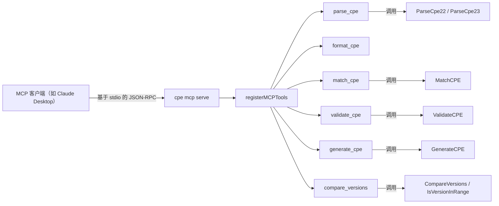

# 🤖 cpe mcp

将 cpe-skills 作为 MCP（Model Context Protocol）服务器运行，把 CPE 的解析、匹配、生成与校验作为工具暴露给 AI 助手，通过 stdio 直接调用。

`mcp` 是父命令——它自身没有行为，必须使用 `serve` 子命令。

## 用法

```sh
cpe mcp serve
```

`serve` 子命令不接受参数，除继承的全局 flags 外也不定义自己的 flags。它使用官方 `go-sdk` 的 MCP 实现，在标准输入/输出上启动 MCP 服务器。

## 客户端配置

将以下内容添加到你的 MCP 客户端配置中（例如 Claude Desktop 的 `claude_desktop_config.json`）：

```json
{
  "mcpServers": {
    "cpe-skills": {
      "command": "cpe",
      "args": ["mcp", "serve"]
    }
  }
}
```

## 暴露的工具

服务器注册了六个工具。每个工具接收 JSON 参数并返回 JSON 文本载荷（失败时返回 `IsError` 结果）。

| 工具              | 说明                                                              |
| ----------------- | ----------------------------------------------------------------- |
| `parse_cpe`       | 将 CPE 2.2/2.3 字符串解析为各组件（自动检测格式）                 |
| `format_cpe`      | 将 CPE 字符串转换为另一格式：`2.2`、`2.3` 或 `wfn`                |
| `match_cpe`       | 检查两个 CPE 是否匹配（NISTIR 7696 语义）                         |
| `validate_cpe`    | 校验 CPE 字符串（格式与组件）                                     |
| `generate_cpe`    | 根据 part/vendor/product/version 生成 CPE 2.3 字符串              |
| `compare_versions`| 比较两个版本字符串（-1/0/1），并可选地进行范围检查                |

## 工具参数 Schema

### parse_cpe

```json
{
  "cpe": "CPE 字符串（2.2 URI 或 2.3 Formatted String）"
}
```

返回：`input`、`format`、`part`、`vendor`、`product`、`version`、`update`、`edition`、`language`、`cpe_2_2`、`cpe_2_3`。

### format_cpe

```json
{
  "cpe": "输入 CPE 字符串",
  "to": "2.2 | 2.3 | wfn"
}
```

返回：`input`、`to`、`result`。

### match_cpe

```json
{
  "criteria": "条件 CPE 字符串",
  "target": "目标 CPE 字符串",
  "ignore_version": false
}
```

返回：`criteria`、`target`、`match`、`ignore_version`。内部设置 `AllowSubVersions: true`。

### validate_cpe

```json
{
  "cpe": "待校验的 CPE 字符串"
}
```

返回：`cpe`、`valid`、`error`（有效时为空）、`format`。

### generate_cpe

```json
{
  "part": "a | o | h",
  "vendor": "厂商名",
  "product": "产品名",
  "version": "版本"
}
```

返回：`cpe_2_3`、`cpe_2_2`、`components`。`part` 取值：`a`（应用程序）、`o`（操作系统）、`h`（硬件）。

### compare_versions

```json
{
  "a": "第一个版本",
  "b": "第二个版本",
  "min": "可选范围最小值",
  "max": "可选范围最大值"
}
```

返回：`a`、`b`、`comparison`（-1/0/1）、`meaning`（`a < b` / `a == b` / `a > b`），当提供 `min` 时还返回 `in_range` + `range`。

## 工作流程

下图展示了 MCP 服务器生命周期：`serve` 子命令构造 MCP 服务器、注册六个工具，并通过 stdio 传输运行。MCP 客户端（如 Claude Desktop）通过 JSON-RPC 调用工具。



## 示例会话

启动服务器并由 MCP 客户端调用 `parse_cpe`：

1. 启动服务器（由你的 MCP 客户端管理该进程）：

   ```sh
   cpe mcp serve
   ```

2. 客户端发送针对 `parse_cpe` 的 `tools/call` 请求，参数为 `{"cpe": "cpe:/a:apache:log4j:2.0"}`。

3. 服务器返回 JSON 文本载荷：

   ```json
   {
     "input": "cpe:/a:apache:log4j:2.0",
     "format": "2.2",
     "part": "a",
     "vendor": "apache",
     "product": "log4j",
     "version": "2.0",
     "update": "",
     "edition": "",
     "language": "",
     "cpe_2_2": "cpe:/a:apache:log4j:2.0",
     "cpe_2_3": "cpe:2.3:a:apache:log4j:2.0:*:*:*:*:*:*:*"
   }
   ```

## 相关 API 模块

- [解析](../api/parsing) — `ParseCpe22`、`ParseCpe23`、`FormatCpe22`、`FormatCpe23`
- [匹配](../api/matching) — `MatchCPE`、`MatchOptions`
- [验证](../api/validation) — `ValidateCPE`
- [生成器](../api/modules/generator) — `GenerateCPE`
- [版本比较](../api/modules/version-compare) — `CompareVersions`、`IsVersionInRange`
- [WFN](../api/wfn) — `wfn` 格式目标使用的 `FromCPE`
