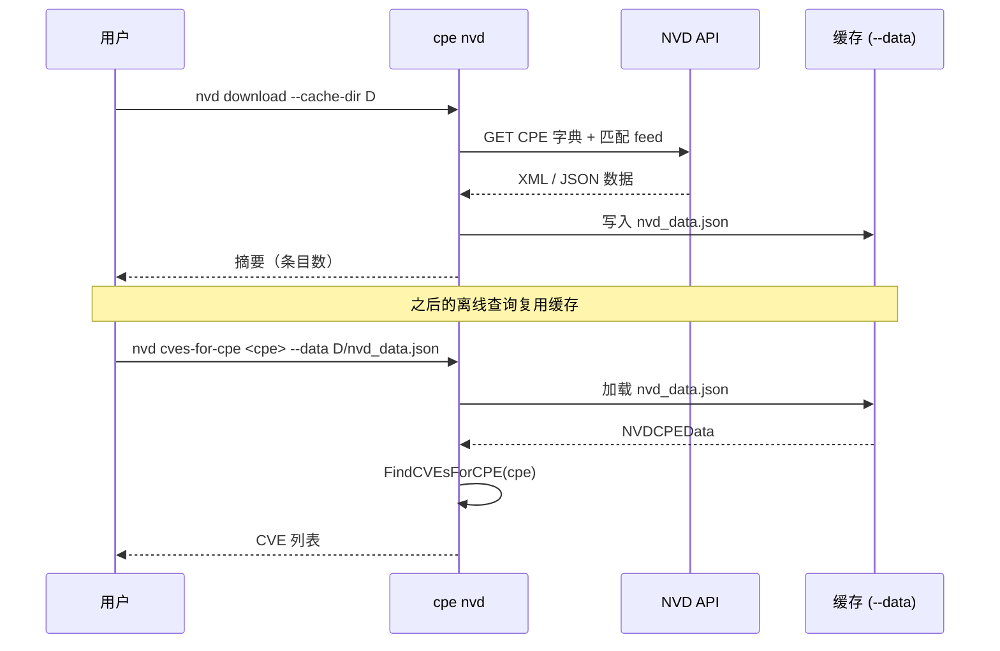

# 📡 cpe nvd

下载并查询 NVD（National Vulnerability Database）的 CPE/CVE 关联数据。

`cpe nvd` 命令组封装了 `cpe-skills` NVD 模块的 feed 下载与双向 CPE↔CVE 查询能力。它会下载官方 CPE 字典与 CPE 匹配 feed，然后让你能查询"某 CPE 受哪些 CVE 影响"或"某 CVE 影响哪些 CPE"。

## 用法

```sh
cpe nvd <子命令> [flags]
```

## 子命令

| 子命令                         | 说明                                                |
| ------------------------------ | --------------------------------------------------- |
| `download`                     | 下载全部 NVD 数据（CPE 字典 + CPE 匹配 feed）        |
| `cves-for-cpe <cpe-string>`    | 查询影响某 CPE 的 CVE（需 `--data`）                |
| `cpes-for-cve <cve-id>`        | 查询某 CVE 影响的 CPE（需 `--data`）                |

## Flags

### `download`

| Flag            | 类型   | 默认值 | 说明                                  |
| --------------- | ------ | ------ | ------------------------------------- |
| `--cache-dir`   | string | 临时目录 | 缓存 NVD 数据的目录                  |
| `--cache-max-age` | int  | `0`    | 缓存最大有效期（小时），0 表示不过期 |

### `cves-for-cpe` / `cpes-for-cve`

| Flag    | 类型   | 说明                                  |
| ------- | ------ | ------------------------------------- |
| `--data`| string | 已缓存 NVD 数据 JSON 文件路径（必填） |

本命令还继承全局 flags `--output, -o`（`text`/`json`）与 `--no-color`。

## 工作原理

下图展示两阶段流程：先下载（一次），再基于缓存查询。



## 示例

### 下载全部 NVD 数据

```sh
cpe nvd download --cache-dir ~/.cache/nvd --cache-max-age 24
```

预期输出：

```text
Downloaded NVD data:
  CPE Dictionary entries: 423817
  CPE Match entries: 189234 CVEs, 1984732 CPEs
  Cache directory: ~/.cache/nvd
```

### 查询影响某 CPE 的 CVE

```sh
cpe nvd cves-for-cpe "cpe:2.3:a:apache:log4j:2.14:*:*:*:*:*:*:*" --data ~/.cache/nvd/nvd_data.json
```

预期输出：

```text
CVEs affecting cpe:2.3:a:apache:log4j:2.14:*:*:*:*:*:*:* (3):
  CVE-2021-44228
  CVE-2021-45046
  CVE-2021-45105
```

### 查询某 CVE 影响的 CPE（JSON）

```sh
cpe nvd cpes-for-cve CVE-2021-44228 --data ~/.cache/nvd/nvd_data.json -o json
```

```json
{
  "cve": "CVE-2021-44228",
  "cpes": [
    "cpe:2.3:a:apache:log4j:2.14.0:*:*:*:*:*:*:*",
    "cpe:2.3:a:apache:log4j:2.14.1:*:*:*:*:*:*:*"
  ],
  "count": 2
}
```

## 错误处理

- 若 `--data` 指向不存在或非法文件，命令返回 `load NVD data: ...` 并退出 1。
- 若 `download` 无法访问 NVD API，返回 `download NVD data: ...` 并退出 1。

## 相关 API 模块

- [NVD](../api/nvd) — `DownloadAllNVDData`、`NVDCPEData.FindCVEsForCPE`、`FindCPEsForCVE`
- [CVE](./cve) — `cpe cve validate` 用于 CVE ID 格式校验
