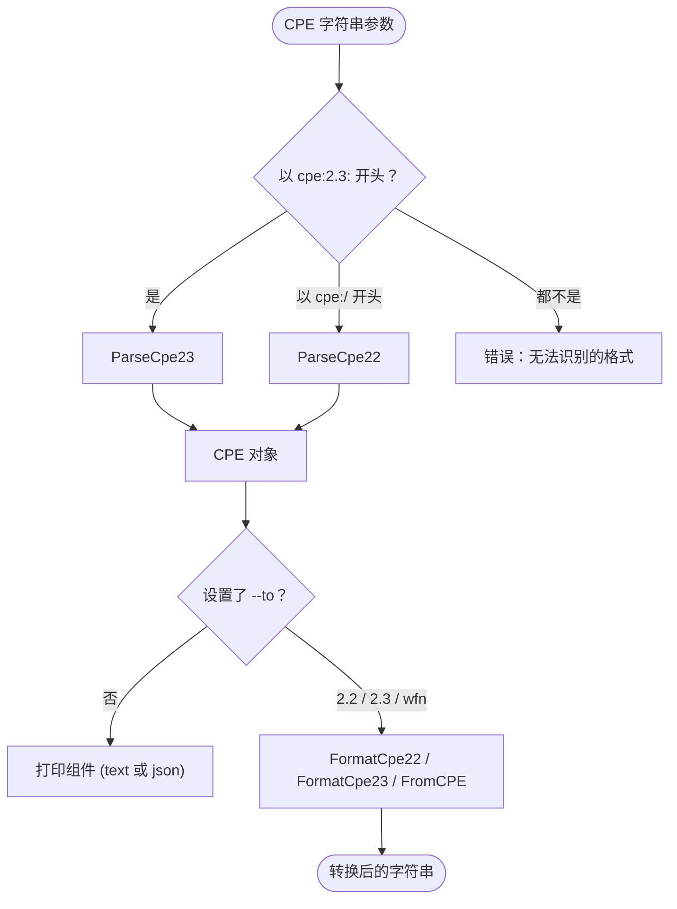

# 🔍 cpe parse

解析 CPE 2.2 或 2.3 格式字符串，并显示其各组件（part、vendor、product、version、update、edition、language 等）。

该命令会自动检测输入是 CPE 2.2（以 `cpe:/` 开头）还是 CPE 2.3（以 `cpe:2.3:` 开头）。它还可以通过 `--to` flag 将输入转换为另一种格式。

## 用法

```sh
cpe parse [flags] <cpe-string>
```

## 参数说明

| 参数           | 说明                                                                |
| -------------- | ------------------------------------------------------------------- |
| `<cpe-string>` | 一个 CPE 字符串，支持 2.2（`cpe:/...`）或 2.3（`cpe:2.3:...`）形式。恰好需要一个参数。 |

## Flags

| Flag    | 简写 | 类型   | 默认值 | 说明                                                                  |
| ------- | ---- | ------ | ------ | --------------------------------------------------------------------- |
| `--to`  | `-t` | string | `""`   | 转换为指定格式而非打印组件。可选值：`2.2`、`2.3`、`wfn`。             |

本命令还继承全局 flags `--output, -o`（`text`/`json`）与 `--no-color`。

## 工作流程

下图展示了 `cpe parse` 如何检测输入格式、解析为 `CPE` 对象，然后要么打印各组件（默认），要么转换为目标格式（`--to`）。



## 示例

### 解析 CPE 2.3 字符串

```sh
cpe parse "cpe:2.3:a:microsoft:windows:10:*:*:*:*:*:*:*"
```

预期输出：

```text
CPE 2.3 URI: cpe:2.3:a:microsoft:windows:10:*:*:*:*:*:*:*
Part:        a (Application)
Vendor:      microsoft
Product:     windows
Version:     10
Update:      *
Edition:     *
Language:    *
```

### 以 JSON 解析 CPE 2.2 字符串

```sh
cpe -o json parse "cpe:/a:apache:log4j:2.0"
```

输出为表示已解析 `CPE` 结构的 JSON 对象，其中包含解析器填充的 `Cpe23` 字段。

### 将 CPE 2.3 字符串转换为 CPE 2.2

```sh
cpe parse -t 2.2 "cpe:2.3:a:apache:log4j:2.0:*:*:*:*:*:*:*"
```

预期输出：

```text
cpe:/a:apache:log4j:2.0
```

### 转换为 Well-Formed Name（WFN）

```sh
cpe parse -t wfn "cpe:/a:apache:log4j:2.0"
```

预期输出：

```text
wfn:[part=a,vendor=apache,product=log4j,version=2.0,update=,edition=,language=]
```

## 错误处理

当输入字符串不以 `cpe:/` 或 `cpe:2.` 开头时，命令返回错误并以退出码 1 退出：

```text
unrecognized CPE format: <input> (expected CPE 2.2 or 2.3)
```

当 `--to` 给出不受支持的值时，命令返回：

```text
unsupported conversion format: <value> (supported: 2.2, 2.3, wfn)
```

## 相关 API 模块

- [解析](../api/parsing) — `ParseCpe22`、`ParseCpe23`、`FormatCpe22`、`FormatCpe23`
- [WFN](../api/wfn) — 用于 Well-Formed Name 转换的 `FromCPE`
- [验证](../api/validation) — 用于校验已解析组件的 `ValidateCPE`
