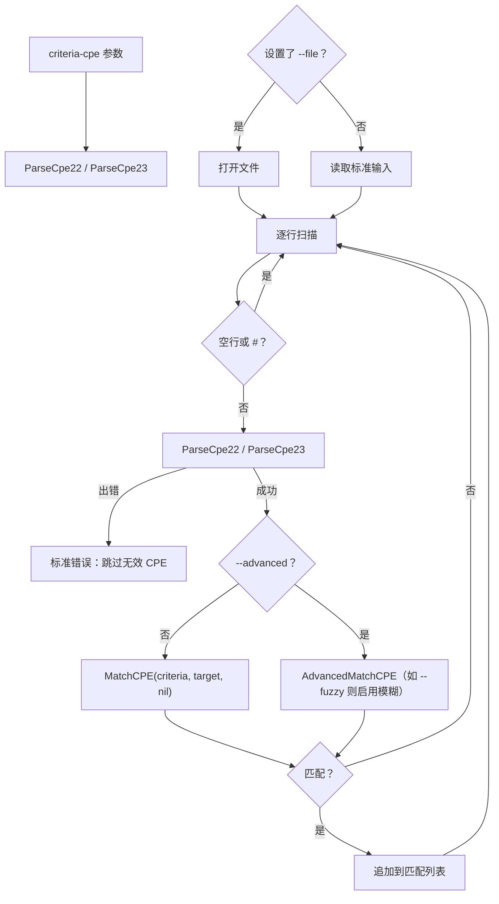

# 📋 cpe search

搜索匹配给定条件的 CPE。从标准输入（每行一个）或文件（`--file`）读取 CPE 字符串，并打印其中匹配条件 CPE 的项。

空行与以 `#` 开头的行会被跳过。解析失败的行会在标准错误上报错并跳过，处理继续进行。

## 用法

```sh
cpe search [flags] <criteria-cpe>
```

## 参数说明

| 参数              | 说明                                                          |
| ----------------- | ------------------------------------------------------------- |
| `<criteria-cpe>`  | 条件 CPE 字符串（2.2 或 2.3）。恰好需要一个参数。             |

## Flags

| Flag         | 简写 | 类型   | 默认值  | 说明                                                                |
| ------------ | ---- | ------ | ------- | ------------------------------------------------------------------- |
| `--file`     | `-f` | string | `""`    | 输入文件，每行一个 CPE 字符串。未设置时读取标准输入。               |
| `--advanced` |      | bool   | `false` | 使用高级匹配（`AdvancedMatchCPE`）而非基础 `MatchCPE`              |
| `--fuzzy`    |      | bool   | `false` | 启用模糊匹配（需要 `--advanced`）                                   |

本命令还继承全局 flags `--output, -o`（`text`/`json`）与 `--no-color`。

当 **未** 设置 `--advanced` 时，命令调用 `MatchCPE(criteria, target, nil)`（基础匹配）。当设置 `--advanced` 时，通过 `NewAdvancedMatchOptions()` 构造选项，并根据 `--fuzzy` 设置 `UseFuzzyMatch`。

## 工作流程

下图展示了 `cpe search` 如何从标准输入或文件逐行读取、解析每个候选项、与条件进行匹配，并收集匹配结果。



## 示例

### 通过管道从标准输入搜索

```sh
cat cpes.txt | cpe search "cpe:2.3:a:microsoft:windows:*:*:*:*:*:*:*:*"
```

预期输出：

```text
Found 2 matching CPE(s):
1. cpe:/a:microsoft:windows:10
2. cpe:/a:microsoft:windows:11
```

### 在文件中搜索 Apache 产品

```sh
cpe search --file cpes.txt "cpe:2.3:a:apache:*:*:*:*:*:*:*:*"
```

### 高级 + 模糊匹配，JSON 输出

```sh
cpe -o json search --advanced --fuzzy "cpe:2.3:a:*:log4j:*:*:*:*:*:*:*" < cpes.txt
```

预期输出（匹配 CPE 2.2 URI 的 JSON 数组）：

```text
["cpe:/a:apache:log4j:2.0", "cpe:/a:apache:log4j:2.14.1"]
```

## 输出

- **text**（默认）：`Found N matching CPE(s):`，后接带编号的匹配 CPE 2.2 URI 列表。
- **json**：匹配 CPE 2.2 URI 的 JSON 数组，例如 `["cpe:/a:...", "cpe:/a:..."]`。

## 相关 API 模块

- [搜索](../api/modules/search) — 搜索模块
- [匹配](../api/matching) — 基础模式使用的 `MatchCPE`
- [高级匹配](../api/modules/advanced-matching) — `AdvancedMatchCPE`、`NewAdvancedMatchOptions`、`UseFuzzyMatch`
