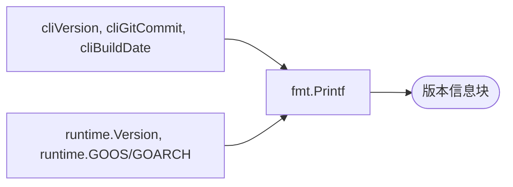

# 🏷️ cpe version

打印 `cpe` CLI 的版本、git 提交、构建日期以及 Go 运行时信息。

## 用法

```sh
cpe version
```

## 参数说明

本命令不接受参数。

## Flags

本命令未定义自己的 flags。全局 flags（`--output, -o`、`--no-color`）虽被接受但对本命令无效——它始终打印固定的多行文本块。

## 输出

本命令按行打印以下字段：

| 字段          | 说明                                                          |
| ------------- | ------------------------------------------------------------- |
| `cpe CLI`     | CLI 版本（默认 `0.1.0`，构建时设置）                          |
| `Git Commit`  | 二进制构建时所用的 git 提交（构建时未注入则为 `unknown`）     |
| `Build Date`  | 构建日期（构建时未注入则为 `unknown`）                        |
| `Go Version`  | `runtime.Version()` 报告的 Go 运行时版本                      |
| `OS/Arch`     | 操作系统与架构（`runtime.GOOS`/`runtime.GOARCH`）             |

## 示例

```sh
cpe version
```

预期输出：

```text
cpe CLI:     0.1.0
Git Commit:  unknown
Build Date:  unknown
Go Version:  go1.25.0
OS/Arch:     linux/amd64
```

## 工作流程

下图表明 `cpe version` 只是读取构建时变量与 Go 运行时值并打印——不调用库、不进行 I/O。



构建时变量（`cliVersion`、`cliGitCommit`、`cliBuildDate`）可在构建时通过 `-ldflags` 覆盖：

```sh
go build -ldflags "-X main.cliVersion=1.0.0 -X main.cliGitCommit=$(git rev-parse HEAD) -X main.cliBuildDate=$(date -u +%Y-%m-%dT%H:%M:%SZ)" \
  -o cpe ./cmd/cpe
```

## 相关文档

- [CLI 概览](./) — 安装与完整的子命令列表
