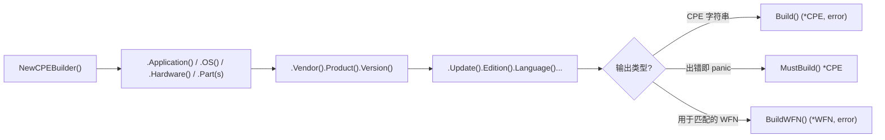

# 🏗️ CPE 构建器示例集

手工拼一个 CPE 2.3 字符串很容易出错——13 个冒号分隔字段、转义规则、还有一个不能写错的 part 代码（`a`/`h`/`o`）。[`builder`](/zh/api/modules/builder) 模块里的链式 `CPEBuilder` 让你一次只设一个字段，并在构建时校验。本页展示常见用法。

## 最小应用 CPE

`NewCPEBuilder()` 返回一个内部带空 WFN 的构建器。链式调用 `.Application()`（或 `.OS()`、`.Hardware()`）加上核心字段，最后 `.Build()`：

```go
package main

import (
    "fmt"
    "log"

    "github.com/scagogogo/cpe-skills"
)

func main() {
    cpe, err := cpeskills.NewCPEBuilder().
        Application().
        Vendor("apache").
        Product("log4j").
        Version("2.14.0").
        Build()
    if err != nil {
        log.Fatal(err)
    }
    fmt.Println(cpe.Cpe23)
    // cpe:2.3:a:apache:log4j:2.14.0:*:*:*:*:*:*:*
}
```

## 操作系统与硬件

`.OS()` 把 part 设为 `o`，`.Hardware()` 设为 `h`。其余链式调用完全一致：

```go
rhel, _ := cpeskills.NewCPEBuilder().
    OS().
    Vendor("redhat").
    Product("enterprise_linux").
    Version("8.2").
    Build()
fmt.Println(rhel.Cpe23)
// cpe:2.3:o:redhat:enterprise_linux:8.2:*:*:*:*:*:*:*

cpu, _ := cpeskills.NewCPEBuilder().
    Hardware().
    Vendor("intel").
    Product("core_i7").
    Version("10700k").
    Build()
fmt.Println(cpu.Cpe23)
// cpe:2.3:h:intel:core_i7:10700k:*:*:*:*:*:*:*
```

## 设置全部字段

构建器为全部 11 个属性都提供了 setter。未设的字段默认为 `*`（ANY）：

```go
c, err := cpeskills.NewCPEBuilder().
    Application().
    Vendor("oracle").
    Product("java_se").
    Version("17.0.1").
    Update("12").
    Edition("lse").
    Language("en").
    SoftwareEdition("jre").
    TargetSoftware("windows").
    TargetHardware("x64").
    Other("LTS").
    Build()
if err != nil {
    log.Fatal(err)
}
fmt.Println(c.Cpe23)
```

## 用 `MustBuild` 做常量

当你在编译期就知道值是合法的，`MustBuild` 出错即 panic，让笔误在测试阶段就暴露，而不是拖到生产：

```go
var log4j = cpeskills.NewCPEBuilder().
    Application().
    Vendor("apache").
    Product("log4j").
    Version("2.14.0").
    MustBuild()
```

## 用 `BuildWFN` 直接拿 WFN

`BuildWFN` 返回 `*WFN` 而不是 `*CPE`。WFN（Well-Formed Name）是 [`matching`](/zh/api/modules/matching) 模块做比较时用的内部表示，适合想跳过 CPE 字符串往返的场景：

```go
wfn, err := cpeskills.NewCPEBuilder().
    Application().
    Vendor("apache").
    Product("log4j").
    Version("*").
    BuildWFN()
if err != nil {
    log.Fatal(err)
}
// wfn 可直接用于 CompareWFNs / FromCPE 互动
fmt.Println(wfn.Get(cpeskills.AttrVendor)) // apache
```

## 用 `Part(string)` 设置 part

如果 part 代码来自配置或用户输入，用 `.Part("a")` 而不是具名助手——它接受 `a`/`h`/`o`：

```go
c, _ := cpeskills.NewCPEBuilder().
    Part("o").
    Vendor("linux").
    Product("linux_kernel").
    Version("5.15.0").
    Build()
```

## 与 `GenerateCPE` 对比

最简单的场景下，[`generator`](/zh/api/modules/generator) 模块的 `GenerateCPE` 更简洁，但它跳过校验、不支持逐字段链式调用。需要校验、可选字段或直接拿 WFN 时，就用构建器。



## 小结

- `NewCPEBuilder()` 是入口，setter 可按任意顺序链式调用。用 `.Application()`/`.OS()`/`.Hardware()` 或 `.Part("a")`。
- `.Build()` 返回 `(*CPE, error)`；`.MustBuild()` 适合包级变量；`.BuildWFN()` 返回 `*WFN` 供匹配引擎使用。比起手工拼接 2.3 URI，优先用构建器。
完整 API 参考见 [`builder`](/zh/api/modules/builder) 和 [`generator`](/zh/api/modules/generator) 模块页。
