# 🔄 CPE 2.2 与 2.3

CPE 历史上出现过两种官方字符串格式。**CPE 2.2** 是较老的 *URI* 风格；**CPE 2.3** 是取代它的较新 *格式化字符串* 风格。两者在真实数据中都还会出现——NVD 历史上输出 2.2 URI，而现代字典和 CVE 数据使用 2.3——因此一个健壮的工具必须两者都能处理。

## 两种语法

**CPE 2.2 URI**（11 个概念字段塞进 7 个 URI 槽位）：

```
cpe:/a:apache:http_server:2.4.58
cpe:/o:microsoft:windows:10:enterprise
```

**CPE 2.3 格式化字符串**（13 个字段，冒号分隔，前缀 `cpe:2.3:`）：

```
cpe:2.3:a:apache:http_server:2.4.58:*:*:*:*:*:*:*
cpe:2.3:o:microsoft:windows:10:*:en-US:*:enterprise:*:*:*
```



```mermaid
flowchart TB
    subgraph URI ["CPE 2.2 URI"]
        U1["cpe:"] --> U2["part"] --> U3["vendor"] --> U4["product"] --> U5["version"]
        U5 --> U6["update"] --> U7["edition"] --> U8["language"]
    end
    subgraph FS ["CPE 2.3 格式化字符串"]
        F1["cpe:2.3"] --> F2["part"] --> F3["vendor"] --> F4["product"] --> F5["version"]
        F5 --> F6["update"] --> F7["edition"] --> F8["language"]
        F8 --> F9["sw_edition"] --> F10["target_sw"] --> F11["target_hw"] --> F12["other"]
    end
```

## 字段对比

| 概念              | 2.2 URI 位置         | 2.3 字段编号 | 说明                              |
|-------------------|----------------------|-------------|------------------------------------|
| part              | 1                    | 1           | `a` / `o` / `h`                    |
| vendor            | 2                    | 2           |                                    |
| product           | 3                    | 3           |                                    |
| version           | 4                    | 4           |                                    |
| update            | 5                    | 5           |                                    |
| edition           | 6                    | 6           | 2.3 把它拆成 4 个子字段            |
| language          | 7                    | 7           |                                    |
| software edition  | 打包进 edition       | 8           | 仅 2.3 可表达                      |
| target software   | 打包进 edition       | 9           | 仅 2.3 可表达                      |
| target hardware   | 打包进 edition       | 10          | 仅 2.3 可表达                      |
| other             | —                    | 11          | 仅 2.3 可表达                      |

关键区别：**2.3 能把 `sw_edition`、`target_sw`、`target_hw`、`other` 表达为独立字段**，而 2.2 把它们塞进单个 `edition` 槽位。这意味着 2.3 名称的表达能力严格强于 2.2 URI。

## 两者互转

因为 2.3 携带更多信息，2.3 → 2.2 方向是有损的：四个额外字段会被折回 `edition`。2.2 → 2.3 方向则只需把缺失字段填为逻辑值 `*`（ANY）。

```go
package main

import (
    "fmt"
    "github.com/scagogogo/cpe-skills"
)

func main() {
    // 2.3 -> 2.2
    uri22, err := cpeskills.ConvertFSToURI("cpe:2.3:a:apache:http_server:2.4.58:*:*:*:*:*:*:*")
    if err != nil { panic(err) }
    fmt.Println(uri22) // cpe:/a:apache:http_server:2.4.58

    // 2.2 -> 2.3
    fs23, err := cpeskills.ConvertURIToFS("cpe:/a:apache:http_server:2.4.58")
    if err != nil { panic(err) }
    fmt.Println(fs23) // cpe:2.3:a:apache:http_server:2.4.58:*:*:*:*:*:*:*
}
```

## 该用哪个？

- **读取**时两者都要支持——输入数据可能含任意一种。
- **写出**时优先 2.3——它无歧义且是当前标准。
- 不在意输入是哪种形式时用 `MustParse`。

## 与各模块的关系

- [Parser 2.2](../api/modules/parser-2.2.md) —— `ParseCpe22`、`FormatCpe22`。
- [Parser 2.3](../api/modules/parser-2.3.md) —— `ParseCpe23`、`FormatCpe23`。
- [Binding](../api/modules/binding.md) —— `ConvertURIToFS`、`ConvertFSToURI`。

## 小结

2.2 是遗留但无处不在；2.3 表达力强但冗长。把它们当作同一逻辑名的两种序列化，自由互转，并为新产出物优先选用 2.3。
